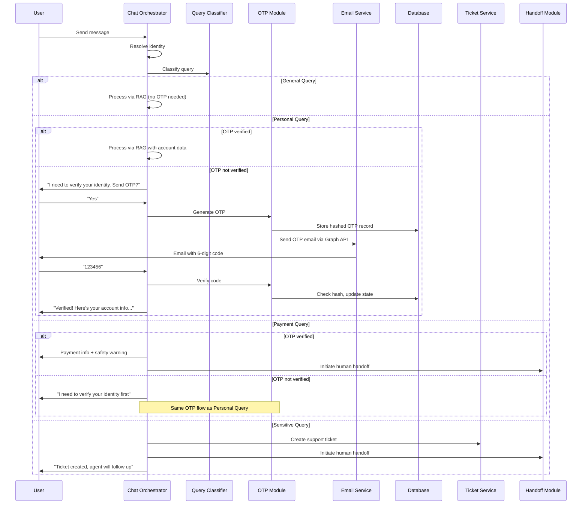
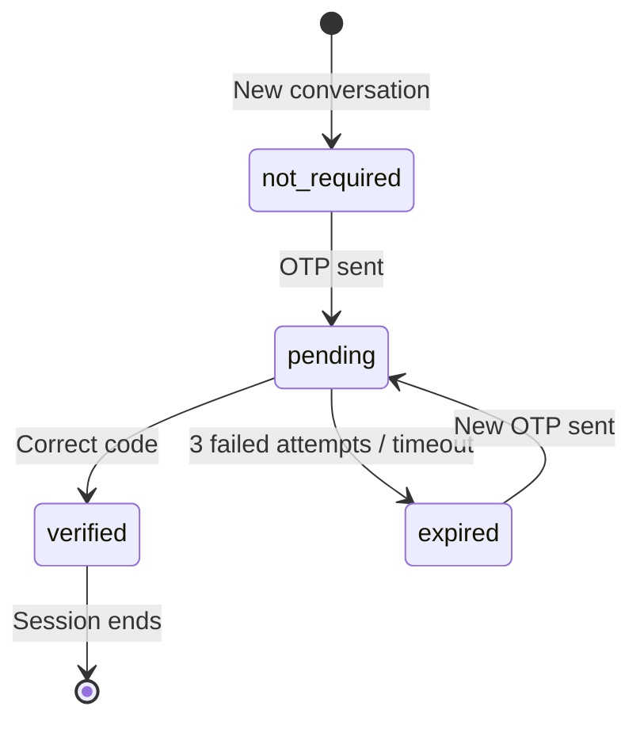

# Design Document: AI OTP Verification

## Overview

This feature adds an OTP (One-Time Password) verification gate to the ORA AI assistant. When a recognized client or tenant asks about personal account data, the AI must first authenticate them via a 6-digit OTP sent to their registered email before sharing any personalized information. The system classifies incoming messages into four categories — general, personal, payment, and sensitive — and applies different handling rules to each.

The OTP module integrates into the existing chat orchestrator (`lib/cms/ai/chat.ts`) as a middleware step between identity resolution and RAG processing. It uses Microsoft Graph API for email delivery via the Azure credentials already configured in the environment.

### Key Design Decisions

| Decision | Choice | Rationale |
|----------|--------|-----------|
| OTP hashing | SHA-256 via `crypto.createHash` | OTPs are short-lived (5 min), 6-digit codes — SHA-256 is fast and sufficient. bcrypt is overkill for ephemeral codes and adds latency. |
| Email delivery | Microsoft Graph REST API (direct fetch) | No additional npm dependency needed. The project already has Azure credentials configured. Simple POST to `/users/{sender}/sendMail`. |
| Query classification | Keyword-based with category lists | Consistent with existing `detectBookingIntent` / `detectAccountIntent` pattern in `chat.ts`. Deterministic, testable, no LLM call overhead. |
| OTP module location | `lib/cms/ai/otp.ts` (generation/verification), `lib/cms/ai/email.ts` (Graph email) | Separation of concerns: crypto logic separate from transport. Both testable independently. |
| OTP storage | New `otp_records` table + `otp_verification_state` column on `ai_conversations` | Follows existing Drizzle ORM patterns. Conversation-scoped state enables session persistence. |
| Token acquisition | OAuth2 client credentials flow with in-memory cache | Azure AD tokens last ~60 min. Caching avoids a token request per email send. |

## Architecture

### OTP Verification Flow



### Integration into Chat Orchestrator

The OTP gate inserts between Step 5 (scope check) and Step 6 (action intents) in the existing `handleChatMessage` flow:

```
Step 1: Load/create conversation
Step 2: Resolve identity
Step 3: Detect language
Step 4: Update conversation
Step 5: Check scope boundary
Step 5.5: ← NEW — Classify query + OTP gate
Step 6: Detect action intents (only if OTP-cleared)
Step 7: RAG pipeline (only if OTP-cleared)
Step 8: Persist messages
Step 9: Return response
```

## Components and Interfaces

### 1. Query Classifier (`lib/cms/ai/otp.ts`)

Classifies user messages into one of four categories based on keyword matching.

```typescript
type QueryCategory = "general" | "personal" | "payment" | "sensitive";

function classifyQuery(message: string, identityType: "client" | "tenant" | "visitor"): QueryCategory;
```

**Classification rules:**
- **Sensitive**: payment dispute, refund, account change, financial correction keywords → always escalate
- **Payment**: payment status, make payment, payment method, installment keywords → OTP + handoff
- **Personal**: my unit, my account, my status, construction progress, lease, handover keywords → OTP required
- **General**: everything else (community info, project details, FAQs, policies)

Visitors asking personal questions get a different response (identify yourself first) rather than an OTP prompt.

### 2. OTP Generator/Verifier (`lib/cms/ai/otp.ts`)

```typescript
interface OtpGenerateResult {
  code: string;       // Plain 6-digit code (for email, never stored)
  hash: string;       // SHA-256 hash (stored in DB)
  expiresAt: Date;    // 5 minutes from now
}

function generateOtp(): OtpGenerateResult;
function hashOtp(code: string): string;
function verifyOtp(code: string, hash: string): boolean;
function maskEmail(email: string): string;
```

- `generateOtp()` uses `crypto.randomInt(0, 1_000_000)` for cryptographically random 6-digit codes, zero-padded.
- `hashOtp()` uses `crypto.createHash('sha256').update(code).digest('hex')`.
- `verifyOtp()` hashes the input and compares against the stored hash.
- `maskEmail()` masks the local part: `"ahmed@example.com"` → `"a****d@example.com"`.

### 3. OTP Database Operations (`lib/cms/ai/otp.ts`)

```typescript
// Create a new OTP record, invalidating any previous pending ones
async function createOtpRecord(db: Database, conversationId: string, email: string, hash: string, expiresAt: Date): Promise<OtpRecord>;

// Look up the active (pending) OTP for a conversation
async function getActiveOtp(db: Database, conversationId: string): Promise<OtpRecord | null>;

// Attempt verification: check hash, expiry, attempts
async function attemptOtpVerification(db: Database, conversationId: string, code: string): Promise<OtpVerificationResult>;

// Invalidate all pending OTPs for a conversation
async function invalidateConversationOtps(db: Database, conversationId: string): Promise<void>;
```

```typescript
type OtpVerificationResult =
  | { status: "verified" }
  | { status: "invalid_code"; remainingAttempts: number }
  | { status: "expired" }
  | { status: "max_attempts_reached" }
  | { status: "no_active_otp" };
```

### 4. Email Service (`lib/cms/ai/email.ts`)

Sends OTP emails via Microsoft Graph API using the client credentials OAuth2 flow.

```typescript
interface SendOtpEmailInput {
  recipientEmail: string;
  otpCode: string;
  recipientName: string;
  language: "en" | "ar";
}

async function sendOtpEmail(input: SendOtpEmailInput): Promise<{ success: boolean; error?: string }>;
```

**Token acquisition** uses a cached OAuth2 client credentials flow:

```typescript
// POST https://login.microsoftonline.com/{tenantId}/oauth2/v2.0/token
// grant_type=client_credentials
// client_id={clientId}
// client_secret={clientSecret}
// scope=https://graph.microsoft.com/.default
```

**Email sending** uses the Graph API sendMail endpoint:

```
POST https://graph.microsoft.com/v1.0/users/{senderEmail}/sendMail
Authorization: Bearer {token}
Content-Type: application/json

{
  "message": {
    "subject": "ORA — Your Verification Code",
    "body": { "contentType": "HTML", "content": "..." },
    "toRecipients": [{ "emailAddress": { "address": "..." } }]
  },
  "saveToSentItems": false
}
```

### 5. OTP Chat Gate (`lib/cms/ai/otp.ts`)

The main integration function called by the chat orchestrator:

```typescript
interface OtpGateResult {
  action: "proceed" | "respond";
  response?: string;
  queryCategory: QueryCategory;
}

async function handleOtpGate(
  db: Database,
  conversationId: string,
  message: string,
  identity: IdentityResult,
  language: "en" | "ar",
  otpVerificationState: OtpVerificationState
): Promise<OtpGateResult>;
```

Returns `{ action: "proceed" }` when the query can continue to RAG, or `{ action: "respond", response: "..." }` when the OTP gate intercepts the message with its own response.

### 6. Sensitive Query Escalation (`lib/cms/ai/otp.ts`)

```typescript
async function escalateSensitiveQuery(
  db: Database,
  conversationId: string,
  message: string,
  identity: IdentityResult,
  language: "en" | "ar"
): Promise<{ ticketNumber: string }>;
```

Creates a support ticket via the existing `createTicket` function from `lib/cms/tickets/service.ts` and initiates a human handoff via `initiateHandoff` from `lib/cms/ai/handoff.ts`.

## Data Models

### New Table: `otp_records`

```typescript
export const otpRecords = pgTable(
  "otp_records",
  {
    id: uuid("id").primaryKey().defaultRandom(),
    conversationId: uuid("conversation_id")
      .notNull()
      .references(() => aiConversations.id, { onDelete: "cascade" }),
    otpHash: text("otp_hash").notNull(),
    email: text("email").notNull(),
    status: text("status", {
      enum: ["pending", "used", "expired", "invalidated"],
    })
      .notNull()
      .default("pending"),
    attemptCount: integer("attempt_count").notNull().default(0),
    maxAttempts: integer("max_attempts").notNull().default(3),
    expiresAt: timestamp("expires_at").notNull(),
    createdAt: timestamp("created_at").defaultNow().notNull(),
    verifiedAt: timestamp("verified_at"),
  },
  (table) => [
    index("otp_records_conversation_status_idx").on(
      table.conversationId,
      table.status
    ),
  ]
);
```

### Modified Table: `ai_conversations`

Add a new column:

```typescript
otpVerificationState: text("otp_verification_state", {
  enum: ["not_required", "pending", "verified", "expired"],
})
  .notNull()
  .default("not_required"),
```

### OTP Verification State Machine



### Email Template Data

The OTP email uses an HTML template with these variables:
- `recipientName`: Client/tenant first name
- `otpCode`: The 6-digit code
- `expiryMinutes`: Always 5
- `language`: "en" or "ar" (determines template direction and text)


## Correctness Properties

*A property is a characteristic or behavior that should hold true across all valid executions of a system — essentially, a formal statement about what the system should do. Properties serve as the bridge between human-readable specifications and machine-verifiable correctness guarantees.*

### Property 1: OTP gate blocks non-verified personal and payment queries

*For any* recognized identity (client or tenant), *for any* message classified as a personal or payment query, and *for any* OTP verification state that is not "verified" (i.e., "not_required", "pending", or "expired"), the OTP gate SHALL return `action: "respond"` and SHALL NOT return `action: "proceed"`.

**Validates: Requirements 1.1, 4.1**

### Property 2: General queries always pass through regardless of OTP state

*For any* message classified as a general query, and *for any* OTP verification state (including "not_required", "pending", "verified", "expired"), the OTP gate SHALL return `action: "proceed"`.

**Validates: Requirements 1.4**

### Property 3: Verified state allows personal queries

*For any* recognized identity (client or tenant), *for any* message classified as a personal query, when the OTP verification state is "verified", the OTP gate SHALL return `action: "proceed"`.

**Validates: Requirements 1.3, 8.1**

### Property 4: Visitor personal queries get identification prompt

*For any* visitor identity (type = "visitor"), *for any* message classified as a personal query, the OTP gate SHALL return `action: "respond"` with a message that asks the user to provide their phone number or email, regardless of OTP verification state.

**Validates: Requirements 1.2**

### Property 5: Query classification keyword correctness

*For any* message string containing at least one keyword from a specific category's keyword list, `classifyQuery` SHALL return that category. *For any* message string containing no keywords from any category list, `classifyQuery` SHALL return "general". When keywords from multiple categories are present, sensitive takes priority over payment, which takes priority over personal.

**Validates: Requirements 1.5**

### Property 6: OTP generation produces valid 6-digit codes

*For any* call to `generateOtp()`, the returned code SHALL be a string of exactly 6 numeric characters representing an integer in the range [0, 999999], and the returned hash SHALL be a 64-character lowercase hexadecimal string (SHA-256 digest).

**Validates: Requirements 2.1**

### Property 7: Only the latest OTP is active per conversation

*For any* conversation, after generating N OTP records (N ≥ 2), only the most recently created OTP record SHALL have status "pending". All previously created OTP records for that conversation SHALL have status "invalidated".

**Validates: Requirements 2.6**

### Property 8: OTP hash round-trip verification

*For any* 6-digit numeric string, generating the hash via `hashOtp(code)` and then calling `verifyOtp(code, hash)` SHALL return `true`. Additionally, the hash SHALL NOT equal the original code (ensuring raw codes are never stored as-is).

**Validates: Requirements 3.6, 6.4**

### Property 9: Failed OTP attempts decrement remaining count

*For any* active OTP record with attempt count < max attempts, verifying with an incorrect code SHALL increment the attempt count by exactly 1, and the reported remaining attempts SHALL equal `maxAttempts - newAttemptCount`.

**Validates: Requirements 3.3**

### Property 10: Expired OTPs are always rejected

*For any* OTP record where the current time is past `expiresAt`, attempting verification with any code (including the correct one) SHALL return a result with status "expired".

**Validates: Requirements 3.5**

### Property 11: Sensitive queries never proceed to RAG

*For any* message classified as a sensitive query, regardless of identity type or OTP verification state, the OTP gate SHALL NOT return `action: "proceed"`. It SHALL always return `action: "respond"` with an escalation response.

**Validates: Requirements 5.3**

### Property 12: Email template contains all required elements in correct language

*For any* valid recipient name, *for any* valid 6-digit OTP code, and *for each* supported language ("en", "ar"), the rendered email HTML SHALL contain: the ORA brand name, the OTP code, an expiry notice, a security warning, and support contact information. When language is "ar", the template SHALL contain Arabic text. When language is "en", the template SHALL contain English text.

**Validates: Requirements 7.2, 7.3**

## Error Handling

### OTP Email Delivery Failure
- If the Microsoft Graph API returns a non-2xx status or the token acquisition fails, the system responds to the user with a friendly error message and offers to retry or connect with a human agent.
- The error is logged but does not crash the chat flow. The conversation OTP state remains unchanged (stays at current state, does not transition to "pending").

### Invalid OTP Code Format
- If the user provides a message that looks like a code attempt but is not exactly 6 digits, the system treats it as a regular message rather than a verification attempt. Only strings matching `/^\d{6}$/` are treated as OTP submissions when the state is "pending".

### Database Errors
- OTP record creation/update failures are caught and result in a user-facing error message suggesting they try again.
- Conversation state update failures are logged and the system falls back to treating the conversation as unverified (safe default).

### Token Cache Expiry
- The Azure AD token is cached in memory with its `expires_in` value minus a 60-second buffer. If the token is expired or missing, a new one is acquired before the email send attempt.
- If token acquisition fails (invalid credentials, network error), the error propagates to the email send function which returns `{ success: false, error: "..." }`.

### Race Conditions
- If two OTP requests arrive simultaneously for the same conversation, the `createOtpRecord` function invalidates all existing pending records before inserting, so only one will be active. The database's transactional guarantees handle this.

### Conversation Cleanup
- When a conversation status transitions to "resolved" or "handed_off", any pending OTP records are invalidated. This is handled in the handoff and resolution flows.

## Testing Strategy

### Property-Based Tests (fast-check)

The project already has `fast-check@^4.7.0` in devDependencies and uses `vitest` as the test runner. Each correctness property maps to a single property-based test with a minimum of 100 iterations.

**Test file**: `lib/cms/ai/otp.test.ts`

Property tests cover:
- **OTP generation validity** (Property 6): Generate many OTPs, verify format constraints
- **OTP hash round-trip** (Property 8): For random 6-digit strings, hash then verify succeeds
- **Query classification** (Property 5): Random messages with injected keywords classify correctly
- **Email masking**: For random email addresses, masked output preserves first/last char and domain
- **Email template rendering** (Property 12): Random names/codes produce HTML with all required elements

**Test file**: `lib/cms/ai/otp-gate.test.ts`

Property tests cover:
- **OTP gate blocking** (Property 1): Random personal/payment queries with non-verified state are blocked
- **General query passthrough** (Property 2): Random general queries always proceed
- **Verified state passthrough** (Property 3): Verified + personal query → proceed
- **Visitor identification prompt** (Property 4): Visitor + personal query → identification prompt
- **Sensitive query escalation** (Property 11): Sensitive queries never proceed

Each test is tagged with: `Feature: ai-otp-verification, Property {N}: {title}`

### Unit Tests (vitest)

**Test file**: `lib/cms/ai/otp.test.ts`

Example-based tests:
- OTP email delivery failure returns error response (Req 2.5)
- Payment query response includes safety warning in English and Arabic (Req 4.2, 4.4)
- Sensitive query creates ticket with correct priority mapping (Req 5.4)
- Email subject line matches expected format (Req 7.1)
- Email uses configured sender address (Req 7.4)

Edge case tests:
- Max attempts (3) locks the OTP and sets state to expired (Req 3.4)
- Expired OTP with correct code still returns "expired" (Req 3.5)
- Generating new OTP invalidates previous pending one (Req 2.6)

### Integration Tests

**Test file**: `lib/cms/ai/otp-integration.test.ts`

Using `pg-mem` (already in devDependencies) for database tests:
- OTP record creation stores all required fields (Req 2.2)
- Conversation state transitions correctly through the OTP lifecycle (Req 6.2)
- Only latest OTP is active after multiple generations (Property 7)
- Failed attempt counting persists across verification calls (Property 9)
- Expired OTP detection based on timestamp (Property 10)
- Conversation cleanup invalidates pending OTPs (Req 6.5)
- New conversations start with "not_required" state (Req 8.2)

### Test Configuration

```typescript
// Minimum 100 iterations for property tests
const FC_OPTIONS = { numRuns: 100 };
```

All property tests reference their design document property:
```typescript
// Feature: ai-otp-verification, Property 8: OTP hash round-trip verification
```
