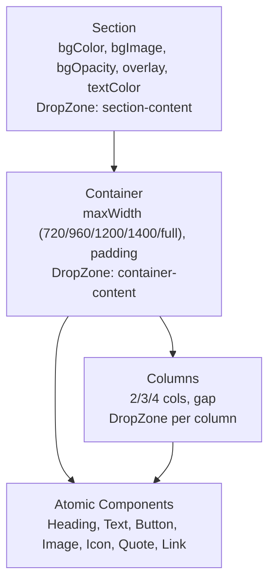
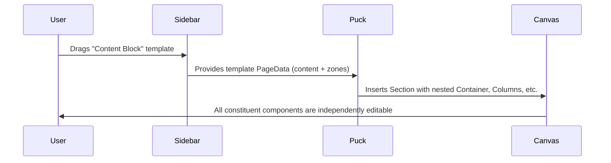

# Design Document: Atomic Component Architecture

## Overview

This design refactors the ORA page builder from compound components (ContentBlock, HighlightBlock, Gallery) to an atomic, composable architecture. The key changes are:

1. **Section refactor** — Remove `maxWidth` from Section so it becomes a pure background/overlay wrapper. Content width moves to Container.
2. **Icon component** — New atomic component using Lucide React icons with configurable size and color.
3. **Template component system** — Pre-composed blocks (Hero Section, Content Block, CTA Section, etc.) that expand into atomic pieces using Puck's `zones` data format.
4. **Sidebar reorganization** — Add "Templates" category; add Icon to "Basic" category.
5. **Page template migration** — Update `bayn-landing`, `property-showcase`, and `specs-page` templates to use atomic components only.

Most atomic components (Heading, Text, Button, Image, Quote, Link, Spacer, Divider) and layout components (Container, Columns, Accordion) already exist. The compound components (ContentBlock, HighlightBlock, Gallery) are already kept in the registry for backward compatibility but removed from sidebar categories.

## Architecture

### Component Hierarchy

```
Section (full-width, background only)
  └── Container (content width constraint: 720/960/1200/1400/full)
        └── Atomic components (Heading, Text, Button, Image, Icon, Quote, Link)
        └── Columns (2/3/4 grid)
              └── Atomic components per column
        └── Accordion
              └── Atomic components
```

### Separation of Concerns



Section handles visual presentation (background color, image, opacity, text color). Container handles spatial layout (max-width, centering, padding). This is a clean separation — Section never constrains content width.

### Template Expansion Flow



## Components and Interfaces

### Section (Refactored)

Remove the `maxWidth` field. Section becomes a pure full-width background wrapper.

**Fields:**
- `bgColor` — select from ORA palette
- `bgImage` — media upload
- `bgOpacity` — opacity for background image
- `textColor` — auto or explicit color
- `_padding`, `_margin`, `_border` — spacing/border fields
- `_animation` — animation fields

**Render:** Full-width `<section>` with background layers. DropZone `section-content` spans full width with no max-width constraint or horizontal padding.

**Change from current:** Remove `maxWidth` field and its associated rendering logic. The inner `<div>` wrapping the DropZone should have no `maxWidth` or padding — just `position: relative; zIndex: 2`.

### Container (Existing)

Already implemented. Controls content width with `maxWidth` options (720/960/1200/1400/full) and centers with auto margins.

### Icon (New)

**Fields:**
- `icon` — select field with predefined Lucide icon names (e.g., "home", "phone", "mail", "map-pin", "star", "heart", "check", "arrow-right", "building", "palm-tree", "waves", "sun", "shield", "car", "bed", "bath")
- `size` — select: 16, 20, 24, 32, 40, 48, 64
- `color` — color field (reuse `colorField` from typography-fields)
- `alignment` — toggle: left, center, right
- `strokeWidth` — select: 1, 1.5, 2 (default 1 per ORA design system)
- `_padding`, `_margin`, `_border` — spacing/border fields
- `_animation` — animation fields

**Render:** Wraps a Lucide React icon component in a div with alignment. Uses dynamic import or a lookup map from icon name string to Lucide component.

**Implementation approach:** Create a static map of ~20 curated icon names to their Lucide components. This avoids dynamic imports and keeps the bundle predictable.

```typescript
import { Home, Phone, Mail, MapPin, Star, Heart, Check, ArrowRight,
         Building, Palmtree, Waves, Sun, Shield, Car, Bed, Bath,
         Eye, Download, ExternalLink, Quote as QuoteIcon } from "lucide-react";

const ICON_MAP: Record<string, React.ComponentType<{ size?: number; color?: string; strokeWidth?: number }>> = {
  home: Home, phone: Phone, mail: Mail, "map-pin": MapPin,
  star: Star, heart: Heart, check: Check, "arrow-right": ArrowRight,
  building: Building, palmtree: Palmtree, waves: Waves, sun: Sun,
  shield: Shield, car: Car, bed: Bed, bath: Bath,
  eye: Eye, download: Download, "external-link": ExternalLink, quote: QuoteIcon,
};
```

### Template Component System

Templates are NOT Puck components registered in the config. They are **data blueprints** — pre-built `PageData` snippets that get inserted into the editor when dropped.

**How it works with Puck:**

Puck's data format uses `content` (top-level components) and `zones` (children inside DropZones). A template defines a complete subtree:

```typescript
interface ComponentTemplate {
  id: string;
  name: string;
  category: "Templates";
  // The data that gets inserted — a mini PageData
  data: {
    content: ComponentInstance[];      // Top-level: usually a Section
    zones: Record<string, ComponentInstance[]>;  // Nested children
  };
}
```

When a template is dropped, the system:
1. Generates unique IDs for all component instances
2. Inserts the `content` items into the page's content array
3. Merges the `zones` entries into the page's zones map
4. Each component is now independently editable

**Template definitions:**

| Template | Structure |
|----------|-----------|
| Content Block | Section > Container > Columns(2) > [Image, [Quote + Text + Button]] |
| Hero Section | Section(bg image, dark overlay) > Container > [Heading + Text + Button] |
| Feature Section | Section > Container > [Heading + FeatureGrid] |
| CTA Section | Section(charcoal bg) > Container > [Heading + Text + Button(gold)] |
| Testimonial Section | Section > Container > [Heading + Columns(3) > [Quote, Quote, Quote]] |

**Sidebar integration:** Templates appear in a "Templates" category in the Puck sidebar. This requires using Puck's `categories` config with a custom component list that triggers template insertion instead of single-component insertion.

### Sidebar Categories (Updated)

```typescript
categories: {
  layout: {
    components: ["Section", "Container", "Columns", "Accordion", "Spacer", "Divider"],
    title: "Layout",
    defaultExpanded: true,
  },
  basic: {
    components: ["Heading", "Text", "Button", "InlineLink", "Image", "Quote", "Icon"],
    title: "Basic",
  },
  ora: {
    components: ["HeroBanner", "PropertyCard", "FeatureGrid", "FilterTabs", "StatRow", "Footer", "MegaFooter"],
    title: "ORA",
  },
  templates: {
    components: ["TplContentBlock", "TplHeroSection", "TplFeatureSection", "TplCTASection", "TplTestimonialSection"],
    title: "Templates",
  },
}
```

Template "components" are thin wrappers registered in the Puck config that, on render, expand their data into the page. Each template component's `resolveData` or initial insertion hook replaces itself with the expanded atomic tree.

## Data Models

### ComponentInstance (Existing)

```typescript
interface ComponentInstance {
  type: string;           // Component key in registry (e.g., "Heading", "Section")
  props: {
    id: string;           // Unique instance ID
    [key: string]: unknown;
  };
}
```

### PageData with Zones (Existing)

```typescript
interface PageData {
  root: { props: { title?: string; [key: string]: unknown } };
  content: ComponentInstance[];                          // Top-level components
  zones?: Record<string, ComponentInstance[]>;           // DropZone children keyed by "parentId:zoneName"
}
```

Zone keys follow the pattern `"<parentComponentId>:<dropZoneName>"`, e.g., `"section-abc:section-content"` contains the children of that Section's DropZone.

### Icon Component Props

```typescript
interface IconProps {
  id: string;
  icon: string;          // Lucide icon key from ICON_MAP
  size: string;          // "16" | "20" | "24" | "32" | "40" | "48" | "64"
  color: string;         // Hex color
  alignment: string;     // "left" | "center" | "right"
  strokeWidth: string;   // "1" | "1.5" | "2"
  _padding: { paddingTop: string; paddingBottom: string; paddingLeft: string; paddingRight: string };
  _margin: { marginTop: string; marginBottom: string };
  _border: { borderWidth: string; borderColor: string; borderRadius: string };
  _animation: { entrance: string; duration: string; delay: string; hover: string };
}
```

### ComponentTemplate

```typescript
interface ComponentTemplate {
  id: string;
  name: string;
  description: string;
  build: () => {
    content: ComponentInstance[];
    zones: Record<string, ComponentInstance[]>;
  };
}
```

The `build()` function generates fresh unique IDs each time, ensuring no ID collisions when multiple instances of the same template are dropped.


## Correctness Properties

*A property is a characteristic or behavior that should hold true across all valid executions of a system — essentially, a formal statement about what the system should do. Properties serve as the bridge between human-readable specifications and machine-verifiable correctness guarantees.*

### Property 1: Style system fields present on all atomic components

*For any* atomic component registered in the Component_Registry (Heading, Text, Button, InlineLink, Image, Quote, Spacer, Divider, Icon), its field definitions SHALL include `_padding` (with paddingTop, paddingBottom, paddingLeft, paddingRight), `_margin` (with marginTop, marginBottom), and `_border` (with borderWidth, borderColor, borderRadius).

**Validates: Requirements 5.1, 5.2, 5.3, 5.6**

### Property 2: Typography fields present on text-bearing atomic components

*For any* text-bearing atomic component (Heading, Text, Button, InlineLink, Quote), its field definitions SHALL include typography fields: fontFamily, fontSize, fontWeight, color, textAlign, letterSpacing, lineHeight.

**Validates: Requirements 5.5**

### Property 3: Icon renders valid SVG for any predefined icon name

*For any* icon name in the predefined ICON_MAP, rendering the Icon component with that name, a valid size, and a valid color SHALL produce a rendered element containing an SVG.

**Validates: Requirements 4.6, 4.7, 4.8**

### Property 4: Heading renders correct HTML tag for any level

*For any* heading level in {h1, h2, h3, h4, h5, h6}, rendering the Heading component with that level SHALL produce an element with the corresponding HTML tag name.

**Validates: Requirements 10.2**

### Property 5: Template expansion produces unique component IDs

*For any* template definition, calling its `build()` function SHALL produce a data structure where every ComponentInstance across `content` and all `zones` entries has a unique `id` value, and calling `build()` twice SHALL produce different ID sets (no collisions across invocations).

**Validates: Requirements 6.6, 6.7**

### Property 6: All built-in page templates pass schema validation

*For any* built-in page template in the template registry, its `data` field SHALL pass `validatePageData()` successfully (returning `{ success: true }`).

**Validates: Requirements 11.4**

### Property 7: Component props JSON round-trip

*For any* component registered in the Component_Registry (atomic or layout), serializing its `defaultProps` to JSON via `JSON.stringify` and deserializing back via `JSON.parse` SHALL produce an object deeply equal to the original `defaultProps`.

**Validates: Requirements 12.1, 12.2**

### Property 8: Template expanded data JSON round-trip

*For any* component template, the output of `build()` (containing `content` and `zones`) serialized to JSON and deserialized back SHALL produce a deeply equal data structure, preserving all zone keys, component types, and prop values.

**Validates: Requirements 12.3, 12.4**

## Error Handling

### Icon Component
- If an invalid icon name is provided (not in ICON_MAP), render a fallback placeholder (empty box or question mark icon) rather than crashing.
- If size or color values are malformed, fall back to defaults (size: 24, color: #2C2C2C).

### Template Expansion
- If a template's `build()` function encounters an error, log the error and return an empty `{ content: [], zones: {} }` structure rather than crashing the editor.
- ID generation should use `crypto.randomUUID()` or a similar collision-resistant method.

### Section Refactor (Backward Compatibility)
- Existing page data that includes `maxWidth` on Section should be silently ignored during render (the field is removed from the UI but old data may still contain it).
- ContentBlock, HighlightBlock, and Gallery remain in the component registry (not in sidebar categories) so existing pages that reference them continue to render.

### Page Template Migration
- Templates that reference removed compound components should be updated. The `validatePageData` schema check catches structural issues but not semantic ones (e.g., referencing a component type that doesn't exist in the registry).
- A runtime warning should be logged if a page references a component type not found in the active config categories.

## Testing Strategy

### Property-Based Tests (fast-check)

Use `fast-check` as the property-based testing library. Each property test runs a minimum of 100 iterations.

**Test file:** `lib/page-builder/config.property.test.ts` (extend existing)

| Property | Test approach |
|----------|--------------|
| Property 1: Style system fields | Iterate over all atomic component keys, verify field presence |
| Property 2: Typography fields | Iterate over text-bearing component keys, verify typography field presence |
| Property 3: Icon renders SVG | Generate random icon name from ICON_MAP keys, random size, random color; render and verify SVG |
| Property 4: Heading tag | Generate random level from h1-h6; render and verify tag |
| Property 5: Template unique IDs | For each template, call build() with random seed, collect all IDs, verify uniqueness |
| Property 6: Template validation | For each template, validate data against schema |
| Property 7: Props round-trip | For each component, JSON round-trip defaultProps |
| Property 8: Template data round-trip | For each template, JSON round-trip build() output |

Tag format: `Feature: atomic-component-architecture, Property N: <description>`

### Unit Tests (Example-Based)

**Test file:** `lib/page-builder/config.test.ts`

- Registry contains expected component keys (Req 1.1-1.6)
- Sidebar categories have correct component lists (Req 7.1-7.5)
- Section does NOT have maxWidth field (Req 3.3)
- Section renders full-width with no content constraint (Req 3.4)
- Container renders with correct maxWidth CSS for each option (Req 2.4-2.6)
- Button gold variant has correct classes (Req 8.5)
- Button fullWidth renders w-full (Req 8.6)
- Each template expands to expected structure (Req 6.1-6.5)
- Migrated templates contain no compound component references (Req 11.1-11.3)

### Integration Tests

- Drop a template onto a page, save, reload, verify all components render correctly
- Existing pages with legacy compound components still render (backward compat)
