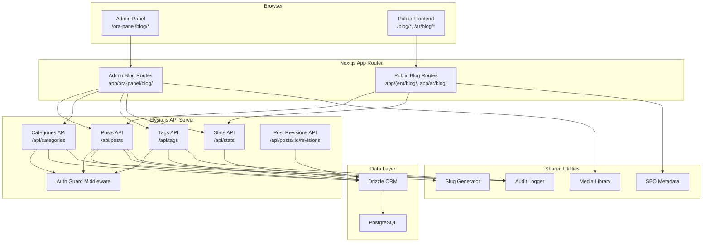
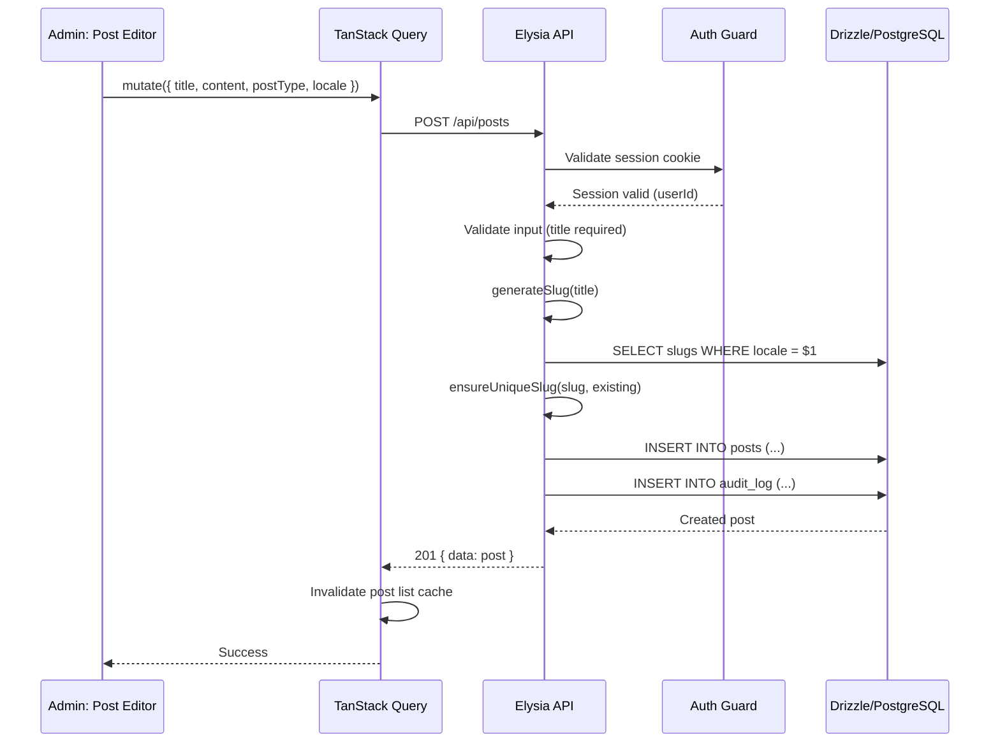
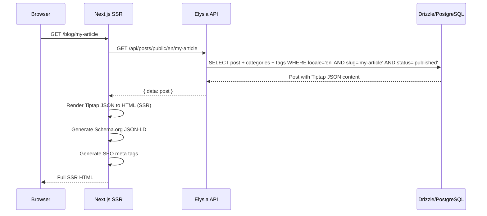
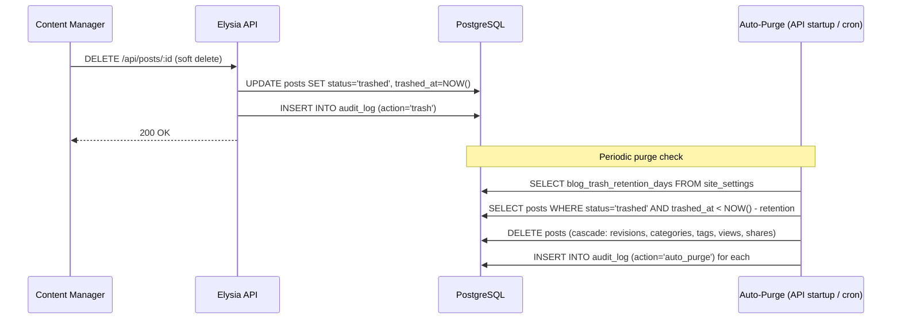
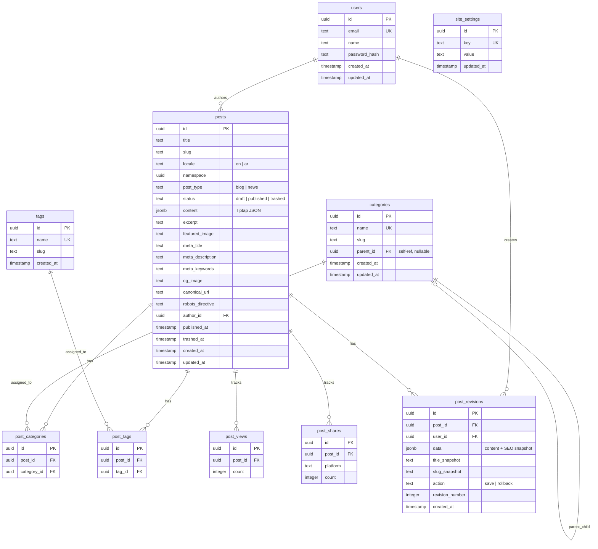

# Design Document: Blogs & News Module

## Overview

The Blogs & News module extends the ORA CMS platform with a dedicated content management system for blog posts and news articles. Unlike the existing pages system which uses the Puck visual page builder for layout composition, this module uses a Tiptap rich text editor for long-form content authoring — a fundamentally different editing paradigm suited to articles, announcements, and editorial content.

The module follows the same three-tier architecture established by the ORA CMS platform:

1. **Database Layer** — New Drizzle ORM tables (`posts`, `categories`, `tags`, `post_categories`, `post_tags`, `post_views`, `post_shares`, `post_revisions`) alongside the existing schema
2. **API Layer** — New Elysia.js route modules (`posts`, `categories`, `tags`, `stats`) plugged into the existing API app with the same auth guard pattern
3. **Frontend Layer** — Admin panel pages under `/ora-panel/blog/*` and SSR public pages under `/blog/*` and `/ar/blog/*`

### Key Design Decisions

1. **Separate `posts` table, not reusing `pages`**: Posts have fundamentally different fields (post_type, excerpt, trashed_at, content as Tiptap JSON vs PageData JSON, categories, tags, analytics). Sharing the pages table would require nullable columns and complex conditional logic. A dedicated table keeps both systems clean.

2. **Tiptap JSON stored as JSONB**: Content is stored as Tiptap's native JSON format rather than rendered HTML. This preserves the full document structure for editing, enables server-side rendering via `@tiptap/html`, and allows future content transformations without lossy HTML parsing.

3. **Soft-delete with auto-purge**: Posts use a three-state status (`draft` / `published` / `trashed`) instead of hard delete. The `trashedAt` timestamp enables time-based auto-purge. The retention period is stored in `site_settings` for admin configurability.

4. **Reusing existing utilities**: Slug generation (`generateSlug`, `ensureUniqueSlug`), audit logging (`logAudit`), SEO metadata generation (`generatePageMetadata`), and the media library are reused directly. The blog module extends the existing `AuditAction` and `AuditEntityType` types.

5. **Namespace-based locale pairing**: Same pattern as pages — posts are grouped by a `namespace` UUID with at most one EN and one AR record per namespace. This enables the same locale completion indicator UI.

6. **Schema.org structured data**: JSON-LD is generated server-side based on `post_type` — `Article` for blogs, `NewsArticle` for news. This uses the existing SEO utility pattern extended with structured data generation.

7. **Analytics via simple counters**: View and share tracking uses simple counter tables (`post_views`, `post_shares`) with atomic increment operations. This avoids the complexity of event-sourced analytics while providing the required metrics.

## Architecture



### Request Flow: Post Creation



### Request Flow: Public Post Render (SSR)



### Request Flow: Trash and Auto-Purge



## Components and Interfaces

### 1. Blog Schema Extension (`lib/cms/schema.ts`)

New table definitions added to the existing schema file:

```typescript
// ── Posts ─────────────────────────────────────────────────────────────────────
export const posts = pgTable("posts", {
  id: uuid("id").primaryKey().defaultRandom(),
  title: text("title").notNull(),
  slug: text("slug").notNull(),
  locale: text("locale", { enum: ["en", "ar"] }).notNull(),
  namespace: uuid("namespace").notNull(),
  postType: text("post_type", { enum: ["blog", "news"] }).notNull().default("blog"),
  status: text("status", { enum: ["draft", "published", "trashed"] }).notNull().default("draft"),
  content: jsonb("content"),           // Tiptap JSON
  excerpt: text("excerpt"),
  featuredImage: text("featured_image"),
  metaTitle: text("meta_title"),
  metaDescription: text("meta_description"),
  metaKeywords: text("meta_keywords"),
  ogImage: text("og_image"),
  canonicalUrl: text("canonical_url"),
  robotsDirective: text("robots_directive").default("index, follow"),
  authorId: uuid("author_id").notNull().references(() => users.id),
  publishedAt: timestamp("published_at"),
  trashedAt: timestamp("trashed_at"),
  createdAt: timestamp("created_at").defaultNow().notNull(),
  updatedAt: timestamp("updated_at").defaultNow().notNull(),
}, (table) => [
  uniqueIndex("posts_slug_locale_idx").on(table.slug, table.locale),
  index("posts_namespace_idx").on(table.namespace),
  index("posts_status_idx").on(table.status),
  index("posts_post_type_idx").on(table.postType),
]);

// ── Categories ───────────────────────────────────────────────────────────────
export const categories = pgTable("categories", {
  id: uuid("id").primaryKey().defaultRandom(),
  name: text("name").notNull(),
  slug: text("slug").notNull(),
  parentId: uuid("parent_id"),
  createdAt: timestamp("created_at").defaultNow().notNull(),
  updatedAt: timestamp("updated_at").defaultNow().notNull(),
}, (table) => [
  uniqueIndex("categories_name_idx").on(table.name),
]);

// ── Tags ─────────────────────────────────────────────────────────────────────
export const tags = pgTable("tags", {
  id: uuid("id").primaryKey().defaultRandom(),
  name: text("name").notNull(),
  slug: text("slug").notNull(),
  createdAt: timestamp("created_at").defaultNow().notNull(),
}, (table) => [
  uniqueIndex("tags_name_idx").on(table.name),
]);

// ── Junction Tables ──────────────────────────────────────────────────────────
export const postCategories = pgTable("post_categories", {
  id: uuid("id").primaryKey().defaultRandom(),
  postId: uuid("post_id").notNull().references(() => posts.id, { onDelete: "cascade" }),
  categoryId: uuid("category_id").notNull().references(() => categories.id, { onDelete: "cascade" }),
}, (table) => [
  uniqueIndex("post_categories_unique_idx").on(table.postId, table.categoryId),
]);

export const postTags = pgTable("post_tags", {
  id: uuid("id").primaryKey().defaultRandom(),
  postId: uuid("post_id").notNull().references(() => posts.id, { onDelete: "cascade" }),
  tagId: uuid("tag_id").notNull().references(() => tags.id, { onDelete: "cascade" }),
}, (table) => [
  uniqueIndex("post_tags_unique_idx").on(table.postId, table.tagId),
]);

// ── Analytics ────────────────────────────────────────────────────────────────
export const postViews = pgTable("post_views", {
  id: uuid("id").primaryKey().defaultRandom(),
  postId: uuid("post_id").notNull().references(() => posts.id, { onDelete: "cascade" }),
  count: integer("count").notNull().default(0),
});

export const postShares = pgTable("post_shares", {
  id: uuid("id").primaryKey().defaultRandom(),
  postId: uuid("post_id").notNull().references(() => posts.id, { onDelete: "cascade" }),
  platform: text("platform").notNull(),
  count: integer("count").notNull().default(0),
}, (table) => [
  uniqueIndex("post_shares_unique_idx").on(table.postId, table.platform),
]);

// ── Post Revisions ───────────────────────────────────────────────────────────
export const postRevisions = pgTable("post_revisions", {
  id: uuid("id").primaryKey().defaultRandom(),
  postId: uuid("post_id").notNull().references(() => posts.id, { onDelete: "cascade" }),
  userId: uuid("user_id").notNull().references(() => users.id),
  data: jsonb("data").notNull(),       // Snapshot of content + SEO fields
  titleSnapshot: text("title_snapshot").notNull(),
  slugSnapshot: text("slug_snapshot").notNull(),
  action: text("action", { enum: ["save", "rollback"] }).notNull().default("save"),
  revisionNumber: integer("revision_number").notNull(),
  createdAt: timestamp("created_at").defaultNow().notNull(),
}, (table) => [
  index("post_revisions_post_id_idx").on(table.postId),
]);
```

### 2. Posts API Routes (`lib/cms/api/routes/posts.ts`)

```typescript
// Public routes (no auth):
// GET  /api/posts/public/:locale/:slug  — Fetch published post by locale+slug (SSR)
// GET  /api/posts/public/:locale        — List published posts for locale (paginated)

// Read routes (no auth for admin reads):
// GET  /api/posts                       — List posts with filters (namespace groups)
// GET  /api/posts/:id                   — Get single post with all fields
// GET  /api/posts/trash                 — List trashed posts

// Protected routes (auth required):
// POST   /api/posts                     — Create post
// PUT    /api/posts/:id                 — Update post (creates revision first)
// DELETE /api/posts/:id                 — Soft delete (move to trash)
// POST   /api/posts/:id/publish         — Publish post
// POST   /api/posts/:id/unpublish       — Unpublish post
// POST   /api/posts/:id/clone-locale    — Clone to AR locale
// POST   /api/posts/:id/restore         — Restore from trash
// DELETE /api/posts/:id/permanent       — Permanent delete from trash
// PUT    /api/posts/:id/categories      — Set post categories
// PUT    /api/posts/:id/tags            — Set post tags
```

### 3. Categories API Routes (`lib/cms/api/routes/categories.ts`)

```typescript
// GET    /api/categories                — List all categories (tree structure)
// POST   /api/categories                — Create category (auth)
// PUT    /api/categories/:id            — Update category (auth)
// DELETE /api/categories/:id            — Delete category (auth, promotes children)
```

### 4. Tags API Routes (`lib/cms/api/routes/tags.ts`)

```typescript
// GET    /api/tags                      — List all tags
// POST   /api/tags                      — Create tag (auth)
// PUT    /api/tags/:id                  — Update tag (auth)
// DELETE /api/tags/:id                  — Delete tag (auth)
```

### 5. Stats API Routes (`lib/cms/api/routes/stats.ts`)

```typescript
// GET    /api/stats/overview            — Total posts, views, shares
// GET    /api/stats/top-posts           — Top posts by view count
// GET    /api/stats/shares              — Per-platform share breakdown
// POST   /api/stats/view/:postId        — Increment view count (public, no auth)
// POST   /api/stats/share/:postId       — Increment share count (public, no auth)
```

### 6. Post Revisions API (`lib/cms/api/routes/post-revisions.ts`)

```typescript
// GET    /api/posts/:id/revisions                    — List revisions for a post
// GET    /api/posts/:id/revisions/:revisionId        — Get single revision
// POST   /api/posts/:id/revisions/:revisionId/rollback — Rollback to revision (auth)
```

### 7. React Query Hooks (`lib/cms/hooks/`)

```typescript
// lib/cms/hooks/use-posts.ts
// usePosts(filters?)        — List posts with namespace grouping
// usePost(id)               — Single post query
// useCreatePost()           — Create mutation
// useUpdatePost()           — Update mutation with optimistic cache
// useDeletePost()           — Soft delete (trash) mutation
// usePublishPost()          — Publish mutation
// useUnpublishPost()        — Unpublish mutation
// useClonePostLocale()      — Clone to AR mutation
// useRestorePost()          — Restore from trash mutation
// usePermanentDeletePost()  — Permanent delete mutation
// useTrashedPosts()         — List trashed posts

// lib/cms/hooks/use-blog-categories.ts
// useBlogCategories()       — List categories (tree)
// useCreateCategory()       — Create mutation
// useUpdateCategory()       — Update mutation
// useDeleteCategory()       — Delete mutation

// lib/cms/hooks/use-blog-tags.ts
// useBlogTags()             — List tags
// useCreateTag()            — Create mutation
// useUpdateTag()            — Update mutation
// useDeleteTag()            — Delete mutation

// lib/cms/hooks/use-blog-stats.ts
// useBlogStats(filters?)    — Overview stats
// useTopPosts(filters?)     — Top posts by views
// useShareBreakdown()       — Per-platform shares
// useTrackView()            — View increment mutation
// useTrackShare()           — Share increment mutation

// lib/cms/hooks/use-post-revisions.ts
// usePostRevisions(postId)  — List revisions
// useRollbackPost()         — Rollback mutation
```

### 8. Rich Text Renderer (`lib/cms/utils/rich-text-renderer.ts`)

```typescript
import { generateHTML } from "@tiptap/html";
// Import Tiptap extensions matching the editor config

/**
 * Convert Tiptap JSON content to HTML string for SSR rendering.
 * Uses the same extension set as the editor to ensure formatting fidelity.
 */
export function renderTiptapToHtml(content: Record<string, unknown>): string;
```

### 9. Schema.org Structured Data (`lib/cms/utils/structured-data.ts`)

```typescript
export interface StructuredDataInput {
  postType: "blog" | "news";
  title: string;
  description: string;
  image?: string;
  publishedAt: string;
  updatedAt: string;
  authorName: string;
  url: string;
}

/**
 * Generate Schema.org Article or NewsArticle JSON-LD object.
 */
export function generateStructuredData(input: StructuredDataInput): Record<string, unknown>;
```

### 10. Blog SEO Metadata (`lib/cms/utils/blog-seo.ts`)

Extends the existing `generatePageMetadata` pattern for blog-specific fields:

```typescript
import type { Metadata } from "next";

export interface BlogMetadataInput {
  metaTitle?: string | null;
  metaDescription?: string | null;
  metaKeywords?: string | null;
  ogImage?: string | null;
  featuredImage?: string | null;
  canonicalUrl?: string | null;
  robotsDirective?: string | null;
  slug: string;
  locale: "en" | "ar";
  postType: "blog" | "news";
}

/**
 * Generate Next.js Metadata for a blog post.
 * Falls back to featuredImage for OG image when ogImage is not set.
 */
export function generateBlogMetadata(input: BlogMetadataInput): Metadata;
```

### 11. Fetch Utilities (`lib/cms/utils/fetch-post.ts`)

```typescript
/**
 * Fetch a published post by locale and slug (SSR).
 */
export async function fetchPublicPost(locale: string, slug: string): Promise<PostRecord | null>;

/**
 * Fetch published posts for listing (paginated).
 */
export async function fetchPublicPosts(locale: string, page?: number, pageSize?: number): Promise<{ posts: PostRecord[]; total: number }>;

/**
 * Fetch posts by category slug.
 */
export async function fetchPostsByCategory(locale: string, categorySlug: string, page?: number): Promise<{ posts: PostRecord[]; total: number; category: CategoryRecord }>;

/**
 * Fetch posts by tag slug.
 */
export async function fetchPostsByTag(locale: string, tagSlug: string, page?: number): Promise<{ posts: PostRecord[]; total: number; tag: TagRecord }>;

/**
 * Fetch related posts for a given post (by shared categories/tags).
 */
export async function fetchRelatedPosts(postId: string, locale: string, limit?: number): Promise<PostRecord[]>;
```

### 12. Trash Auto-Purge Service (`lib/cms/blog/trash-purge.ts`)

```typescript
/**
 * Purge posts that have been trashed longer than the retention period.
 * Called on API startup and can be triggered via a cron endpoint.
 */
export async function purgeExpiredTrash(db: Database): Promise<number>;
```

### 13. Admin Panel Route Structure

```
app/ora-panel/blog/
├── page.tsx                    — Post listing (namespace groups, filters, trash toggle)
├── new/
│   └── page.tsx                — Create new post (editor page)
├── [id]/
│   └── page.tsx                — Edit post (editor + SEO + categories + tags + revisions)
├── categories/
│   └── page.tsx                — Category management (tree view, inline CRUD)
├── tags/
│   └── page.tsx                — Tag management (flat list, inline CRUD)
└── stats/
    └── page.tsx                — Stats dashboard (views, shares, top posts)
```

### 14. Public Frontend Route Structure

```
app/(en)/blog/
├── page.tsx                    — EN blog listing (paginated)
├── [slug]/
│   └── page.tsx                — EN individual post
├── category/
│   └── [slug]/
│       └── page.tsx            — EN category archive
└── tag/
    └── [slug]/
        └── page.tsx            — EN tag archive

app/ar/blog/
├── page.tsx                    — AR blog listing (paginated)
├── [slug]/
│   └── page.tsx                — AR individual post
├── category/
│   └── [slug]/
│       └── page.tsx            — AR category archive
└── tag/
    └── [slug]/
        └── page.tsx            — AR tag archive
```

### 15. Sidebar Navigation Update

Add a "Blog" entry to the `navItems` array in `app/ora-panel/layout.tsx`:

```typescript
import { Newspaper } from 'lucide-react';

// Add to navItems array:
{ href: '/ora-panel/blog', label: 'Blog', icon: Newspaper },
```

## Data Models

### Entity Relationship Diagram



### Type Definitions (`lib/cms/types.ts` extensions)

```typescript
// Post types
export type PostType = "blog" | "news";
export type PostStatus = "draft" | "published" | "trashed";

// Post namespace group (same pattern as PageNamespaceGroup)
export interface PostNamespaceGroup {
  namespace: string;
  slug: string;
  postType: PostType;
  locales: {
    en?: { id: string; title: string; status: PostStatus };
    ar?: { id: string; title: string; status: PostStatus };
  };
}

// Category with children for tree display
export interface CategoryTree {
  id: string;
  name: string;
  slug: string;
  parentId: string | null;
  children: CategoryTree[];
}

// Share platforms
export type SharePlatform = "twitter" | "facebook" | "linkedin" | "whatsapp" | "copy_link";

// Extended audit types
export type BlogAuditAction = AuditAction | "trash" | "restore" | "auto_purge";
export type BlogAuditEntityType = AuditEntityType | "post" | "category" | "tag";
```


## Correctness Properties

*A property is a characteristic or behavior that should hold true across all valid executions of a system — essentially, a formal statement about what the system should do. Properties serve as the bridge between human-readable specifications and machine-verifiable correctness guarantees.*

### Property 1: Post CRUD round-trip

*For any* valid post title, post type, locale, and optional SEO metadata (metaTitle, metaDescription, metaKeywords, canonicalUrl, robotsDirective, featuredImage, ogImage), creating a post and then reading it back by ID SHALL return a post with matching title, postType, locale, status "draft", a valid UUID namespace, and all SEO fields matching the input values.

**Validates: Requirements 1.1, 1.3, 2.5, 8.1, 8.2, 8.3**

### Property 2: Post list filtering

*For any* combination of locale, status, and post type filters applied to a set of posts, all returned posts SHALL match every specified filter criterion, and every post in the database matching all criteria SHALL appear in the results.

**Validates: Requirements 2.2, 2.3, 2.4**

### Property 3: Trashed posts excluded from public results

*For any* set of posts with mixed statuses (draft, published, trashed), querying the public API SHALL return only posts with status "published". No trashed or draft post SHALL appear in public query results.

**Validates: Requirements 4.3, 4.5**

### Property 4: Trash and restore round-trip

*For any* post with status "draft" or "published", trashing it SHALL set status to "trashed" and set a non-null trashedAt timestamp. Restoring that same post SHALL set status back to "draft" and clear trashedAt to null.

**Validates: Requirements 4.1, 4a.2**

### Property 5: Permanent delete cascades all associations

*For any* trashed post that has category assignments, tag assignments, revisions, view counts, and share counts, permanently deleting it SHALL remove the post record and all associated records from post_categories, post_tags, post_revisions, post_views, and post_shares tables.

**Validates: Requirements 4a.3**

### Property 6: Auto-purge respects retention period

*For any* set of trashed posts with various trashedAt timestamps and a configured retention period of N days, running the auto-purge SHALL permanently delete only posts where `(now - trashedAt) > N days`, and SHALL leave all other trashed posts untouched.

**Validates: Requirements 4b.1, 4b.5**

### Property 7: Publish/unpublish lifecycle

*For any* newly created post, its initial status SHALL be "draft" with null publishedAt. Publishing it SHALL set status to "published" and set a non-null publishedAt timestamp. Unpublishing it SHALL set status back to "draft".

**Validates: Requirements 5.1, 5.2**

### Property 8: Locale clone produces correct AR post

*For any* EN post with any valid content and SEO fields, cloning to AR SHALL produce a new post with the same namespace, locale "ar", status "draft", and all content and SEO fields deeply equal to the source post.

**Validates: Requirements 6.1**

### Property 9: Revision snapshot before update

*For any* post update, the system SHALL create a revision record containing the post's pre-update title, slug, content, and SEO fields BEFORE applying the changes. The revision number SHALL be strictly greater than all previous revision numbers for that post.

**Validates: Requirements 3.1, 6a.1, 6a.2**

### Property 10: Revision restore creates undo point and overwrites

*For any* post with two or more revisions, restoring to a previous revision SHALL: (1) create a new revision of the current state with action "rollback", and (2) overwrite the post's content and SEO fields with the selected revision's snapshot. The post's content after restore SHALL deeply equal the target revision's snapshot.

**Validates: Requirements 6a.4**

### Property 11: Revision history ordering

*For any* post with revisions, listing revisions SHALL return all revisions ordered by revision number descending, and revision numbers SHALL form a strictly increasing sequence when read in creation order.

**Validates: Requirements 6a.3**

### Property 12: Slug uniqueness within locale

*For any* set of posts created in the same locale, all slugs SHALL be unique within that locale. When a generated slug collides with an existing slug, the system SHALL append a numeric suffix (-1, -2, etc.) to produce a unique slug.

**Validates: Requirements 7.1, 7.2, 7.5**

### Property 13: OG image falls back to featured image

*For any* post where ogImage is null or empty but featuredImage is set, the generated blog metadata SHALL use the featuredImage URL as the OpenGraph image.

**Validates: Requirements 8.4**

### Property 14: Schema.org structured data type mapping

*For any* published post, the generated structured data SHALL have @type "Article" when postType is "blog" and @type "NewsArticle" when postType is "news". The structured data SHALL use metaTitle as headline, publishedAt as datePublished, and updatedAt as dateModified.

**Validates: Requirements 9.1, 9.2, 9.3**

### Property 15: Tiptap JSON to HTML round-trip

*For any* valid Tiptap JSON document, rendering to HTML SHALL produce a non-empty string containing valid HTML. The rendered HTML SHALL preserve all formatting semantics (headings map to h1-h6 tags, bold to strong, italic to em, lists to ol/ul, links to anchor tags, blockquotes to blockquote tags, code blocks to pre/code tags).

**Validates: Requirements 11.1, 11.2, 11.3**

### Property 16: Category parent deletion promotes children

*For any* parent category with one or more child categories, deleting the parent SHALL set all children's parentId to null (promoting them to root categories) and SHALL remove all post-category associations for the deleted parent.

**Validates: Requirements 12.4, 12.5**

### Property 17: Tag update regenerates slug

*For any* tag, updating its name SHALL regenerate the slug to match the new name. The new slug SHALL be the output of generateSlug applied to the new name.

**Validates: Requirements 13.3**

### Property 18: Post-category and post-tag assignment round-trip

*For any* post and set of categories/tags, assigning them SHALL create the corresponding junction records. Reading the post's categories/tags back SHALL return exactly the assigned set. Removing an assignment SHALL delete the junction record.

**Validates: Requirements 14.1, 14.2, 14.3**

### Property 19: Analytics counter increment

*For any* post, incrementing the view count N times SHALL result in a total view count of N. Incrementing the share count for a specific platform M times SHALL result in a share count of M for that platform, independent of other platforms' counts.

**Validates: Requirements 17.1, 17.2, 18.1, 18.2**

### Property 20: Stats aggregation correctness

*For any* post with known view and share counts across platforms, the stats endpoint SHALL return a total view count equal to the sum of all view increments, and a per-platform share breakdown where each platform's count equals its individual increment total.

**Validates: Requirements 17.3, 18.3**

### Property 21: Pagination correctness

*For any* set of N published posts and a page size of P, requesting page K SHALL return at most P posts, and the union of all pages SHALL equal the complete set of published posts with no duplicates and no omissions.

**Validates: Requirements 20.3**

### Property 22: Related posts constraints

*For any* published post, the related posts list SHALL contain at most 3 posts, SHALL NOT include the current post, and each related post SHALL either share at least one category or tag with the current post OR be a recent post of the same post type (as a fallback when fewer than 3 category/tag matches exist).

**Validates: Requirements 23.1, 23.2, 23.3, 23.4**

### Property 23: Mutating actions create audit entries

*For any* mutating action (create, update, trash, restore, delete, publish, unpublish, rollback, auto_purge) performed on a post, category, or tag, an audit log entry SHALL be created containing the correct userId, action type, entity type, entity ID, and a non-empty summary.

**Validates: Requirements 1.4, 3.2, 4.2, 4b.4, 5.3, 5.4, 6.3, 6a.5**

### Property 24: Blog URL format

*For any* post slug, the public URL SHALL follow the format `/blog/{slug}` for English locale and `/ar/blog/{slug}` for Arabic locale. Category archive URLs SHALL follow `/blog/category/{slug}` and tag archive URLs SHALL follow `/blog/tag/{slug}`.

**Validates: Requirements 21.4, 22.4**

## Error Handling

### API Layer Errors

| Status | Condition | Response |
|--------|-----------|----------|
| 400 | Missing or empty title on post creation | `{ error: "Title is required" }` |
| 404 | Post/category/tag ID not found | `{ error: "{Entity} not found" }` |
| 404 | Public post slug not found or not published | `{ error: "Post not found" }` |
| 409 | Duplicate category name | `{ error: "Category with this name already exists" }` |
| 409 | Duplicate tag name | `{ error: "Tag with this name already exists" }` |
| 409 | AR locale already exists for namespace | `{ error: "AR locale version already exists for this namespace" }` |
| 401 | Missing or invalid session on protected routes | `{ error: "Unauthorized" }` |

### Frontend Error Handling

- Post editor: Display toast notifications for save/publish/trash errors with retry option
- Post listing: Show error state with retry button if API call fails
- Public pages: Return Next.js `notFound()` for missing/unpublished posts, triggering the 404 page
- Share tracking: Fire-and-forget — share button opens platform dialog regardless of tracking API success
- View tracking: Fire-and-forget — page renders regardless of view increment API success

### Data Integrity

- Cascade deletes on post deletion: post_categories, post_tags, post_views, post_shares, post_revisions all cascade
- Category deletion: promotes children to root (parentId = null), removes post_categories for that category
- Tag deletion: removes post_tags for that tag
- Unique constraints: (slug, locale) on posts, (name) on categories, (name) on tags, (post_id, category_id) on post_categories, (post_id, tag_id) on post_tags, (post_id, platform) on post_shares

## Testing Strategy

### Property-Based Tests (fast-check)

The project already uses `fast-check` with `vitest`. Each correctness property above maps to a property-based test file. Configuration: minimum 100 iterations per property test (the existing tests use 20 runs — we'll use 100 for new tests to increase coverage).

Tag format: `Feature: blogs-news-module, Property {N}: {title}`

Key property test files:
- `lib/cms/utils/blog-seo.property.test.ts` — Properties 13, 14 (OG fallback, structured data)
- `lib/cms/utils/rich-text-renderer.property.test.ts` — Property 15 (Tiptap round-trip)
- `lib/cms/blog/post-crud.property.test.ts` — Properties 1, 2, 3, 7, 12 (CRUD, filtering, lifecycle, slugs)
- `lib/cms/blog/trash.property.test.ts` — Properties 4, 5, 6 (trash/restore, cascade, auto-purge)
- `lib/cms/blog/revisions.property.test.ts` — Properties 9, 10, 11 (revision snapshots, restore, ordering)
- `lib/cms/blog/taxonomy.property.test.ts` — Properties 16, 17, 18 (categories, tags, assignments)
- `lib/cms/blog/analytics.property.test.ts` — Properties 19, 20, 21 (counters, stats, pagination)
- `lib/cms/blog/related-posts.property.test.ts` — Property 22 (related posts constraints)

### Unit Tests (vitest)

- Specific examples and edge cases: empty title validation, 404 responses, 409 conflicts, duplicate slug handling
- Structured data output format verification with concrete examples
- Tiptap JSON rendering with specific formatting combinations
- Pagination boundary cases (empty list, last page with fewer items)
- Trash retention period calculation edge cases

### Integration Tests

- SSR rendering of blog listing, post, category archive, tag archive pages
- End-to-end post creation → publish → public fetch flow
- Sidebar navigation highlighting on blog routes
- Media library integration for featured image selection

### Test Infrastructure

- Use `pg-mem` (already in devDependencies) for in-memory PostgreSQL in property and unit tests
- Mock Tiptap extensions for renderer tests
- Use `@testing-library/react` for admin panel component tests
