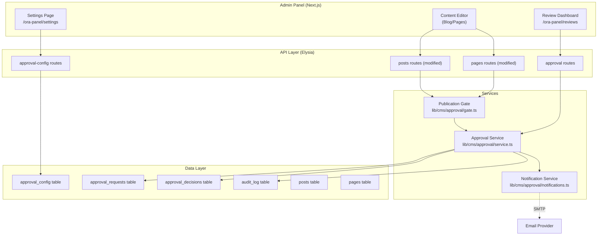
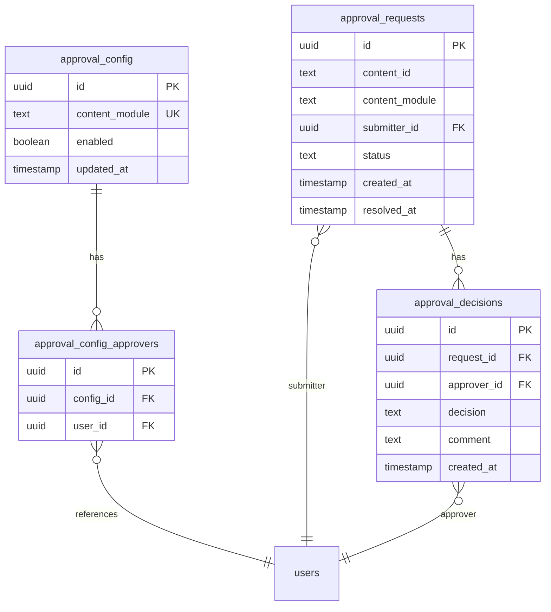

# Design Document: Content Approval Workflow

## Overview

The Content Approval Workflow adds a publication gate to Ora CMS. When enabled for a content module (Pages, Blog, News, Construction Updates), every publish action routes content into a "pending review" queue instead of going live. Assigned approvers receive email notifications and can approve or reject from a centralized Review Dashboard at `/ora-panel/reviews`. Content is published only after all assigned approvers approve; any single rejection reverts to draft.

The system integrates with the existing Elysia API layer, Drizzle ORM schema, React Query hooks, and audit log infrastructure. Three new database tables store approval configuration, requests, and decisions. The existing `pages` and `posts` tables gain a `pending_review` status value. A new notification service handles email delivery via a pluggable transport (initially Nodemailer with SMTP).

## Architecture



The architecture follows the existing pattern: Elysia route files call into service functions, which interact with the database via Drizzle and log to the audit system. The publication gate is a shared function called by both the pages and posts publish endpoints.

## Components and Interfaces

### 1. Publication Gate (`lib/cms/approval/gate.ts`)

The central enforcement point. Called by existing publish endpoints before changing status.

```typescript
interface GateResult {
  allowed: boolean;
  approvalRequestId?: string;
  reason?: string;
}

// Called by publish endpoints
async function checkPublicationGate(
  db: Database,
  contentId: string,
  contentModule: ContentModule,
  submitterId: string
): Promise<GateResult>;
```

Logic:
- Query `approval_config` for the module
- If approval disabled → return `{ allowed: true }`
- If approval enabled → create `approval_request`, set content status to `pending_review`, send notifications, return `{ allowed: false, approvalRequestId }`

### 2. Approval Service (`lib/cms/approval/service.ts`)

Core business logic for managing approval requests and decisions.

```typescript
// Submit a decision (approve/reject)
async function submitDecision(
  db: Database,
  approvalRequestId: string,
  approverId: string,
  decision: "approved" | "rejected",
  comment?: string
): Promise<ApprovalRequest>;

// Get pending requests for an approver
async function getPendingForApprover(
  db: Database,
  approverId: string
): Promise<ApprovalRequestWithDetails[]>;

// Get approval progress for a content item
async function getApprovalProgress(
  db: Database,
  contentId: string,
  contentModule: ContentModule
): Promise<{ approved: number; total: number; decisions: ApprovalDecisionRecord[] }>;

// Auto-resolve pending requests when approval is disabled
async function autoResolvePendingRequests(
  db: Database,
  contentModule: ContentModule
): Promise<number>;
```

### 3. Notification Service (`lib/cms/approval/notifications.ts`)

Handles email delivery with error logging.

```typescript
interface EmailPayload {
  to: string;
  subject: string;
  html: string;
}

// Build and send notification to approvers
async function notifyApprovers(
  db: Database,
  approvalRequest: ApprovalRequest,
  approvers: { email: string; name: string }[],
  submitterName: string,
  contentTitle: string,
  contentModule: ContentModule
): Promise<void>;

// Notify submitter of outcome
async function notifySubmitter(
  db: Database,
  approvalRequest: ApprovalRequest,
  submitterEmail: string,
  outcome: "approved" | "rejected",
  contentTitle: string
): Promise<void>;

// Pluggable transport
async function sendEmail(payload: EmailPayload): Promise<void>;
```

The `sendEmail` function reads SMTP config from environment variables (`SMTP_HOST`, `SMTP_PORT`, `SMTP_USER`, `SMTP_PASS`, `SMTP_FROM`). Failures are caught and logged to the audit log with entity type `notification`.

### 4. API Routes

#### Approval Config Routes (`lib/cms/api/routes/approval-config.ts`)

| Method | Path | Auth | Description |
|--------|------|------|-------------|
| GET | `/api/approval-config` | Yes | Get all module configs |
| PUT | `/api/approval-config/:module` | Yes | Update toggle + approvers for a module |

#### Approval Routes (`lib/cms/api/routes/approvals.ts`)

| Method | Path | Auth | Description |
|--------|------|------|-------------|
| GET | `/api/approvals/pending` | Yes | List pending requests for current user |
| GET | `/api/approvals/:id` | Yes | Get single request with decisions |
| POST | `/api/approvals/:id/decide` | Yes | Submit approve/reject decision |
| GET | `/api/approvals/content/:module/:contentId` | Yes | Get approval status for a content item |

#### Modified Existing Routes

The `POST /posts/:id/publish` and `POST /pages/:id/publish` endpoints are modified to call `checkPublicationGate()` before changing status. If the gate returns `{ allowed: false }`, the endpoint returns a 202 response with the approval request ID instead of publishing.

### 5. React Query Hooks (`lib/cms/hooks/use-approvals.ts`)

```typescript
// Query keys
const approvalKeys = {
  all: ["approvals"] as const,
  config: () => [...approvalKeys.all, "config"] as const,
  pending: () => [...approvalKeys.all, "pending"] as const,
  detail: (id: string) => [...approvalKeys.all, "detail", id] as const,
  contentStatus: (module: string, contentId: string) =>
    [...approvalKeys.all, "content", module, contentId] as const,
};

// Hooks
function useApprovalConfig(): UseQueryResult<ApprovalConfigRecord[]>;
function useUpdateApprovalConfig(): UseMutationResult;
function usePendingApprovals(): UseQueryResult<ApprovalRequestWithDetails[]>;
function useApprovalDetail(id: string): UseQueryResult<ApprovalRequestWithDetails>;
function useSubmitDecision(): UseMutationResult;
function useContentApprovalStatus(module: string, contentId: string): UseQueryResult;
```

### 6. UI Components

#### Settings Page Extension (`app/ora-panel/settings/page.tsx`)

A new "Content Approval" section added below existing settings. For each module:
- Toggle switch (enabled/disabled)
- Multi-select user picker for approvers (searches existing users)

#### Review Dashboard (`app/ora-panel/reviews/page.tsx`)

Table listing pending approval requests with columns:
- Content title (links to content detail)
- Module type (badge)
- Submitter name
- Submitted date
- Progress ("2 of 4 approved")
- Action button (Review)

#### Approval Actions Component (`lib/cms/components/ApprovalActions.tsx`)

Embedded in content detail pages (blog editor, page editor). Shows:
- Current approval status and progress
- Approve/Reject buttons (for approvers)
- Comment textarea
- Decision history timeline

## Data Models

### New Tables

#### `approval_config`

Stores per-module approval settings.

```typescript
export const approvalConfig = pgTable(
  "approval_config",
  {
    id: uuid("id").primaryKey().defaultRandom(),
    contentModule: text("content_module", {
      enum: ["pages", "blog", "news", "construction_updates"],
    }).notNull(),
    enabled: boolean("enabled").notNull().default(false),
    updatedAt: timestamp("updated_at").defaultNow().notNull(),
  },
  (table) => [
    uniqueIndex("approval_config_module_idx").on(table.contentModule),
  ]
);
```

#### `approval_config_approvers` (junction)

Maps approvers to module configs.

```typescript
export const approvalConfigApprovers = pgTable(
  "approval_config_approvers",
  {
    id: uuid("id").primaryKey().defaultRandom(),
    configId: uuid("config_id")
      .notNull()
      .references(() => approvalConfig.id, { onDelete: "cascade" }),
    userId: uuid("user_id")
      .notNull()
      .references(() => users.id, { onDelete: "cascade" }),
  },
  (table) => [
    uniqueIndex("approval_config_approvers_unique_idx").on(
      table.configId,
      table.userId
    ),
  ]
);
```

#### `approval_requests`

Tracks each content submission for review.

```typescript
export const approvalRequests = pgTable(
  "approval_requests",
  {
    id: uuid("id").primaryKey().defaultRandom(),
    contentId: text("content_id").notNull(),
    contentModule: text("content_module", {
      enum: ["pages", "blog", "news", "construction_updates"],
    }).notNull(),
    submitterId: uuid("submitter_id")
      .notNull()
      .references(() => users.id),
    status: text("status", {
      enum: ["pending", "approved", "rejected"],
    })
      .notNull()
      .default("pending"),
    createdAt: timestamp("created_at").defaultNow().notNull(),
    resolvedAt: timestamp("resolved_at"),
  },
  (table) => [
    index("approval_requests_content_idx").on(
      table.contentId,
      table.contentModule
    ),
    index("approval_requests_status_idx").on(table.status),
    index("approval_requests_submitter_idx").on(table.submitterId),
  ]
);
```

#### `approval_decisions`

Individual approver decisions on a request.

```typescript
export const approvalDecisions = pgTable(
  "approval_decisions",
  {
    id: uuid("id").primaryKey().defaultRandom(),
    requestId: uuid("request_id")
      .notNull()
      .references(() => approvalRequests.id, { onDelete: "cascade" }),
    approverId: uuid("approver_id")
      .notNull()
      .references(() => users.id),
    decision: text("decision", {
      enum: ["approved", "rejected"],
    }).notNull(),
    comment: text("comment"),
    createdAt: timestamp("created_at").defaultNow().notNull(),
  },
  (table) => [
    uniqueIndex("approval_decisions_unique_idx").on(
      table.requestId,
      table.approverId
    ),
    index("approval_decisions_request_idx").on(table.requestId),
  ]
);
```

### Modified Tables

The `pages.status` enum gains `"pending_review"`:
```typescript
status: text("status", { enum: ["draft", "published", "pending_review"] })
```

The `posts.status` enum gains `"pending_review"`:
```typescript
status: text("status", { enum: ["draft", "published", "trashed", "pending_review"] })
```

### Type Additions (`lib/cms/types.ts`)

```typescript
export type ContentModule = "pages" | "blog" | "news" | "construction_updates";

export type ApprovalStatus = "pending" | "approved" | "rejected";

export type ApprovalDecisionValue = "approved" | "rejected";

// Extend existing types
export type PageStatus = "draft" | "published" | "pending_review";
export type PostStatus = "draft" | "published" | "trashed" | "pending_review";

// Extend audit types
export type AuditAction = "create" | "update" | "delete" | "publish" | "unpublish"
  | "rollback" | "trash" | "restore" | "auto_purge"
  | "approval_submit" | "approval_decide" | "approval_auto_resolve";
export type AuditEntityType = "page" | "media" | "form" | "settings"
  | "component_template" | "post" | "category" | "tag" | "menu"
  | "approval_request" | "notification";
```

### Entity Relationship



## Correctness Properties

*A property is a characteristic or behavior that should hold true across all valid executions of a system — essentially, a formal statement about what the system should do. Properties serve as the bridge between human-readable specifications and machine-verifiable correctness guarantees.*

### Property 1: Configuration round-trip

*For any* content module and boolean toggle value, saving the approval configuration and reading it back should return the same module and toggle state.

**Validates: Requirements 1.1, 1.4**

### Property 2: Approval-enabled intercepts publish

*For any* content item in a module with approval enabled, calling the publish action should create an approval request with status "pending", set the content status to "pending_review", and not set the content status to "published".

**Validates: Requirements 1.3, 3.1, 8.1**

### Property 3: Approval-disabled allows direct publish

*For any* content item in a module with approval disabled, calling the publish action should set the content status to "published" and not create any approval request.

**Validates: Requirements 1.2, 3.2, 8.3**

### Property 4: Approver assignment round-trip

*For any* content module and non-empty set of valid user IDs, assigning them as approvers and reading back the configuration should return the same set of user IDs.

**Validates: Requirements 2.1**

### Property 5: Approver assignment validation

*For any* set of user IDs submitted as approvers, the system should reject the assignment if the set is empty, exceeds the maximum allowed, or contains any user ID that does not exist in the users table.

**Validates: Requirements 2.2, 2.3**

### Property 6: Removing approver preserves existing requests

*For any* approver who has submitted decisions on existing approval requests, removing that approver from the module configuration should not delete or modify those existing approval decisions.

**Validates: Requirements 2.4**

### Property 7: Approval request records required data

*For any* approval request created by the publication gate, the stored record should contain the correct content item ID, content module type, submitter ID, and a non-null creation timestamp.

**Validates: Requirements 3.3**

### Property 8: Pending content excluded from public queries

*For any* content item with status "pending_review", public-facing API queries should never include that item in their results.

**Validates: Requirements 3.4**

### Property 9: Email body contains required fields

*For any* content title, content module name, submitter name, and approval request ID, the generated notification email body should contain all four values and a valid review link URL.

**Validates: Requirements 4.2**

### Property 10: Decision round-trip

*For any* valid approver, pending approval request, decision value ("approved" or "rejected"), and optional comment string, submitting the decision and reading it back should return the same approver ID, decision value, comment, and a non-null timestamp.

**Validates: Requirements 5.1, 5.2, 5.5**

### Property 11: All approvals trigger publication

*For any* approval request with N assigned approvers (N ≥ 1), when all N approvers submit "approved" decisions, the content status should change from "pending_review" to "published" and the request status should change to "approved".

**Validates: Requirements 5.3**

### Property 12: Any rejection triggers draft revert

*For any* approval request with N assigned approvers (N ≥ 1), when any single approver submits a "rejected" decision, the content status should change from "pending_review" to "draft" and the request status should change to "rejected", regardless of other approvers' decisions.

**Validates: Requirements 5.4**

### Property 13: Approval progress calculation

*For any* approval request with N total assigned approvers and M submitted "approved" decisions (0 ≤ M ≤ N), the progress should report exactly M approved out of N total.

**Validates: Requirements 5.6, 6.4**

### Property 14: Dashboard returns correct filtered data

*For any* set of approval requests across multiple modules and approvers, querying the pending dashboard for a specific approver should return exactly those requests where: (a) the approver is assigned to the request's module, (b) the request status is "pending", and (c) each returned item includes content title, module type, submitter name, and submission date.

**Validates: Requirements 6.1, 6.2**

### Property 15: Approval actions produce audit entries

*For any* approval decision submitted or approval request status change, the audit log should contain a corresponding entry with the correct actor ID, action type, entity ID, and timestamp.

**Validates: Requirements 7.1, 7.2**

### Property 16: Non-retroactive enablement

*For any* content item that is already in "published" status, enabling approval for its module should not change the item's status.

**Validates: Requirements 8.4**

### Property 17: Auto-resolve on disable

*For any* set of pending approval requests in a module, disabling approval for that module should change all those requests' statuses to "rejected" (auto-resolved) and revert the associated content items' statuses to "draft".

**Validates: Requirements 8.5**

## Error Handling

| Scenario | Handling |
|----------|----------|
| Email delivery failure | Catch error, log to audit log with entity type `notification`, do not block the approval request creation. Approvers can still see pending items in the dashboard. |
| Approver submits decision on already-resolved request | Return 409 Conflict with message "This approval request has already been resolved." |
| Approver submits duplicate decision | The unique index on `(request_id, approver_id)` prevents duplicates. Return 409 Conflict. |
| Non-approver attempts to submit decision | Verify the user is an assigned approver for the request's module. Return 403 Forbidden if not. |
| Content deleted while pending review | Cascade delete on `approval_requests` via content ID lookup. The request becomes orphaned but harmless; dashboard queries join on content and filter nulls. |
| Invalid content module in config update | Validate against the `ContentModule` enum. Return 400 Bad Request. |
| SMTP not configured | `sendEmail` checks for required env vars. If missing, log a warning and skip email silently. The workflow still functions without notifications. |
| Race condition: two approvers submit simultaneously | The unique index on `(request_id, approver_id)` prevents duplicate decisions. The resolution check (all approved?) uses a transaction to prevent double-publish. |

## Testing Strategy

### Property-Based Tests

Property-based testing is appropriate for this feature because the core logic involves pure functions and data transformations with clear input/output behavior:
- Publication gate logic (pure decision based on config + content state)
- Approval progress calculation (pure arithmetic)
- Email template generation (pure string building)
- Dashboard query filtering (deterministic query logic)
- Configuration CRUD round-trips

The property-based testing library will be **fast-check** (already available in the Node.js ecosystem with TypeScript support).

Each property test must:
- Run a minimum of 100 iterations
- Reference its design document property with a tag comment
- Format: `// Feature: content-approval-workflow, Property {N}: {title}`

### Unit Tests (Example-Based)

- Settings page renders approval config section with toggles and user pickers (Req 2.5)
- Admin listing shows "Pending Review" badge for pending content (Req 3.5)
- Email failure is logged with approver email and request ID (Req 4.3)
- Result email sent to submitter on resolution (Req 4.4)
- Review Dashboard navigates to content detail on click (Req 6.3)
- Approval history displays on content detail page (Req 7.3)
- Review Dashboard route renders at /ora-panel/reviews (Req 6.5)

### Integration Tests

- Full workflow: enable approval → publish content → receive notification → approve → content goes live
- Full rejection flow: enable approval → publish → reject → content reverts to draft
- Disable approval mid-flow: pending requests auto-resolve
