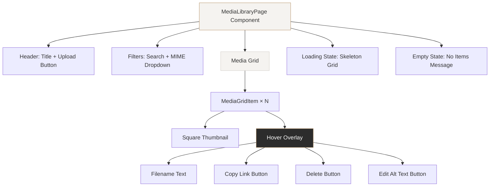

# Design Document: Media Library Compact Grid

## Overview

This design transforms the existing Media Library page (`app/ora-panel/media/page.tsx`) from a 3-column grid with large `aspect-video` cards and inline info panels into a compact 6-column grid with square thumbnails and hover-based action overlays. A new "Copy public link" button is added to each item's overlay, enabling one-click clipboard copy of the `storageUrl`. All existing functionality — upload, search, MIME filter, alt text editing, and delete — is preserved.

The current page is a single `'use client'` component that uses React Query hooks (`useMedia`, `useUploadMedia`, `useDeleteMedia`, `useUpdateMediaAlt`) from `lib/cms/hooks/use-media.ts`. The data model and API layer remain unchanged; this feature is purely a UI refactor of the page component.

### Key Design Decisions

1. **Single-file refactor**: The page remains a single component file. The overlay logic and copy-link behavior are simple enough that extracting separate component files would add indirection without meaningful benefit. If the page grows significantly in the future, extraction can be revisited.
2. **CSS-only responsive grid**: Tailwind responsive prefixes (`grid-cols-2`, `sm:grid-cols-3`, `md:grid-cols-4`, `lg:grid-cols-6`) handle all breakpoint logic without JavaScript resize listeners.
3. **Hover overlay for actions**: Moving action buttons (copy link, delete, alt text) into a hover overlay eliminates the per-item info panel, which is the primary space savings. The overlay uses CSS `group-hover` for zero-JS show/hide.
4. **Clipboard API with fallback feedback**: `navigator.clipboard.writeText()` is used for copy. On success, the icon swaps to a checkmark for 2 seconds. On failure, a brief inline error is shown.

## Architecture

The architecture is a straightforward refactor of the existing single-page component. No new modules, services, or API changes are introduced.



### Responsive Breakpoint Strategy

| Viewport Width | Columns | Tailwind Class |
|---|---|---|
| < 640px | 2 | `grid-cols-2` |
| 640px – 767px | 3 | `sm:grid-cols-3` |
| 768px – 1023px | 4 | `md:grid-cols-4` |
| ≥ 1024px | 6 | `lg:grid-cols-6` |

## Components and Interfaces

### MediaLibraryPage (refactored)

The existing page component is refactored in place. No new exported components are created.

**State additions:**
```typescript
// Tracks which item's copy link is showing success feedback
const [copiedId, setCopiedId] = useState<string | null>(null);
// Tracks which item's copy link failed
const [copyErrorId, setCopyErrorId] = useState<string | null>(null);
```

**New handler:**
```typescript
const handleCopyLink = async (item: MediaItem) => {
  try {
    await navigator.clipboard.writeText(item.storageUrl);
    setCopiedId(item.id);
    setCopyErrorId(null);
    setTimeout(() => setCopiedId(null), 2000);
  } catch {
    setCopyErrorId(item.id);
    setTimeout(() => setCopyErrorId(null), 2000);
  }
};
```

### Grid Item Structure (JSX)

Each media item in the grid renders as:

```
<div class="group relative">                    ← grid cell, hover group
  <div class="aspect-square bg-ora-cream-light border border-ora-sand/60 overflow-hidden">
    
  </div>
  <div class="absolute inset-0 bg-ora-charcoal/70 opacity-0 group-hover:opacity-100
              transition-opacity duration-150 flex flex-col justify-between p-2">
    <div class="flex justify-end gap-1">        ← action buttons row
      <CopyLinkButton />
      <EditAltButton />
      <DeleteButton />
    </div>
    <p class="truncate text-xs text-ora-white">  ← filename
      {filename}
    </p>
  </div>
</div>
```

### Copy Link Button States

| State | Icon | Color | Duration |
|---|---|---|---|
| Default | `Link` (Lucide) | `ora-white` | — |
| Success | `Check` (Lucide) | `ora-gold` | 2 seconds |
| Error | `X` (Lucide) | `ora-error` | 2 seconds |

### Keyboard Accessibility

- The overlay action buttons are rendered as `<button>` elements, making them natively keyboard-focusable.
- Since CSS `opacity-0` hides the overlay visually but keeps elements in the DOM, a `focus-within` variant (`group-focus-within:opacity-100`) ensures the overlay appears when any button inside receives keyboard focus.
- Each button includes an `aria-label` for screen readers (e.g., `"Copy public link for {filename}"`).
- The copy link button includes a `title` attribute for the tooltip: `"Copy public link"`.

### Alt Text Editing

Alt text editing is preserved but moved into the overlay. Clicking the edit-alt button in the overlay opens the existing inline editing UI (input + Save/Cancel buttons) below the thumbnail, outside the overlay. This keeps the editing interaction accessible without trying to fit a text input inside the small overlay.

### Delete Confirmation

The delete flow is preserved: clicking the delete button in the overlay sets `deleteTarget` to the item's ID, which renders a confirmation bar below the thumbnail (outside the overlay), matching the current behavior.

## Data Models

No changes to the data model. The existing `MediaItem` interface from `lib/cms/hooks/use-media.ts` is used as-is:

```typescript
interface MediaItem {
  id: string;
  filename: string;
  altText: string | null;
  mimeType: string;
  fileSize: number;
  width: number | null;
  height: number | null;
  storageUrl: string;
  storageBackend: "local" | "s3" | "r2";
  createdAt: string;
}
```

No new API endpoints, database tables, or query hooks are needed. The `useMedia`, `useUploadMedia`, `useDeleteMedia`, and `useUpdateMediaAlt` hooks remain unchanged.

## Error Handling

| Scenario | Handling |
|---|---|
| Clipboard API not available or permission denied | `handleCopyLink` catch block sets `copyErrorId`, showing an `X` icon on the button for 2 seconds. No toast or modal — the inline icon change is sufficient for this low-severity error. |
| Image fails to load | The `bg-ora-cream-light` background on the thumbnail container remains visible as a placeholder. The overlay and actions still function normally. |
| Upload failure | Handled by existing `useUploadMedia` hook (unchanged). |
| Delete failure | Handled by existing `useDeleteMedia` hook with optimistic rollback (unchanged). |
| Alt text save failure | Handled by existing `useUpdateMediaAlt` hook with optimistic rollback (unchanged). |
| Empty media list | Existing empty state message is preserved with the same styling. |
| Loading state | Skeleton placeholders are updated to use `aspect-square` and the new 6-column grid layout. |

## Testing Strategy

### Why Property-Based Testing Does Not Apply

This feature is a **UI rendering and layout refactor** with a single clipboard side-effect. The changes are:
- CSS grid column counts at different breakpoints (declarative styling)
- Hover overlay show/hide (CSS transitions)
- Clipboard copy with icon feedback (side-effect operation)
- Preserved existing CRUD interactions (already tested)

There are no pure functions with input/output behavior, no data transformations, no parsers or serializers, and no business logic that varies meaningfully across a wide input space. Property-based testing is not appropriate for this feature.

### Unit Tests (Vitest + React Testing Library)

Focus on specific examples and interaction behavior:

1. **Grid renders correct column classes**: Verify the grid container has the expected Tailwind responsive classes (`grid-cols-2 sm:grid-cols-3 md:grid-cols-4 lg:grid-cols-6 gap-2`).
2. **Thumbnail uses square aspect ratio**: Verify each thumbnail container has `aspect-square` class and `object-cover` on the image.
3. **Alt text fallback**: Verify that when `altText` is null, the `img` element uses `filename` as the `alt` attribute.
4. **Copy link calls clipboard API**: Mock `navigator.clipboard.writeText`, click the copy button, verify it was called with the correct `storageUrl`.
5. **Copy success feedback**: After successful copy, verify the button shows a checkmark icon, then reverts after 2 seconds.
6. **Copy failure feedback**: Mock clipboard to reject, click copy, verify error icon appears.
7. **Overlay visibility on hover**: Verify the overlay container has `opacity-0` by default and `group-hover:opacity-100` class.
8. **Keyboard accessibility**: Verify overlay buttons have `aria-label` attributes and the overlay container responds to `focus-within`.
9. **Skeleton loader uses compact layout**: Verify loading state renders skeleton placeholders with `aspect-square` in the 6-column grid.
10. **Delete and alt text editing still work**: Verify the existing delete confirmation and alt text editing flows function correctly in the new layout.

### Manual Testing Checklist

- Resize browser across all breakpoints and verify column counts
- Hover over thumbnails and verify overlay fade-in/out timing
- Tab through grid items and verify overlay appears on focus
- Click copy link and verify clipboard contains the correct URL
- Test copy in a context where clipboard is denied (e.g., HTTP non-localhost)
- Upload, search, filter, edit alt text, and delete in the new layout
- Verify non-image MIME types display gracefully with the cream background
