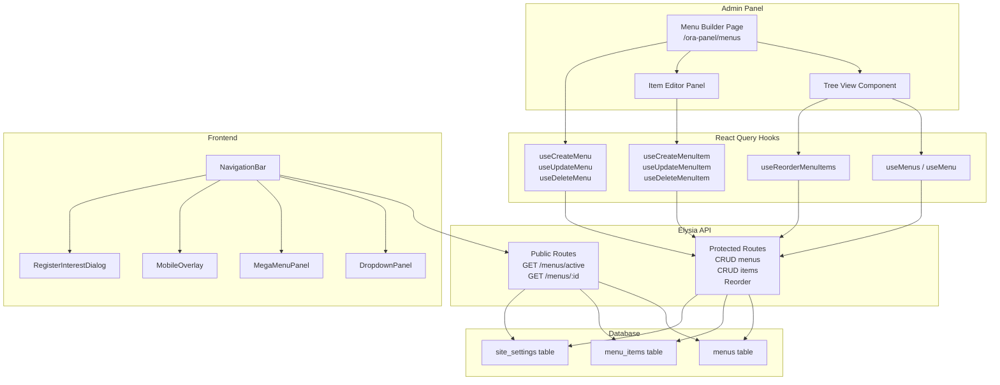
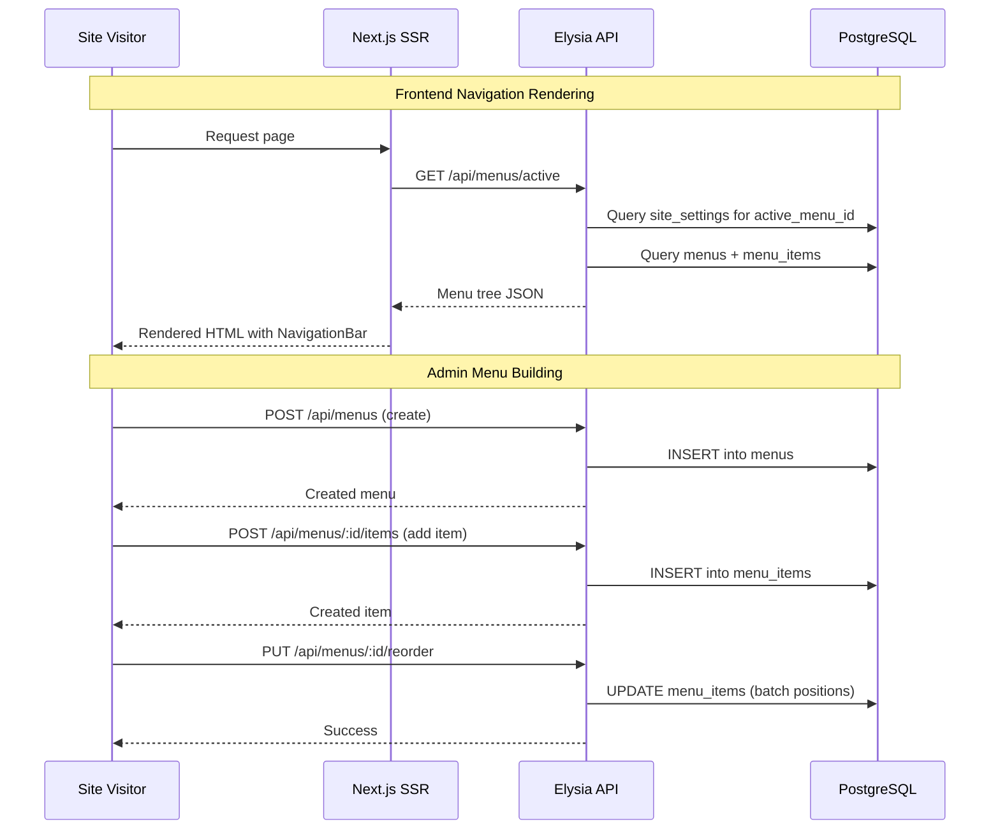
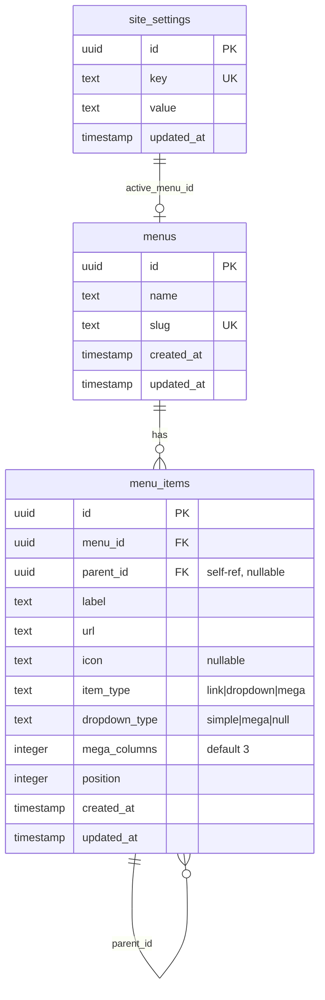

# Design Document: Menu Builder

## Overview

The Menu Builder module adds a complete navigation management system to the ORA CMS platform. It provides admin-side menu construction with drag-and-drop reordering and nesting, and a glassmorphic frontend navigation bar that renders the active menu with dropdowns, mega menus, a CTA button, mobile responsiveness, and RTL support.

The system is composed of three layers:

1. **Data Layer** — Two new Drizzle ORM tables (`menus`, `menu_items`) with a self-referencing parent hierarchy, plus site settings for active menu ID and CTA configuration.
2. **API Layer** — An Elysia plugin (`menusRoutes`) exposing public endpoints for frontend rendering and authenticated endpoints for admin CRUD, item management, and bulk reordering.
3. **UI Layer** — Admin panel menu builder page with tree view and item editor, plus frontend `NavigationBar` component with dropdown/mega menu rendering, mobile overlay, and Register Interest dialog.

### Key Design Decisions

- **Flat table with parent_id** over adjacency list or nested set: simpler to implement, sufficient for max 2-level nesting, and aligns with the existing `categories` self-referencing pattern.
- **Bulk reorder endpoint** over individual position updates: reduces network round-trips during drag-and-drop and ensures atomic position updates within a transaction.
- **SSR fetch for navigation** over client-side query: the navigation bar is above the fold and critical for LCP, so server-side rendering with `fetchActiveMenu()` is preferred.
- **Site settings for CTA and active menu** over dedicated tables: reuses the existing `site_settings` key-value store, keeping the schema minimal.
- **Framer Motion** for all animations: consistent with the existing codebase pattern.

## Architecture



### Data Flow



## Components and Interfaces

### Database Schema Components

#### `menus` table
Stores named menu containers. Each menu has a unique slug derived from its name.

#### `menu_items` table
Stores individual navigation entries with self-referencing `parent_id` for hierarchy. Supports three item types: `link`, `dropdown`, `mega`. Position field controls ordering within a parent group.

### API Components

#### `menusRoutes` (Elysia Plugin)
Follows the established pattern of `publicMenus`, `readMenus`, and `protectedMenus` sub-plugins combined into a single export.

**Public endpoints** (no auth):
- `GET /menus/active` — Returns the active menu with hierarchical items for frontend SSR
- `GET /menus/:id` — Returns a specific menu with hierarchical items

**Read endpoints** (no auth, admin reads):
- `GET /menus` — Lists all menus ordered by creation date

**Protected endpoints** (auth required):
- `POST /menus` — Create menu
- `PUT /menus/:id` — Update menu name/slug
- `DELETE /menus/:id` — Delete menu (cascade deletes items)
- `POST /menus/:id/items` — Add menu item
- `PUT /menus/:id/items/:itemId` — Update menu item
- `DELETE /menus/:id/items/:itemId` — Delete menu item (promotes children)
- `PUT /menus/:id/reorder` — Bulk reorder items
- `POST /menus/:id/set-active` — Set menu as active navigation

### Utility Functions

#### `buildMenuTree(flatItems: MenuItem[]): MenuItemTree[]`
Pure function that converts a flat array of menu items (with `parentId` and `position`) into a nested tree structure. Used by both the API response builder and can be tested independently.

**Algorithm:**
1. Group items by `parentId` (null = root)
2. Sort each group by `position`
3. Recursively attach children to parents
4. Return root-level items

#### `flattenMenuTree(tree: MenuItemTree[]): FlatMenuItem[]`
Inverse of `buildMenuTree`. Converts a nested tree back to a flat array with `parentId` and `position` fields. Used for serialization round-trip validation.

#### `validateNestingDepth(items: { id: string; parentId: string | null }[]): boolean`
Pure function that validates no item exceeds 2 levels of nesting depth. Returns `true` if valid.

#### `fetchActiveMenu(): Promise<MenuWithItems | null>`
Server-side utility (similar to `fetchSiteSettings`) that fetches the active menu from the API for SSR rendering in the layout.

### React Query Hooks

#### `lib/cms/hooks/use-menus.ts`
Follows the established pattern from `use-posts.ts`:

- `menuKeys` — Query key factory
- `useMenus()` — List all menus
- `useMenu(id)` — Single menu with items
- `useActiveMenu()` — Active menu for preview
- `useCreateMenu()` — Create mutation
- `useUpdateMenu()` — Update mutation with optimistic update
- `useDeleteMenu()` — Delete mutation with optimistic removal
- `useCreateMenuItem()` — Add item mutation
- `useUpdateMenuItem()` — Update item mutation with optimistic update
- `useDeleteMenuItem()` — Delete item mutation
- `useReorderMenuItems()` — Bulk reorder mutation with optimistic update
- `useSetActiveMenu()` — Set active menu mutation

### Admin Panel Components

#### `MenuBuilderPage` (`app/ora-panel/menus/page.tsx`)
Main page listing all menus with create/edit/delete actions. Displays a menu selector and the tree view for the selected menu.

#### `MenuTreeView`
Sortable tree component using `@dnd-kit/core` and `@dnd-kit/sortable` for drag-and-drop reordering and nesting. Renders menu items with indentation, expand/collapse for items with children, and drag handles.

#### `MenuItemEditor`
Side panel (or inline form) for editing a selected menu item's properties: label, URL, icon name, item type, dropdown type, mega columns.

#### `AddMenuItemForm`
Form with fields for label, URL, icon (optional Lucide icon name), and item type selector.

### Frontend Components

#### `NavigationBar` (`lib/cms/components/NavigationBar.tsx`)
Server component wrapper that fetches the active menu via `fetchActiveMenu()` and renders `NavigationBarClient`.

#### `NavigationBarClient`
Client component handling:
- Glassmorphic fixed-position bar with `backdrop-blur` and semi-transparent background
- Site logo on the left (link to home)
- Centered menu items from the active menu
- CTA button on the right (from site settings)
- Active state indicator (bold + triangle) based on current pathname
- RTL support via `dir` attribute from parent layout

#### `DropdownPanel`
Renders simple dropdown children as a vertical list. Uses Framer Motion `AnimatePresence` for fade-in/out. 150ms close delay on mouse leave.

#### `MegaMenuPanel`
Renders mega menu children in a multi-column grid (configurable 2-4 columns). Each direct child is a section header with its nested children below. Same animation and delay behavior as `DropdownPanel`.

#### `MobileMenuOverlay`
Full-screen overlay triggered by hamburger icon (below 768px). Vertical list with expandable sub-items (+/- toggle). CTA button at bottom. Slide-in animation via Framer Motion.

#### `RegisterInterestDialog`
Modal dialog following ORA design system pattern: centered Card with `max-w-xl`, backdrop `bg-ora-charcoal/40`. Title "Register Your Interest", placeholder paragraph, close button. Closes on backdrop click, close button, or Escape key.

### Type Definitions

Added to `lib/cms/types.ts`:

```typescript
// Menu item types
export type ItemType = "link" | "dropdown" | "mega";
export type DropdownType = "simple" | "mega";

// Menu item tree node (API response)
export interface MenuItemTree {
  id: string;
  menuId: string;
  parentId: string | null;
  label: string;
  url: string;
  icon: string | null;
  itemType: ItemType;
  dropdownType: DropdownType | null;
  megaColumns: number;
  position: number;
  children: MenuItemTree[];
}

// Menu with nested items (API response)
export interface MenuWithItems {
  id: string;
  name: string;
  slug: string;
  createdAt: string;
  updatedAt: string;
  items: MenuItemTree[];
}

// Flat menu item (database record)
export interface MenuItemRecord {
  id: string;
  menuId: string;
  parentId: string | null;
  label: string;
  url: string;
  icon: string | null;
  itemType: ItemType;
  dropdownType: DropdownType | null;
  megaColumns: number;
  position: number;
  createdAt: string;
  updatedAt: string;
}

// Reorder payload
export interface ReorderItem {
  id: string;
  position: number;
  parentId: string | null;
}
```

Audit types extended:
```typescript
export type AuditEntityType = "page" | "media" | "form" | "settings" | "component_template" | "post" | "category" | "tag" | "menu";
```

## Data Models

### `menus` Table

```typescript
export const menus = pgTable("menus", {
  id: uuid("id").primaryKey().defaultRandom(),
  name: text("name").notNull(),
  slug: text("slug").notNull().unique(),
  createdAt: timestamp("created_at").defaultNow().notNull(),
  updatedAt: timestamp("updated_at").defaultNow().notNull(),
});
```

### `menu_items` Table

```typescript
export const menuItems = pgTable(
  "menu_items",
  {
    id: uuid("id").primaryKey().defaultRandom(),
    menuId: uuid("menu_id")
      .notNull()
      .references(() => menus.id, { onDelete: "cascade" }),
    parentId: uuid("parent_id"),  // self-referencing, nullable
    label: text("label").notNull(),
    url: text("url").notNull().default("#"),
    icon: text("icon"),  // Lucide icon name, nullable
    itemType: text("item_type", { enum: ["link", "dropdown", "mega"] })
      .notNull()
      .default("link"),
    dropdownType: text("dropdown_type", { enum: ["simple", "mega"] }),  // nullable
    megaColumns: integer("mega_columns").notNull().default(3),
    position: integer("position").notNull().default(0),
    createdAt: timestamp("created_at").defaultNow().notNull(),
    updatedAt: timestamp("updated_at").defaultNow().notNull(),
  },
  (table) => [
    index("menu_items_menu_id_idx").on(table.menuId),
    index("menu_items_parent_id_idx").on(table.parentId),
  ]
);
```

### Site Settings Keys

| Key | Value | Description |
|-----|-------|-------------|
| `active_menu_id` | UUID string | ID of the menu rendered in the frontend NavigationBar |
| `nav_cta_label` | string | Label text for the CTA button |
| `nav_cta_url` | string | URL or `#register-interest` for the CTA button |

### Entity Relationship Diagram




## Correctness Properties

*A property is a characteristic or behavior that should hold true across all valid executions of a system — essentially, a formal statement about what the system should do. Properties serve as the bridge between human-readable specifications and machine-verifiable correctness guarantees.*

### Property 1: Slug generation produces valid URL-safe slugs

*For any* non-empty menu name string, `generateSlug(name)` SHALL produce a non-empty string containing only lowercase alphanumeric characters and hyphens, with no leading or trailing hyphens.

**Validates: Requirements 1.1**

### Property 2: Menu tree build/flatten round-trip

*For any* valid flat array of menu items (with consistent `parentId` references and `position` values), `flattenMenuTree(buildMenuTree(items))` SHALL produce an array containing the same items with equivalent `id`, `parentId`, and `position` values as the original input.

**Validates: Requirements 1.5, 13.7**

### Property 3: New item position auto-assignment

*For any* menu with N existing items at a given parent level, adding a new menu item to that parent level SHALL assign it position N (zero-indexed), making it the last item in that group.

**Validates: Requirements 2.1**

### Property 4: Delete item promotes children and preserves count minus one

*For any* menu tree and any non-leaf menu item selected for deletion, after deletion: (a) all former children of the deleted item SHALL have their `parentId` set to the deleted item's former `parentId`, and (b) the total item count SHALL equal the original count minus one.

**Validates: Requirements 2.4**

### Property 5: dropdown_type consistency with item_type

*For any* menu item after any create or update operation, the `dropdown_type` field SHALL be `null` when `item_type` is `"link"`, `"simple"` when `item_type` is `"dropdown"`, and `"mega"` when `item_type` is `"mega"`.

**Validates: Requirements 2.5, 2.6, 2.7, 12.5**

### Property 6: Maximum nesting depth validation

*For any* set of menu items with `parentId` references, `validateNestingDepth(items)` SHALL return `true` if and only if no item has a nesting depth exceeding 2 levels (root=0, child=1, grandchild=2).

**Validates: Requirements 3.4, 3.5**

### Property 7: Reorder preserves item count

*For any* menu with N items and any valid bulk reorder operation (array of `{ id, position, parentId }` covering all items), the total count of menu items after reordering SHALL equal N.

**Validates: Requirements 3.7**

### Property 8: Link items cannot have children

*For any* menu tree, no menu item of `item_type` `"link"` SHALL have any children (items with `parentId` pointing to it).

**Validates: Requirements 4.5**

### Property 9: Active state URL matching

*For any* menu item URL and current page URL, the active state detection function SHALL return `true` if and only if the current URL matches the menu item URL exactly or is a path-prefix match (for non-root URLs).

**Validates: Requirements 5.5**

## Error Handling

### API Error Responses

All API errors follow the established pattern: `set.status = 4xx; return { error: "message" }`.

| Scenario | Status | Message |
|----------|--------|---------|
| Create menu without name | 400 | "Name is required" |
| Create menu with duplicate name | 409 | "Menu with this name already exists" |
| Menu not found (GET/PUT/DELETE) | 404 | "Menu not found" |
| Add item without label | 400 | "Label is required" |
| Menu item not found | 404 | "Menu item not found" |
| Reorder with invalid item IDs | 400 | "Invalid item IDs for this menu" |
| Reorder exceeds nesting depth | 400 | "Maximum nesting depth exceeded" |
| Assign children to link item | 400 | "Cannot assign children to a link item" |

### Frontend Error Handling

- **Failed menu fetch (SSR):** `fetchActiveMenu()` returns `null` on error, NavigationBar renders empty navigation (logo + CTA only) — graceful degradation.
- **Failed menu fetch (admin):** React Query `isError` state displays an error message with retry button.
- **Failed mutation (admin):** Optimistic updates roll back on error, toast notification shows error message.
- **Invalid drag-and-drop:** Client-side validation prevents invalid nesting before sending reorder request. If server rejects, optimistic state rolls back.

## Testing Strategy

### Property-Based Tests

Property-based testing is appropriate for this feature because it contains several pure functions (`buildMenuTree`, `flattenMenuTree`, `validateNestingDepth`, `generateSlug`, active URL matching) and clear invariants (dropdown_type consistency, item count preservation, nesting depth limits).

**Library:** [fast-check](https://github.com/dubzzz/fast-check) (already available in the ecosystem for TypeScript/Bun)

**Configuration:**
- Minimum 100 iterations per property test
- Each test tagged with: `Feature: menu-builder, Property {number}: {property_text}`

**Property test files:**
- `lib/cms/menu-builder/tree.property.test.ts` — Properties 2, 6, 8 (tree building, nesting validation, link children)
- `lib/cms/menu-builder/reorder.property.test.ts` — Properties 4, 7 (delete promotion, reorder count)
- `lib/cms/menu-builder/invariants.property.test.ts` — Properties 1, 3, 5, 9 (slug generation, position assignment, dropdown_type consistency, active URL matching)

### Unit Tests (Example-Based)

- Menu CRUD validation (empty name, duplicate name, not found)
- Menu item CRUD validation (empty label, not found)
- CTA button conditional rendering (no label → hidden, `#register-interest` → dialog)
- Register Interest dialog open/close behavior
- Mobile menu overlay toggle behavior
- Mega menu column count selector (2, 3, 4)

### Integration Tests

- Full menu CRUD lifecycle (create → add items → reorder → delete)
- Active menu setting and frontend rendering
- Audit logging for menu operations
- CTA settings persistence in site_settings
- Cascade delete (menu deletion removes all items)
- API authentication enforcement on protected endpoints

### Component Tests

- NavigationBar rendering with menu data (desktop and mobile viewports)
- Dropdown and mega menu hover/keyboard interactions
- RTL layout mirroring
- MenuTreeView drag-and-drop behavior
- MenuItemEditor form validation
