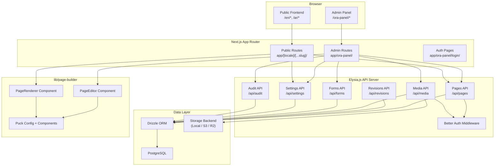
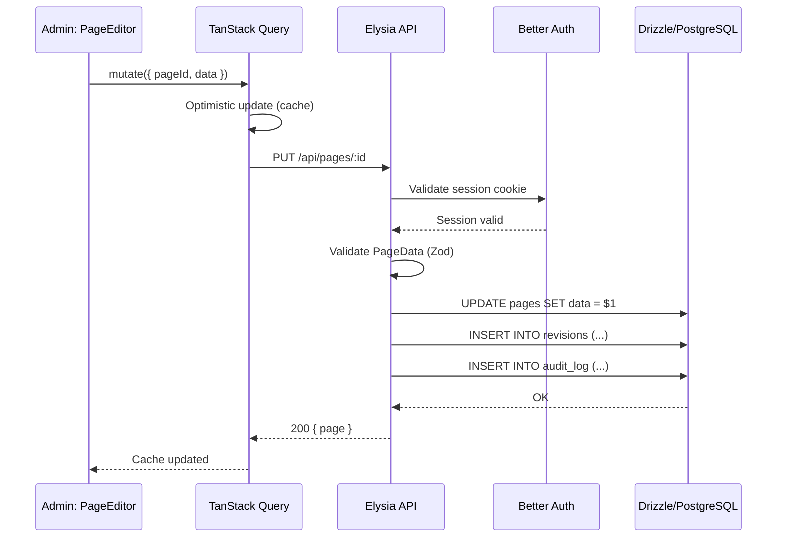
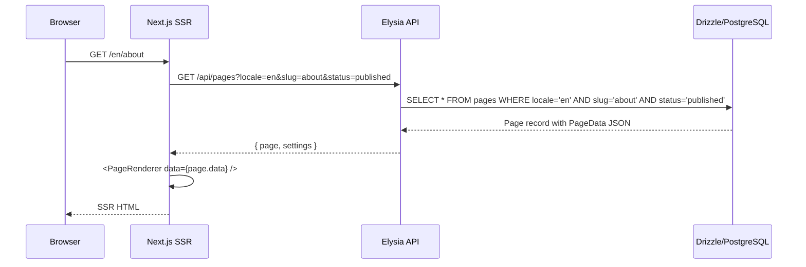
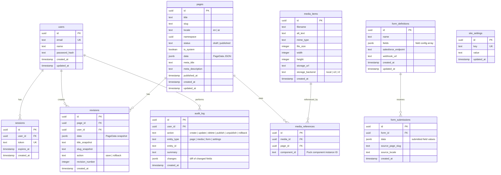

# Design Document: ORA CMS Platform

## Overview

The ORA CMS Platform is a full content management system layered on top of the existing Puck visual page builder module (`lib/page-builder/`). It adds a complete admin panel, multilingual page management (EN/AR), media library, form builder, site settings, authentication, versioning, and a public SSR frontend.

The system follows a three-tier architecture:

1. **Database Layer** — Drizzle ORM schemas on PostgreSQL, providing typed table definitions, migrations, and query building
2. **API Layer** — Elysia.js REST API with request/response validation derived from Drizzle schemas, Better Auth session guards, and structured error responses
3. **Frontend Layer** — Next.js App Router serving both the admin panel (`/ora-panel/*`) and the public locale-prefixed site (`/en/*`, `/ar/*`)

### Key Design Decisions

1. **Elysia.js as a standalone API server**: Elysia runs as a separate Bun process alongside Next.js. Next.js handles SSR and static routes; Elysia handles all data mutations and reads. This keeps the API type-safe end-to-end (Drizzle → Elysia → TanStack Query) without mixing Next.js server actions with REST endpoints.

2. **Namespace-based locale pairing**: Pages are grouped by a `namespace` UUID. Each namespace has at most two page records (one per locale). This avoids complex translation table joins and makes locale-pair queries a simple `WHERE namespace = ?`.

3. **Revision as append-only log**: Every save creates a new revision row. Rollback creates yet another revision pointing to the restored snapshot. No revision is ever mutated or deleted (except on page deletion via cascade).

4. **Storage backend abstraction**: Media uploads go through a `StorageBackend` interface with implementations for local filesystem, S3, and R2. The active backend is selected via environment variable.

5. **Page builder consumed as-is**: The existing `lib/page-builder/` module (PageEditor, PageRenderer, config, schema) is used directly. The CMS provides a `DataStore` implementation backed by the Elysia API, replacing the in-memory store.

6. **TanStack Query with optimistic updates**: All admin panel mutations use `useMutation` with `onMutate` optimistic handlers and `onError` rollback. This gives instant UI feedback while the API call completes.

7. **Better Auth with session cookies**: Authentication uses Better Auth's built-in session management. The Elysia API validates session cookies on mutating endpoints. Public read endpoints are unauthenticated.

## Architecture



### Request Flow: Page Save



### Request Flow: Public Page Render



## Components and Interfaces

### 1. Database Connection (`lib/cms/db.ts`)

```typescript
import { drizzle } from "drizzle-orm/node-postgres";
import * as schema from "./schema";

export const db = drizzle(process.env.DATABASE_URL!, { schema });
export type Database = typeof db;
```

### 2. Storage Backend (`lib/cms/storage.ts`)

```typescript
export interface StorageBackend {
  upload(file: Buffer, filename: string, mimeType: string): Promise<string>; // returns URL
  delete(url: string): Promise<void>;
}

export class LocalStorageBackend implements StorageBackend { /* writes to public/uploads/ */ }
export class S3StorageBackend implements StorageBackend { /* uses AWS SDK */ }
export class R2StorageBackend implements StorageBackend { /* uses Cloudflare R2 */ }

export function createStorageBackend(): StorageBackend {
  switch (process.env.STORAGE_BACKEND) {
    case "s3": return new S3StorageBackend();
    case "r2": return new R2StorageBackend();
    default: return new LocalStorageBackend();
  }
}
```

### 3. Elysia API App (`lib/cms/api/index.ts`)

```typescript
import { Elysia } from "elysia";
import { pagesRoutes } from "./routes/pages";
import { mediaRoutes } from "./routes/media";
import { formsRoutes } from "./routes/forms";
import { settingsRoutes } from "./routes/settings";
import { auditRoutes } from "./routes/audit";
import { revisionsRoutes } from "./routes/revisions";
import { authPlugin } from "./auth";

export const api = new Elysia({ prefix: "/api" })
  .use(authPlugin)
  .use(pagesRoutes)
  .use(revisionsRoutes)
  .use(mediaRoutes)
  .use(formsRoutes)
  .use(settingsRoutes)
  .use(auditRoutes);
```

### 4. Pages API Routes (`lib/cms/api/routes/pages.ts`)

```typescript
// Key endpoints:
// GET    /api/pages              — List pages (filterable by locale, status, namespace)
// GET    /api/pages/:id          — Get single page with PageData
// POST   /api/pages              — Create page (auth required)
// PUT    /api/pages/:id          — Update page + create revision (auth required)
// DELETE /api/pages/:id          — Delete page + cascade (auth required)
// POST   /api/pages/:id/publish  — Publish page (auth required)
// POST   /api/pages/:id/unpublish — Unpublish page (auth required)
// POST   /api/pages/:id/clone-locale — Create locale pair (auth required)
// GET    /api/pages/public/:locale/:slug — Public page fetch (no auth)
```

### 5. Admin Panel TanStack Query Hooks (`lib/cms/hooks/`)

```typescript
// usePages() — list with filters, optimistic create/delete
// usePage(id) — single page query
// useUpdatePage() — mutation with optimistic cache update
// usePublishPage() — publish mutation
// useRevisions(pageId) — revision history
// useRollback() — rollback mutation
// useMedia() — media list with search
// useUploadMedia() — upload mutation
// useFormSubmissions() — submissions list
// useSiteSettings() — settings query + mutation
// useAuditLog() — audit entries with filters
```

### 6. CMS DataStore Adapter (`lib/cms/data-store-adapter.ts`)

Implements the existing `DataStore` interface from `lib/page-builder/` but delegates to the Elysia API:

```typescript
import type { DataStore } from "@/lib/page-builder";
import type { PageData } from "@/lib/page-builder";

export class ApiDataStore implements DataStore {
  constructor(private baseUrl: string) {}

  async save(pageId: string, data: PageData): Promise<void> {
    await fetch(`${this.baseUrl}/api/pages/${pageId}`, {
      method: "PUT",
      headers: { "Content-Type": "application/json" },
      body: JSON.stringify({ data }),
      credentials: "include",
    });
  }

  async load(pageId: string): Promise<PageData | null> {
    const res = await fetch(`${this.baseUrl}/api/pages/${pageId}`);
    if (!res.ok) return null;
    const page = await res.json();
    return page.data;
  }

  async delete(pageId: string): Promise<void> {
    await fetch(`${this.baseUrl}/api/pages/${pageId}`, {
      method: "DELETE",
      credentials: "include",
    });
  }
}
```

### 7. Slug Generation (`lib/cms/utils/slug.ts`)

```typescript
import slugify from "slugify";

export function generateSlug(title: string): string {
  return slugify(title, { lower: true, strict: true });
}

export async function ensureUniqueSlug(
  baseSlug: string,
  existingSlugs: string[]
): Promise<string> {
  if (!existingSlugs.includes(baseSlug)) return baseSlug;
  let counter = 1;
  while (existingSlugs.includes(`${baseSlug}-${counter}`)) counter++;
  return `${baseSlug}-${counter}`;
}
```

### 8. Audit Logger (`lib/cms/audit.ts`)

```typescript
export type AuditAction = "create" | "update" | "delete" | "publish" | "unpublish" | "rollback";
export type AuditEntityType = "page" | "media" | "form" | "settings";

export interface AuditLogEntry {
  userId: string;
  action: AuditAction;
  entityType: AuditEntityType;
  entityId: string;
  summary: string;
  timestamp: Date;
}

export async function logAudit(db: Database, entry: AuditLogEntry): Promise<void>;
```

### 9. First-Run Seeder (`lib/cms/seed.ts`)

```typescript
export async function seedSystemPages(db: Database): Promise<void> {
  // Check if any pages exist
  // If not, create Home (slug: "/") and Contact (slug: "contact")
  // in both EN and AR locales, marked as system pages
}
```

### 10. Admin Panel Layout (`app/ora-panel/layout.tsx`)

```typescript
// Wraps all admin routes with:
// - Auth session check (redirect to login if unauthenticated)
// - Sidebar navigation (Dashboard, Pages, Media, Submissions, Settings, Audit)
// - TanStack QueryClientProvider
// - ORA design system theme
```

### 11. Public Frontend Layout (`app/[locale]/layout.tsx`)

```typescript
// Wraps all public routes with:
// - Locale validation (en | ar), 404 for invalid
// - HTML dir="rtl" for AR locale
// - Arabic font loading for AR
// - Site settings injection via React context
```

## Data Models

### Drizzle ORM Schema



### Drizzle Table Definitions (`lib/cms/schema.ts`)

```typescript
import { pgTable, uuid, text, boolean, jsonb, integer, timestamp, uniqueIndex, index } from "drizzle-orm/pg-core";

export const users = pgTable("users", {
  id: uuid("id").primaryKey().defaultRandom(),
  email: text("email").notNull().unique(),
  name: text("name").notNull(),
  passwordHash: text("password_hash").notNull(),
  createdAt: timestamp("created_at").defaultNow().notNull(),
  updatedAt: timestamp("updated_at").defaultNow().notNull(),
});

export const sessions = pgTable("sessions", {
  id: uuid("id").primaryKey().defaultRandom(),
  userId: uuid("user_id").notNull().references(() => users.id),
  token: text("token").notNull().unique(),
  expiresAt: timestamp("expires_at").notNull(),
  createdAt: timestamp("created_at").defaultNow().notNull(),
});

export const pages = pgTable("pages", {
  id: uuid("id").primaryKey().defaultRandom(),
  title: text("title").notNull(),
  slug: text("slug").notNull(),
  locale: text("locale", { enum: ["en", "ar"] }).notNull(),
  namespace: uuid("namespace").notNull(),
  status: text("status", { enum: ["draft", "published"] }).notNull().default("draft"),
  isSystem: boolean("is_system").notNull().default(false),
  data: jsonb("data").notNull(), // PageData JSON
  metaTitle: text("meta_title"),
  metaDescription: text("meta_description"),
  publishedAt: timestamp("published_at"),
  createdAt: timestamp("created_at").defaultNow().notNull(),
  updatedAt: timestamp("updated_at").defaultNow().notNull(),
}, (table) => [
  uniqueIndex("pages_slug_locale_idx").on(table.slug, table.locale),
  index("pages_namespace_idx").on(table.namespace),
  index("pages_status_idx").on(table.status),
]);

export const revisions = pgTable("revisions", {
  id: uuid("id").primaryKey().defaultRandom(),
  pageId: uuid("page_id").notNull().references(() => pages.id, { onDelete: "cascade" }),
  userId: uuid("user_id").notNull().references(() => users.id),
  data: jsonb("data").notNull(),
  titleSnapshot: text("title_snapshot").notNull(),
  slugSnapshot: text("slug_snapshot").notNull(),
  action: text("action", { enum: ["save", "rollback"] }).notNull().default("save"),
  revisionNumber: integer("revision_number").notNull(),
  createdAt: timestamp("created_at").defaultNow().notNull(),
}, (table) => [
  index("revisions_page_id_idx").on(table.pageId),
]);

export const mediaItems = pgTable("media_items", {
  id: uuid("id").primaryKey().defaultRandom(),
  filename: text("filename").notNull(),
  altText: text("alt_text").default(""),
  mimeType: text("mime_type").notNull(),
  fileSize: integer("file_size").notNull(),
  width: integer("width"),
  height: integer("height"),
  storageUrl: text("storage_url").notNull(),
  storageBackend: text("storage_backend", { enum: ["local", "s3", "r2"] }).notNull(),
  createdAt: timestamp("created_at").defaultNow().notNull(),
});

export const mediaReferences = pgTable("media_references", {
  id: uuid("id").primaryKey().defaultRandom(),
  mediaId: uuid("media_id").notNull().references(() => mediaItems.id),
  pageId: uuid("page_id").notNull().references(() => pages.id, { onDelete: "cascade" }),
  componentId: text("component_id").notNull(),
}, (table) => [
  index("media_refs_media_id_idx").on(table.mediaId),
  index("media_refs_page_id_idx").on(table.pageId),
]);

export const formDefinitions = pgTable("form_definitions", {
  id: uuid("id").primaryKey().defaultRandom(),
  name: text("name").notNull(),
  fields: jsonb("fields").notNull(), // FormFieldConfig[]
  salesforceEndpoint: text("salesforce_endpoint"),
  webhookUrl: text("webhook_url"),
  createdAt: timestamp("created_at").defaultNow().notNull(),
  updatedAt: timestamp("updated_at").defaultNow().notNull(),
});

export const formSubmissions = pgTable("form_submissions", {
  id: uuid("id").primaryKey().defaultRandom(),
  formId: uuid("form_id").notNull().references(() => formDefinitions.id),
  data: jsonb("data").notNull(),
  sourcePageSlug: text("source_page_slug"),
  sourceLocale: text("source_locale"),
  createdAt: timestamp("created_at").defaultNow().notNull(),
});

export const siteSettings = pgTable("site_settings", {
  id: uuid("id").primaryKey().defaultRandom(),
  key: text("key").notNull().unique(),
  value: text("value").notNull().default(""),
  updatedAt: timestamp("updated_at").defaultNow().notNull(),
});

export const auditLog = pgTable("audit_log", {
  id: uuid("id").primaryKey().defaultRandom(),
  userId: uuid("user_id").notNull().references(() => users.id),
  action: text("action").notNull(), // create | update | delete | publish | unpublish | rollback
  entityType: text("entity_type").notNull(), // page | media | form | settings
  entityId: text("entity_id").notNull(),
  summary: text("summary").notNull(),
  changes: jsonb("changes"), // { field: { old, new } }
  createdAt: timestamp("created_at").defaultNow().notNull(),
}, (table) => [
  index("audit_log_entity_type_idx").on(table.entityType),
  index("audit_log_created_at_idx").on(table.createdAt),
  index("audit_log_user_id_idx").on(table.userId),
]);
```

### TypeScript Types (`lib/cms/types.ts`)

```typescript
import type { PageData } from "@/lib/page-builder";

// Locale
export type Locale = "en" | "ar";
export const LOCALES: Locale[] = ["en", "ar"];
export const DEFAULT_LOCALE: Locale = "en";

// Page status
export type PageStatus = "draft" | "published";

// Form field types
export type FormFieldType = "text" | "email" | "phone" | "textarea" | "select" | "checkbox" | "radio";

export interface FormFieldConfig {
  name: string;
  label: string;
  type: FormFieldType;
  required: boolean;
  placeholder?: string;
  options?: string[]; // for select, radio
}

// Audit
export type AuditAction = "create" | "update" | "delete" | "publish" | "unpublish" | "rollback";
export type AuditEntityType = "page" | "media" | "form" | "settings";

// API response wrappers
export interface ApiResponse<T> {
  data: T;
}

export interface ApiError {
  error: string;
  details?: Record<string, string>;
}

// Page with locale completion info for admin list
export interface PageNamespaceGroup {
  namespace: string;
  slug: string;
  isSystem: boolean;
  locales: {
    en?: { id: string; title: string; status: PageStatus };
    ar?: { id: string; title: string; status: PageStatus };
  };
}
```

### Admin Panel Route Structure

```
app/ora-panel/
├── layout.tsx              — Auth guard + sidebar + QueryClientProvider
├── page.tsx                — Dashboard (stats overview)
├── login/
│   └── page.tsx            — Login form
├── pages/
│   ├── page.tsx            — Page index (namespace groups with locale indicators)
│   ├── new/
│   │   └── page.tsx        — Create new page form
│   └── [id]/
│       ├── page.tsx        — Page detail (metadata, status, revisions)
│       ├── edit/
│       │   └── page.tsx    — Embedded PageEditor
│       └── revisions/
│           └── page.tsx    — Revision history + rollback
├── media/
│   └── page.tsx            — Media library (grid, upload, search)
├── submissions/
│   └── page.tsx            — Form submissions viewer
├── settings/
│   └── page.tsx            — Site settings editor
└── audit/
    └── page.tsx            — Audit log viewer with filters
```

### Public Frontend Route Structure

```
app/
├── (en)/                   — Route group for EN (no URL segment, serves at root)
│   ├── layout.tsx          — dir="ltr", EN settings context, hreflang tags
│   ├── page.tsx            — EN Home page (domain.com/)
│   └── [...slug]/
│       └── page.tsx        — EN pages (domain.com/about)
├── ar/                     — AR route segment (domain.com/ar/*)
│   ├── layout.tsx          — dir="rtl", AR font, AR settings context, hreflang tags
│   ├── page.tsx            — AR Home page (domain.com/ar/)
│   └── [...slug]/
│       └── page.tsx        — AR pages (domain.com/ar/about)
├── ora-panel/              — Admin panel (no conflict)
└── not-found.tsx           — 404 page
```


## Correctness Properties

*A property is a characteristic or behavior that should hold true across all valid executions of a system — essentially, a formal statement about what the system should do. Properties serve as the bridge between human-readable specifications and machine-verifiable correctness guarantees.*

### Property 1: Slug generation produces URL-safe deterministic output

*For any* non-empty title string, generating a slug via `generateSlug(title)` SHALL produce a lowercase string containing only alphanumeric characters and hyphens, and calling `generateSlug` again with the same title SHALL produce the same slug.

**Validates: Requirements 2.1**

### Property 2: Slug deduplication ensures uniqueness

*For any* base slug and any set of existing slugs, `ensureUniqueSlug(baseSlug, existingSlugs)` SHALL return a slug that is not present in the existing set. If the base slug is not in the set, it SHALL be returned as-is. If it is in the set, the returned slug SHALL follow the pattern `{baseSlug}-{N}` where N is a positive integer.

**Validates: Requirements 2.2**

### Property 3: PageData JSON round-trip integrity

*For any* valid PageData object, serializing it to JSON via `JSON.stringify` and parsing it back via `JSON.parse` SHALL produce an object deeply equal to the original.

**Validates: Requirements 2.6, 14.6**

### Property 4: Page CRUD round-trip

*For any* valid page title, slug, locale, and PageData, creating a page via the API and then reading it back SHALL return a page with matching title, slug, locale, and data. Updating the page with new valid values and reading again SHALL reflect the updates. Deleting the page SHALL make it no longer retrievable.

**Validates: Requirements 2.4**

### Property 5: Cascade delete removes all associated records

*For any* page that has one or more revisions and audit entries, deleting the page SHALL also delete all associated revisions. After deletion, querying revisions by the deleted page's ID SHALL return an empty result.

**Validates: Requirements 2.7, 5.6, 15.4**

### Property 6: System page deletion protection

*For any* page marked with `isSystem = true`, attempting to delete it via the API SHALL be rejected with an error, and the page SHALL remain in the database unchanged.

**Validates: Requirements 3.2, 3.3**

### Property 7: Draft/publish/unpublish lifecycle

*For any* newly created page, its initial status SHALL be "draft" with a null `publishedAt`. Publishing it SHALL change status to "published" and set a non-null `publishedAt` timestamp. Unpublishing it SHALL change status back to "draft".

**Validates: Requirements 4.1, 4.2, 4.3**

### Property 8: Public visibility excludes draft pages

*For any* set of pages with mixed draft and published statuses, querying the public page endpoint SHALL return only pages with status "published". No draft page SHALL appear in public query results.

**Validates: Requirements 4.4, 4.5, 8.4, 13.5**

### Property 9: Rollback restores revision data and creates new revision

*For any* page with two or more revisions, rolling back to a previous revision SHALL replace the page's current PageData with that revision's snapshot data, AND SHALL create a new revision with action "rollback" containing the restored data.

**Validates: Requirements 5.5**

### Property 10: Mutating actions create audit entries

*For any* mutating action (create, update, delete, publish, unpublish, rollback) performed on any entity, an audit log entry SHALL be created containing the correct user ID, action type, entity type, entity ID, and a timestamp not earlier than the action's start time.

**Validates: Requirements 6.1**

### Property 11: Audit log filtering returns matching entries

*For any* set of audit entries and any filter combination (entity type, action type, user ID, date range), the filtered results SHALL contain only entries that match ALL specified filter criteria, and SHALL contain every entry that matches all criteria.

**Validates: Requirements 6.3**

### Property 12: Locale clone produces correct AR page

*For any* EN page with any valid PageData, creating the AR locale version SHALL produce a new page with the same namespace, same slug, locale "ar", and PageData deeply equal to the EN page's data. The two pages SHALL share the same namespace UUID.

**Validates: Requirements 7.3, 7.6**

### Property 13: Locale completion indicator logic

*For any* namespace group, the completion indicator SHALL be: green when all locale versions are published, amber when exactly one locale version is published, and gray when no locale version is published.

**Validates: Requirements 7.4**

### Property 14: URL resolution with default language

*For any* published EN page slug, the URL `/{slug}` SHALL resolve to the correct EN page. *For any* published AR page slug, the URL `/ar/{slug}` SHALL resolve to the correct AR page. The root URL `/` SHALL resolve to the EN home page without redirect. The URL `/ar/` SHALL resolve to the AR home page.

**Validates: Requirements 8.1, 8.2, 8.3, 8.5, 8.8**

### Property 15: Media upload creates complete record

*For any* valid image file with known dimensions, uploading it SHALL create a media item record containing the original filename, correct MIME type, file size, dimensions, a non-empty alt text, and a valid storage URL that can be used to retrieve the file.

**Validates: Requirements 9.2**

### Property 16: Media search filters correctly

*For any* set of media items and any search query string, the search results SHALL contain only items whose filename or alt text contains the query string (case-insensitive), and SHALL contain every item that matches.

**Validates: Requirements 9.3**

### Property 17: Media deletion respects references

*For any* media item that is referenced by one or more pages, deletion SHALL be rejected and the error response SHALL list the referencing page IDs. For any media item with zero page references, deletion SHALL succeed and remove both the database record and the stored file.

**Validates: Requirements 9.5, 9.6**

### Property 18: Form submission validation and storage

*For any* form definition with required fields and any submission data, if all required fields are present and valid, the submission SHALL be stored as a form_submission record. If any required field is missing or invalid, the submission SHALL be rejected with field-level error messages for each invalid field.

**Validates: Requirements 10.3, 10.7**

### Property 19: Site settings key-value round-trip

*For any* key-value pair, setting it via the API and reading it back SHALL return the same value. Updating the value and reading again SHALL return the updated value.

**Validates: Requirements 11.1**

### Property 20: Missing setting key renders empty string

*For any* key that does not exist in the site_settings table, requesting its value SHALL return an empty string rather than an error or null.

**Validates: Requirements 11.5**

### Property 21: SEO meta tags from page metadata

*For any* published page with non-empty metaTitle and metaDescription, the server-rendered HTML SHALL contain a `<title>` tag with the metaTitle value, and `<meta>` tags for `og:title` and `og:description` with the corresponding values.

**Validates: Requirements 13.4**

### Property 22: Auth required for mutating endpoints

*For any* mutating API endpoint (POST, PUT, DELETE on pages, media, forms, settings), sending a request without a valid session cookie SHALL return a 401 Unauthorized response and SHALL NOT modify any data.

**Validates: Requirements 14.4**

### Property 23: API rejects invalid input with descriptive errors

*For any* API endpoint that accepts a request body, sending a body that violates the validation schema SHALL return a 400 response with an error message describing which fields are invalid.

**Validates: Requirements 14.3**

## Error Handling

### API Layer Errors

- **Validation errors (400)**: Elysia request validation returns structured `{ error: string, details: { field: message } }` responses. The admin panel displays field-level errors in forms.
- **Authentication errors (401)**: Missing or expired session returns 401. The admin panel redirects to login. TanStack Query `onError` handlers detect 401 and trigger a global redirect.
- **Authorization errors (403)**: Attempting to delete a system page returns 403 with a descriptive message.
- **Not found (404)**: Requesting a non-existent entity returns 404. The admin panel shows a "not found" state. The public frontend shows the 404 page.
- **Conflict (409)**: Slug conflicts on page creation return 409 with the conflicting slug. The admin panel offers to auto-generate an alternative.
- **Server errors (500)**: Unexpected errors are caught by Elysia's error handler, logged, and returned as generic 500 responses. No internal details are leaked.

### Database Errors

- **Connection failures**: The Drizzle client retries transient connection errors. If the database is unreachable, the API returns 503 Service Unavailable.
- **Constraint violations**: Foreign key and unique constraint violations are caught and mapped to appropriate HTTP status codes (409 for unique, 400 for FK).
- **Migration failures**: Drizzle migrations run at startup. If a migration fails, the API server refuses to start and logs the error.

### Storage Backend Errors

- **Upload failures**: If the storage backend (S3/R2/local) fails during upload, the API returns 500 and does not create a media_items record (atomic operation).
- **Delete failures**: If file deletion fails but the DB record is deleted, the orphaned file is logged for manual cleanup. The reverse (file deleted, DB fails) is prevented by deleting the DB record first.

### Client-Side Error Handling

- **Optimistic update rollback**: TanStack Query mutations use `onMutate` to snapshot the cache, `onError` to restore the snapshot, and `onSettled` to invalidate queries. Failed mutations show a toast notification.
- **Network errors**: A global error boundary catches unhandled fetch failures and displays a retry prompt.
- **Form validation**: Client-side validation runs before submission. Server-side validation errors are mapped back to form fields.

### Page Builder Errors

- **Invalid PageData on load**: If the API returns PageData that fails Zod validation, the editor shows an error state with an option to reset to a blank page or load the last valid revision.
- **Save failures**: If the save API call fails, the editor preserves the current state and shows a retry button. No data is lost.

## Testing Strategy

### Unit Tests

Unit tests cover specific examples, edge cases, and error conditions:

- **Slug generation**: Edge cases — empty string, special characters, Unicode, very long titles, titles that are already URL-safe
- **Slug deduplication**: Specific collision scenarios — 1 conflict, multiple sequential conflicts, slug-1 already taken
- **Locale completion indicator**: All combinations — both published, one published, none published, mixed draft/published
- **Form field validation**: Each field type with valid and invalid inputs
- **Audit log entry creation**: Verify all required fields are populated for each action type
- **Settings default value**: Missing key returns empty string
- **SEO meta tag generation**: Pages with/without meta fields, special characters in meta values
- **Auth middleware**: Valid session, expired session, no session, malformed token
- **System page protection**: Delete attempt on system page, edit/publish/unpublish on system page

### Property-Based Tests

Property-based tests verify universal properties across randomly generated inputs. Use `fast-check` (already installed) as the PBT library.

- Minimum **100 iterations** per property test
- Each test references its design document property via tag comment
- Tag format: `Feature: ora-cms-platform, Property {N}: {title}`

**Properties to implement:**

| Property | What it tests | Generator strategy |
|----------|--------------|-------------------|
| 1: Slug generation | URL-safe, deterministic output | Random Unicode strings, alphanumeric strings, strings with spaces/special chars |
| 2: Slug deduplication | Uniqueness guarantee | Random base slugs + random arrays of existing slugs |
| 3: PageData JSON round-trip | `JSON.parse(JSON.stringify(data)) ≡ data` | Generate arbitrary valid PageData trees (random components, props, zones) |
| 4: Page CRUD round-trip | Create → read → update → read → delete | Random titles, slugs, locales, PageData |
| 5: Cascade delete | Page delete removes revisions | Random pages with random revision counts |
| 6: System page protection | System pages cannot be deleted | Random system pages with delete attempts |
| 7: Draft/publish lifecycle | draft → published → draft transitions | Random page creation inputs |
| 8: Public visibility | Only published pages in public results | Random pages with random statuses |
| 9: Rollback | Restores data + creates revision | Random pages with multiple revisions |
| 10: Audit entries | Every mutation creates audit entry | Random mutations on random entities |
| 11: Audit filtering | Filters return correct subset | Random audit entries + random filter combos |
| 12: Locale clone | AR clone matches EN data | Random EN pages with random PageData |
| 13: Locale completion | Indicator logic correct | Random namespace groups with random statuses |
| 14: URL resolution | Locale prefix routing | Random slugs + valid/invalid locales |
| 15: Media upload | Record has all metadata | Random file metadata |
| 16: Media search | Search returns matching items | Random media items + random queries |
| 17: Media deletion | Respects references | Random media with/without references |
| 18: Form validation | Valid stored, invalid rejected | Random form definitions + random submissions |
| 19: Settings round-trip | Set → get returns same value | Random key-value pairs |
| 20: Missing setting | Returns empty string | Random non-existent keys |
| 21: SEO meta tags | HTML contains correct tags | Random page metadata |
| 22: Auth guard | Mutations rejected without session | Random mutating requests |
| 23: API validation | Invalid input returns errors | Random malformed request bodies |

### Integration Tests

- **Full page lifecycle**: Create → edit → save → publish → render on public frontend → unpublish → delete
- **Locale pair workflow**: Create EN page → clone to AR → publish both → verify both public URLs work
- **Revision workflow**: Create → save 3 times → rollback to revision 1 → verify data restored
- **Media workflow**: Upload → use in page → attempt delete (rejected) → remove from page → delete (succeeds)
- **Form workflow**: Create form definition → place on page → submit from public frontend → verify submission stored
- **Auth flow**: Login → access admin → logout → verify redirect
- **First-run seed**: Empty database → run seed → verify system pages exist

### Test Infrastructure

- **Framework**: Vitest (already configured)
- **PBT Library**: `fast-check` (already installed)
- **Database**: Test PostgreSQL instance (Docker or in-memory via pg-mem for unit tests)
- **API Testing**: Elysia's built-in test utilities or supertest-style HTTP assertions
- **Component Testing**: React Testing Library for admin panel components
- **Mocking**: In-memory implementations for storage backend, mock Better Auth sessions for auth tests
