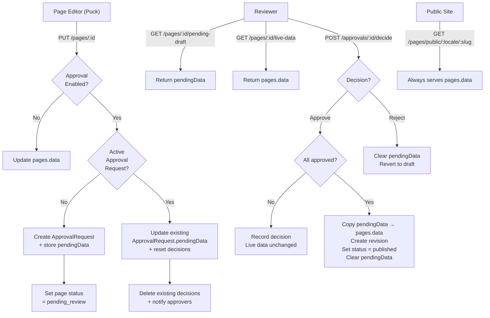
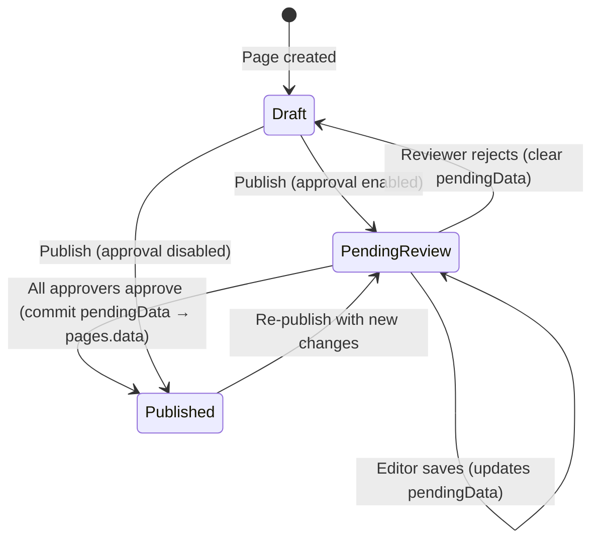

# Design Document: Pages Approval Draft Preview

## Overview

This feature enhances the existing Content Approval Workflow to support **pending draft semantics** for the Pages module. Currently, when a page editor saves and triggers approval, edits are written directly to `pages.data`. This design introduces a `pendingData` column on the `approvalRequests` table that holds proposed changes separately from live content. The live page remains untouched until all approvers approve, at which point the pending draft is committed as the new live version.

Key capabilities:
- **Draft isolation**: Saves during active approval write to `pendingData`, not `pages.data`
- **Preview & compare**: Reviewers can preview the pending version and compare it to the current live version via dedicated endpoints and read-only preview pages
- **Commit-on-approval**: Full approval triggers an atomic commit of `pendingData` → `pages.data` with revision tracking
- **Rejection with reason**: Rejection requires a mandatory comment, clears the pending draft, and reverts page status
- **Relaxed authorization**: Any employee can approve/reject (demo mode), but the configured approval threshold still applies
- **Decision reset**: Re-editing a pending draft after partial approvals resets all existing decisions

## Architecture



## Components and Interfaces

### Modified Components

#### 1. `PUT /pages/:id` Route (lib/cms/api/routes/pages.ts)

The existing save endpoint is modified to check for active approval:

```typescript
// Pseudocode for modified save logic
async function handlePageSave(id, body, userId) {
  const page = await getPage(id);
  const approvalEnabled = await isApprovalEnabled("pages");
  
  if (!approvalEnabled) {
    // Existing behavior: save directly to pages.data
    return await directSave(id, body);
  }
  
  // Approval is enabled — route to pending draft
  const existingRequest = await getActiveApprovalRequest(id, "pages");
  
  if (existingRequest) {
    // Update existing request's pendingData
    await updatePendingData(existingRequest.id, body.data);
    // Reset any existing decisions (re-review required)
    await resetDecisions(existingRequest.id);
  } else {
    // Create new approval request with pendingData
    await createApprovalRequestWithDraft(id, "pages", userId, body.data);
    // Set page status to pending_review
    await setPageStatus(id, "pending_review");
  }
}
```

#### 2. Approval Service (lib/cms/approval/service.ts)

The `submitDecision` function is extended to handle commit-on-approval:

- On full approval: copy `pendingData` → `pages.data`, create revision of old data, set page status to "published", clear `pendingData`, set request status to "approved"
- On rejection: clear `pendingData` (set to null), revert page status to "draft", store rejection reason as comment

#### 3. Publication Gate (lib/cms/approval/gate.ts)

Modified to store the current editor data as `pendingData` when creating an approval request during the publish flow.

#### 4. Page Editor UI (app/ora-panel/pages/[id]/edit/page.tsx)

Modified to:
- Load `pendingData` (via `GET /pages/:id/pending-draft`) instead of `pages.data` when a pending request exists
- Display a banner indicating "Changes are saved to pending draft — live page is unchanged"
- Save to the modified `PUT /pages/:id` endpoint (which routes to pendingData)

#### 5. Page Detail View (app/ora-panel/pages/[id]/page.tsx)

Extended with:
- "Preview Pending" and "View Current Live" links when a pending draft exists
- Rejection reason display when the latest request was rejected

#### 6. ApprovalActions Component (lib/cms/components/ApprovalActions.tsx)

Extended to:
- Enforce mandatory rejection reason (non-empty, non-whitespace)
- Show a rejection dialog with required comment field
- Display preview links for pending drafts

### New Components

#### 7. `GET /pages/:id/pending-draft` Endpoint

Returns the `pendingData` from the active approval request for a page. Requires employee authentication. Returns 404 if no pending draft exists.

#### 8. `GET /pages/:id/live-data` Endpoint

Returns the current `pages.data` regardless of approval status. Requires employee authentication.

#### 9. Preview Pages

- `app/ora-panel/pages/[id]/preview-pending/page.tsx` — Renders `pendingData` using `<PageRenderer>` in a full-width read-only view
- `app/ora-panel/pages/[id]/preview-live/page.tsx` — Renders `pages.data` using `<PageRenderer>` in a full-width read-only view

Both pages use the same `PageRenderer` component used for the public site, ensuring WYSIWYG fidelity.

## Data Models

### Schema Change: `approvalRequests` table

Add a `pendingData` JSONB column to store the proposed page data:

```sql
ALTER TABLE approval_requests
ADD COLUMN pending_data jsonb;
```

Drizzle schema update:

```typescript
export const approvalRequests = pgTable(
  "approval_requests",
  {
    id: uuid("id").primaryKey().defaultRandom(),
    contentId: text("content_id").notNull(),
    contentModule: text("content_module", {
      enum: ["pages", "blog", "news", "construction_updates"],
    }).notNull(),
    submitterId: uuid("submitter_id")
      .notNull()
      .references(() => users.id),
    status: text("status", {
      enum: ["pending", "approved", "rejected"],
    })
      .notNull()
      .default("pending"),
    pendingData: jsonb("pending_data"),  // NEW: stores proposed Puck JSON
    createdAt: timestamp("created_at").defaultNow().notNull(),
    resolvedAt: timestamp("resolved_at"),
  },
  // ... existing indexes
);
```

### Data Flow



### Modified `GET /pages/:id` Response

The existing page detail endpoint is extended to include a `hasPendingDraft` boolean:

```typescript
interface PageDetailResponse {
  // ... existing fields
  hasPendingDraft: boolean;  // true if an active pending approval request with pendingData exists
}
```

## Correctness Properties

*A property is a characteristic or behavior that should hold true across all valid executions of a system — essentially, a formal statement about what the system should do. Properties serve as the bridge between human-readable specifications and machine-verifiable correctness guarantees.*

### Property 1: Save-to-pending routing

*For any* valid Puck JSON page data and any page with approval enabled, saving via `PUT /pages/:id` SHALL store the data in `approvalRequests.pendingData` without modifying `pages.data`, and SHALL reuse the existing approval request (no duplicates created). When approval is disabled, the save SHALL write directly to `pages.data` with no approval request created.

**Validates: Requirements 1.1, 1.5, 1.6, 2.1, 2.2, 2.3, 7.2**

### Property 2: Live data invariant

*For any* page with a pending approval request, `pages.data` SHALL remain unchanged regardless of how many saves to the pending draft or partial approvals are submitted. The public endpoint and the `GET /pages/:id/live-data` endpoint SHALL always return the original `pages.data`.

**Validates: Requirements 1.2, 4.5, 8.2**

### Property 3: Pending draft retrieval

*For any* page with an active approval request containing `pendingData`, `GET /pages/:id/pending-draft` SHALL return that `pendingData`. For any page without an active pending request, the endpoint SHALL return 404. The `GET /pages/:id` response SHALL include `hasPendingDraft: true` if and only if an active pending request with non-null `pendingData` exists.

**Validates: Requirements 1.3, 7.1, 8.1, 8.4**

### Property 4: Pending data round-trip

*For any* valid Puck JSON data structure stored in `approvalRequests.pendingData`, reading it back via the `GET /pages/:id/pending-draft` endpoint SHALL produce a value identical to what was stored.

**Validates: Requirements 1.4**

### Property 5: Commit-on-approval

*For any* page with a pending approval request containing `pendingData`, when all required approvers submit "approved" decisions, the system SHALL: (a) copy `pendingData` into `pages.data`, (b) create a revision record with the previous `pages.data`, (c) set page status to "published" with a `publishedAt` timestamp, (d) set `pendingData` to null, and (e) set the request status to "approved".

**Validates: Requirements 4.1, 4.2, 4.3, 4.4**

### Property 6: Rejection cleanup

*For any* pending approval request that is rejected, the system SHALL set `pendingData` to null, revert the page status to "draft", and store the rejection reason as the decision comment.

**Validates: Requirements 5.4**

### Property 7: Rejection reason validation

*For any* string composed entirely of whitespace (including empty string), the system SHALL reject a rejection decision submission. *For any* non-empty, non-whitespace reason string, the rejection SHALL be accepted and the reason stored verbatim as the decision comment.

**Validates: Requirements 5.2, 5.3**

### Property 8: Decision reset on re-edit

*For any* pending approval request that has one or more existing decisions, when the submitter saves new changes to the pending draft, the system SHALL delete all existing decisions for that request, effectively requiring re-review from all approvers.

**Validates: Requirements 7.4**

### Property 9: Any-employee authorization with threshold

*For any* user with `userType = "employee"`, the system SHALL allow them to submit approval or rejection decisions on any pending pages approval request. The system SHALL commit the pending draft only when the number of "approved" decisions reaches the configured approver count threshold, regardless of which employees provided those approvals.

**Validates: Requirements 6.1, 6.2, 6.3**

## Error Handling

| Scenario | Behavior |
|----------|----------|
| `PUT /pages/:id` with invalid page data (fails Puck schema validation) | Return 400 with validation error; do not update pendingData |
| `GET /pages/:id/pending-draft` with no active request | Return 404 `{ error: "No pending draft" }` |
| `GET /pages/:id/pending-draft` without authentication | Return 401 |
| `POST /approvals/:id/decide` with empty/whitespace rejection reason | Return 400 `{ error: "Rejection reason is required" }` |
| `POST /approvals/:id/decide` by non-employee user | Return 403 `{ error: "Only employees can submit decisions" }` |
| `POST /approvals/:id/decide` on already-resolved request | Return 409 `{ error: "Request already resolved" }` |
| Concurrent approval decisions causing race condition | Use database transaction with row-level locking on the approval request |
| `pendingData` contains component types no longer in config | `PageRenderer` filters unknown types gracefully (existing behavior) |
| Page deleted while approval is pending | Cascade delete removes approval request (existing FK behavior) |

## Testing Strategy

### Property-Based Tests (fast-check)

Each correctness property above will be implemented as a property-based test using `fast-check` with a minimum of 100 iterations. Tests will use `pg-mem` for in-memory database simulation (consistent with existing test infrastructure).

**Library**: `fast-check` (already in devDependencies)
**Runner**: `vitest` (already configured)
**Database**: `pg-mem` for isolated, fast test execution

Tag format: `Feature: pages-approval-draft-preview, Property {number}: {property_text}`

Properties to implement:
1. Save-to-pending routing — generate random Puck JSON, verify routing logic
2. Live data invariant — generate random saves/approvals, verify pages.data unchanged
3. Pending draft retrieval — generate pages with/without drafts, verify endpoint responses
4. Pending data round-trip — generate random Puck JSON, store and retrieve
5. Commit-on-approval — generate random data and approver counts, verify commit semantics
6. Rejection cleanup — generate random data, reject, verify cleanup
7. Rejection reason validation — generate whitespace strings and valid strings
8. Decision reset on re-edit — generate existing decisions, re-save, verify reset
9. Any-employee authorization with threshold — generate random employees and thresholds

### Unit Tests (example-based)

- Preview link presence in page detail view when pending draft exists
- Banner display in editor during pending approval
- Rejection dialog enforces non-empty reason in UI
- Rejection reason display on page detail after rejection
- Authentication enforcement on pending-draft endpoint (401 for unauthenticated)
- Preview pages render using PageRenderer component

### Integration Tests

- Full workflow: save → approve → commit → verify live page updated
- Full workflow: save → reject → verify draft cleared and status reverted
- Re-edit after partial approval → decisions reset → re-approve → commit
- Approval disabled mid-flow → existing pending requests auto-resolved
