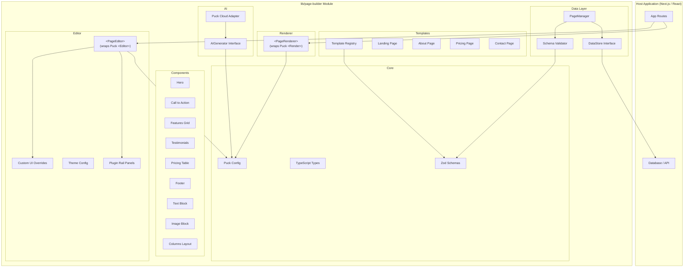
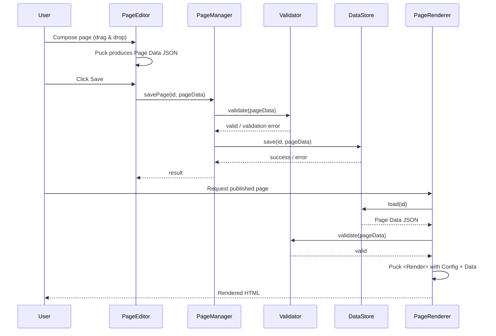

# Design Document: Puck Visual Page Builder

## Overview

This design describes a custom visual page builder CMS built on top of [Puck](https://puckeditor.com/) (`@puckeditor/core`). The system is structured as a self-contained module (`lib/page-builder/`) that can be embedded in any Next.js or standalone React application. It provides:

- A **Component Library** of Tailwind CSS 4 styled components registered via Puck's `Config` API
- A **Visual Editor** wrapping Puck's `<Puck>` component with custom UI overrides and branding
- A **Renderer** using Puck's `<Render>` component for server-side rendering of published pages
- A **Data Store** abstraction for persisting Page Data JSON to any backend
- A **Page Manager** handling CRUD, draft/published workflow, and slug uniqueness
- A **Template System** providing pre-built page layouts as valid Page Data JSON
- An **AI Generator** integrating with Puck AI's `generate()` API for natural language page creation
- **Schema Validation** using Zod to validate Page Data before save and render operations

### Key Design Decisions

1. **Puck as the core engine**: Rather than building a drag-and-drop system from scratch, we leverage Puck's battle-tested editor, renderer, and data model. This gives us DropZones, field configuration, undo/redo, viewports, and plugin support out of the box.

2. **Module-first architecture**: All builder code lives under `lib/page-builder/` with a barrel export. External dependencies (database, auth, API keys) are injected via TypeScript interfaces, keeping the module portable.

3. **Zod for schema validation**: Page Data is validated at save and load boundaries using Zod schemas derived from the component field configurations. This catches invalid data before it reaches the renderer.

4. **Puck AI `generate()` as default backend**: The AI generator uses `@puckeditor/cloud-client`'s `generate()` function by default, with an abstract interface allowing custom LLM backends to be swapped in.

5. **Tailwind CSS 4 exclusively**: All components use Tailwind utility classes. Style-related props expose constrained value sets (e.g., predefined color palettes, alignment options) rather than arbitrary CSS.

## Architecture



### Data Flow



## Components and Interfaces

### 1. Puck Configuration (`lib/page-builder/config.ts`)

The central `Config` object registers all components and is shared between Editor and Renderer.

```typescript
import type { Config } from "@puckeditor/core";
import type { PageData } from "./types";

export const pageBuilderConfig: Config<PageData> = {
  categories: {
    layout: { components: ["Hero", "ColumnsLayout", "Footer"] },
    content: { components: ["TextBlock", "ImageBlock", "FeaturesGrid"] },
    conversion: { components: ["CallToAction", "PricingTable", "Testimonials"] },
  },
  components: {
    Hero: { /* ComponentConfig */ },
    CallToAction: { /* ComponentConfig */ },
    FeaturesGrid: { /* ComponentConfig */ },
    Testimonials: { /* ComponentConfig */ },
    PricingTable: { /* ComponentConfig */ },
    Footer: { /* ComponentConfig */ },
    TextBlock: { /* ComponentConfig */ },
    ImageBlock: { /* ComponentConfig */ },
    ColumnsLayout: { /* ComponentConfig - uses DropZone */ },
  },
};
```

### 2. DataStore Interface (`lib/page-builder/data-store.ts`)

```typescript
export interface DataStore {
  save(pageId: string, data: PageData): Promise<void>;
  load(pageId: string): Promise<PageData | null>;
  delete(pageId: string): Promise<void>;
}
```

### 3. PageManager (`lib/page-builder/page-manager.ts`)

Orchestrates CRUD, slug uniqueness, and draft/published transitions.

```typescript
export interface PageMeta {
  id: string;
  title: string;
  slug: string;
  status: "draft" | "published";
  createdAt: string;
  updatedAt: string;
  publishedAt: string | null;
}

export interface PageRecord {
  meta: PageMeta;
  data: PageData;
}

export interface PageManagerDeps {
  dataStore: DataStore;
  metaStore: PageMetaStore;
}

export interface PageMetaStore {
  create(meta: PageMeta): Promise<void>;
  update(id: string, meta: Partial<PageMeta>): Promise<void>;
  delete(id: string): Promise<void>;
  getById(id: string): Promise<PageMeta | null>;
  getBySlug(slug: string): Promise<PageMeta | null>;
  list(): Promise<PageMeta[]>;
}
```

### 4. AIGenerator Interface (`lib/page-builder/ai-generator.ts`)

```typescript
export interface AIGenerateOptions {
  prompt: string;
  existingData?: PageData;
  systemContext?: string;
}

export interface AIGenerator {
  generate(options: AIGenerateOptions): Promise<PageData>;
}
```

The default implementation (`PuckCloudAIGenerator`) delegates to `@puckeditor/cloud-client`'s `generate()` function, passing the shared `pageBuilderConfig`.

### 5. Template Registry (`lib/page-builder/templates/`)

```typescript
export interface PageTemplate {
  id: string;
  name: string;
  description: string;
  thumbnailId: string;
  data: PageData;
}

export interface TemplateRegistry {
  list(): PageTemplate[];
  getById(id: string): PageTemplate | null;
  register(template: PageTemplate): void;
}
```

### 6. Schema Validator (`lib/page-builder/schema.ts`)

```typescript
export interface ValidationResult {
  success: boolean;
  errors?: Array<{ path: string; message: string }>;
}

export function validatePageData(data: unknown): ValidationResult;
```

### 7. Editor Component (`lib/page-builder/components/PageEditor.tsx`)

```typescript
export interface PageEditorProps {
  initialData: PageData;
  onSave: (data: PageData) => Promise<void>;
  onPublish?: (data: PageData) => Promise<void>;
  theme?: EditorTheme;
  aiGenerator?: AIGenerator;
}
```

Wraps `<Puck>` with custom `overrides`, `plugins` (Plugin Rail for SEO/settings/publish panels), and the AI plugin when an `aiGenerator` is provided.

### 8. Renderer Component (`lib/page-builder/components/PageRenderer.tsx`)

```typescript
export interface PageRendererProps {
  data: PageData;
  fallback?: React.ReactNode;
}
```

Wraps `<Render>` with validation and graceful handling of unknown component keys.

### 9. Barrel Export (`lib/page-builder/index.ts`)

```typescript
// Components
export { PageEditor } from "./components/PageEditor";
export { PageRenderer } from "./components/PageRenderer";

// Config
export { pageBuilderConfig } from "./config";

// Types
export type { PageData, PageMeta, PageRecord } from "./types";
export type { DataStore } from "./data-store";
export type { AIGenerator, AIGenerateOptions } from "./ai-generator";
export type { PageTemplate, TemplateRegistry } from "./templates";
export type { EditorTheme } from "./theme";
export type { ValidationResult } from "./schema";

// Utilities
export { validatePageData } from "./schema";
export { createPageManager } from "./page-manager";
export { createTemplateRegistry } from "./templates";
export { PuckCloudAIGenerator } from "./ai-generator";
```

## Data Models

### PageData (Puck Data Format)

The canonical data format produced by Puck's editor. This is the JSON stored in the database.

```typescript
// Mirrors Puck's Data type from @puckeditor/core
export interface PageData {
  root: {
    props: {
      title?: string;
      [key: string]: unknown;
    };
  };
  content: ComponentInstance[];
  zones?: Record<string, ComponentInstance[]>;
}

export interface ComponentInstance {
  type: string;           // Component key from Config (e.g., "Hero")
  props: {
    id: string;           // Unique instance ID generated by Puck
    [key: string]: unknown;
  };
}
```

### PageMeta

```typescript
export interface PageMeta {
  id: string;             // UUID
  title: string;
  slug: string;           // URL-safe, unique across all pages
  status: "draft" | "published";
  createdAt: string;      // ISO 8601
  updatedAt: string;      // ISO 8601
  publishedAt: string | null;
}
```

### EditorTheme

```typescript
export interface EditorTheme {
  colors: {
    primary: string;
    primaryForeground: string;
    sidebar: string;
    sidebarForeground: string;
    canvas: string;
  };
  logo?: React.ReactNode;
  fontFamily?: string;
}
```

### Zod Schema for PageData Validation

```typescript
import { z } from "zod";

const componentInstanceSchema = z.object({
  type: z.string().min(1),
  props: z.object({
    id: z.string().min(1),
  }).passthrough(),
});

const pageDataSchema = z.object({
  root: z.object({
    props: z.record(z.unknown()).default({}),
  }),
  content: z.array(componentInstanceSchema),
  zones: z.record(z.array(componentInstanceSchema)).optional(),
});
```


## Correctness Properties

*A property is a characteristic or behavior that should hold true across all valid executions of a system — essentially, a formal statement about what the system should do. Properties serve as the bridge between human-readable specifications and machine-verifiable correctness guarantees.*

### Property 1: PageData JSON serialization round-trip

*For any* valid PageData object, serializing it to a JSON string via `JSON.stringify` and then parsing it back via `JSON.parse` SHALL produce an object deeply equal to the original.

**Validates: Requirements 11.4**

### Property 2: DataStore save/load round-trip

*For any* valid PageData object and any page identifier, saving the PageData via the DataStore and then loading it back SHALL return PageData equivalent to the originally saved data.

**Validates: Requirements 5.4**

### Property 3: PageManager CRUD integrity

*For any* valid page title, slug, and PageData, creating a page via the PageManager and then retrieving it by ID SHALL return a page with matching title, slug, and data. Updating the page with new valid values and retrieving again SHALL reflect the updates. Deleting the page SHALL make it no longer retrievable.

**Validates: Requirements 6.1, 6.2, 6.3, 6.4**

### Property 4: Publish/unpublish round-trip

*For any* draft page, publishing it SHALL change its status to "published" and set a non-null `publishedAt` timestamp. Subsequently unpublishing it SHALL change its status back to "draft".

**Validates: Requirements 6.5, 6.6**

### Property 5: Slug uniqueness invariant

*For any* two page creation requests with the same URL slug, the PageManager SHALL accept the first and reject the second with an error, ensuring no two pages share a slug.

**Validates: Requirements 6.7**

### Property 6: Schema validation rejects invalid PageData

*For any* malformed PageData (missing `root`, missing `content`, component instance missing `type` or `props.id`), the schema validator SHALL return a failure result with at least one descriptive error containing a path. For any valid PageData, the validator SHALL return success.

**Validates: Requirements 11.1, 11.2, 11.3**

### Property 7: Renderer gracefully handles unknown components

*For any* PageData containing a mix of known component keys (present in Config) and unknown component keys (not in Config), the Renderer SHALL render all known components and skip unknown ones without throwing an error.

**Validates: Requirements 7.3, 7.4**

### Property 8: All templates produce valid PageData

*For any* template in the TemplateRegistry, its `data` field SHALL pass schema validation and SHALL only reference component keys that exist in the Component_Library configuration.

**Validates: Requirements 8.1**

### Property 9: Template instantiation produces independent copy

*For any* template, creating a page from that template SHALL produce a page whose initial PageData is deeply equal to the template's data. Modifying the page's data after creation SHALL NOT alter the original template's data.

**Validates: Requirements 8.3, 8.4**

### Property 10: Template registration round-trip

*For any* valid template definition (name, description, thumbnailId, and valid PageData), registering it with the TemplateRegistry and then retrieving it by ID SHALL return an equivalent template.

**Validates: Requirements 8.5**

### Property 11: All component fields have default values

*For any* component in the Component_Library configuration, every field defined in its Field_Config SHALL have a corresponding default value in `defaultProps`, ensuring new component instances are always fully initialized.

**Validates: Requirements 12.2**

## Error Handling

### DataStore Errors

- When `DataStore.save()` or `DataStore.load()` throws, the PageManager catches the error and returns a structured error result. The Editor displays a toast notification and preserves the current editor state (no data loss).
- Network timeouts and transient failures surface as retryable errors to the UI layer.

### Schema Validation Errors

- `validatePageData()` returns a `ValidationResult` with `success: false` and an array of `{ path, message }` errors.
- The PageManager calls validation before every save. The Renderer calls validation before every render.
- Invalid data is rejected at the boundary — it never reaches the DataStore or Puck's `<Render>`.

### AI Generator Errors

- If `AIGenerator.generate()` throws or returns invalid PageData, the Editor catches the error, displays a user-friendly message ("AI generation failed — please try again or modify your prompt"), and preserves the current canvas state.
- The PuckCloudAIGenerator wraps `@puckeditor/cloud-client` errors with context about rate limits, API key issues, or network failures.

### Renderer Errors

- Unknown component keys in PageData are silently skipped (logged to console in development). The rest of the page renders normally.
- If the entire PageData is invalid (fails schema validation), the Renderer displays the `fallback` prop content or a generic error message.

### Page Manager Errors

- Duplicate slug creation returns a specific `SlugConflictError` so the UI can prompt the user to choose a different slug.
- Attempting to publish an already-published page or unpublish an already-draft page is a no-op (idempotent).
- Deleting a non-existent page returns success (idempotent).

## Testing Strategy

### Unit Tests

Unit tests cover specific examples, edge cases, and error conditions:

- **Config structure**: Verify all required components exist, each has render + fields, categories are correct
- **Component rendering**: Snapshot tests for each component with default props and various prop combinations
- **Validation edge cases**: Empty objects, missing fields, extra fields, deeply nested zones
- **PageManager error paths**: Duplicate slugs, missing pages, invalid status transitions
- **AI Generator error handling**: Mock failures, invalid output, timeout scenarios
- **Theme application**: Verify theme config translates to correct CSS custom properties

### Property-Based Tests

Property-based tests verify universal properties across randomly generated inputs. Use `fast-check` as the PBT library.

- Minimum **100 iterations** per property test
- Each test references its design document property via tag comment
- Tag format: `Feature: puck-visual-page-builder, Property {N}: {title}`

**Properties to implement:**

| Property | What it tests | Generator strategy |
|----------|--------------|-------------------|
| 1: JSON round-trip | `JSON.parse(JSON.stringify(data)) ≡ data` | Generate arbitrary valid PageData trees |
| 2: DataStore round-trip | `load(save(data)) ≡ data` | Same generator + in-memory DataStore |
| 3: CRUD integrity | Create → read → update → read → delete → not found | Random titles, slugs, PageData |
| 4: Publish/unpublish | Draft → publish → published → unpublish → draft | Random page creation inputs |
| 5: Slug uniqueness | Two creates with same slug → second fails | Random slugs |
| 6: Validation | Valid data passes, invalid data fails with errors | Both valid and corrupted PageData |
| 7: Unknown components | Renderer skips unknowns, renders knowns | PageData with mix of real/fake component keys |
| 8: Template validity | All templates pass schema validation | Enumerate registry |
| 9: Template independence | Page from template is a deep copy | Random templates + mutations |
| 10: Template registration | Register → retrieve ≡ original | Random template definitions |
| 11: Field defaults | Every field has a default | Enumerate config components |

### Integration Tests

- **Editor mount**: PageEditor renders without errors with valid config and data
- **Renderer SSR**: PageRenderer produces complete HTML server-side
- **AI generation**: End-to-end test with Puck Cloud (limited to CI with API key)
- **Full page lifecycle**: Create → edit → save → publish → render → unpublish → delete

### Test Infrastructure

- **Framework**: Vitest (already compatible with Next.js ecosystem)
- **PBT Library**: `fast-check` for property-based testing
- **Component Testing**: React Testing Library for Editor/Renderer component tests
- **Mocking**: In-memory implementations of DataStore and PageMetaStore for unit/property tests
