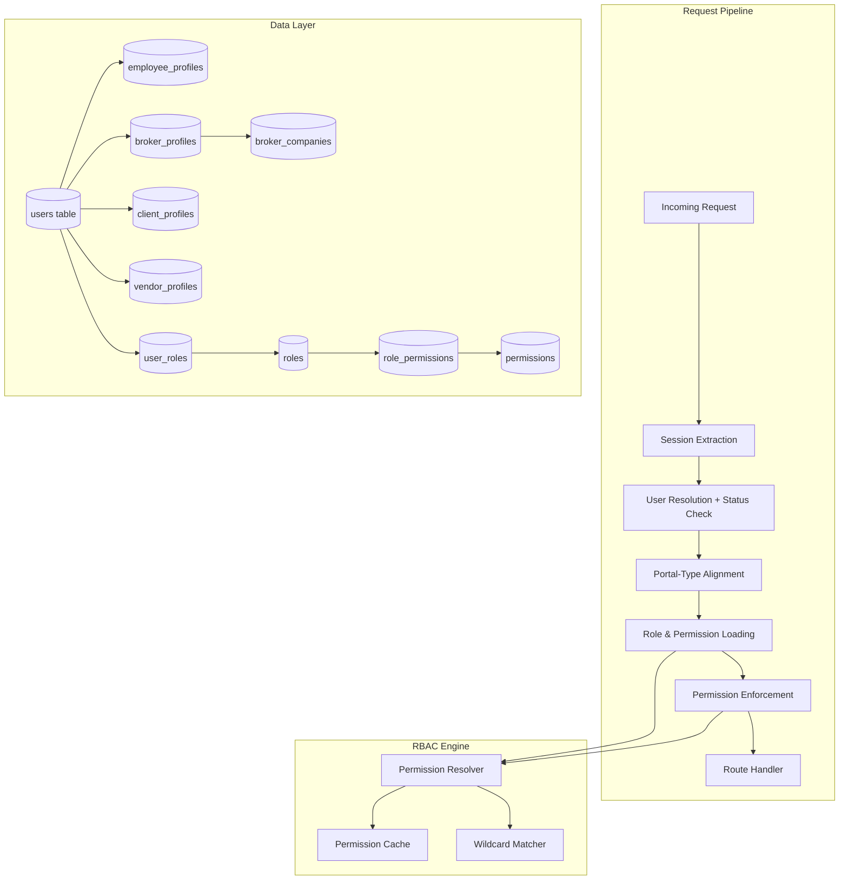
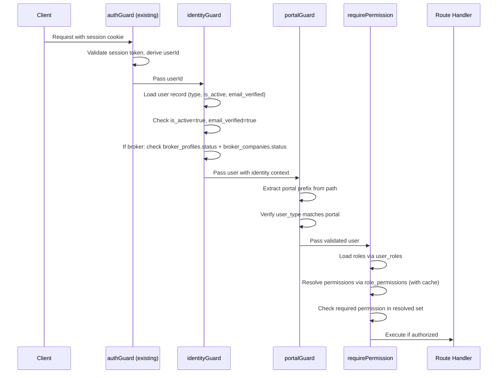
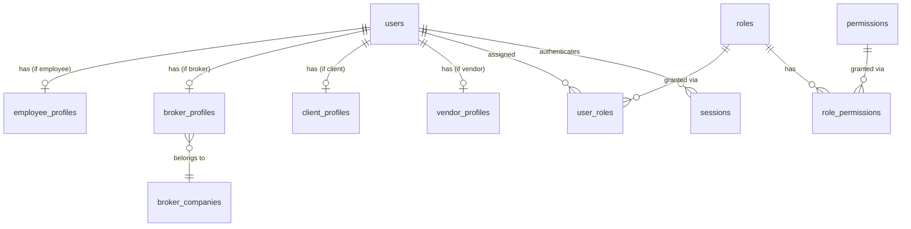

# Design Document: RBAC Identity System

## Overview

The RBAC Identity System transforms the Ora platform from a single-type user model into a multi-tenant identity system supporting four user types (employee, broker, client, vendor), each with dedicated portals, profile schemas, and role-based access control. The system introduces a zero-trust middleware pipeline that validates every API request against user type, portal scope, active status, and granular `resource:action` permissions.

The design extends the existing Drizzle ORM schema, Elysia API layer, and session infrastructure. It preserves backward compatibility by migrating all existing users to the `employee` type with `super_admin` roles, ensuring no disruption to current workflows.

### Key Design Decisions

1. **Discriminator column over separate tables**: A `user_type` column on the existing `users` table avoids duplicating authentication logic across multiple user tables. Type-specific data lives in dedicated profile tables joined via `user_id`.

2. **Permission strings as `resource:action`**: Fine-grained permissions expressed as colon-separated strings (e.g., `pages:publish`, `brokers:manage`) enable declarative route protection and frontend visibility filtering without coupling to role names.

3. **Elysia plugin composition for middleware**: The zero-trust pipeline is implemented as composable Elysia plugins (`identityGuard`, `portalGuard`, `requirePermission`) that stack on top of the existing `authGuard`, following the established pattern in `lib/cms/api/auth.ts`.

4. **In-memory permission cache per request**: Roles and permissions are resolved once per request and attached to the Elysia context via `derive`. A session-level cache (Map keyed by userId with TTL) avoids repeated DB lookups across requests within the same session.

5. **Drizzle migrations for schema changes**: All new tables and column additions use Drizzle Kit migrations (`drizzle/` directory), consistent with the existing migration history.

## Architecture



### Middleware Pipeline Sequence



## Components and Interfaces

### 1. Schema Extensions (`lib/cms/schema.ts`)

New columns on `users` table:
- `user_type`: enum column (`employee`, `broker`, `client`, `vendor`), default `employee`
- `is_active`: boolean, default `true`
- `email_verified`: boolean, default `false`
- `password_hash`: changed from `.notNull()` to nullable

New tables:
- `employee_profiles` — one-to-one with users where `user_type = 'employee'`
- `broker_companies` — organization records for brokerage agencies
- `broker_profiles` — links broker users to companies
- `client_profiles` — reserved for future use
- `vendor_profiles` — reserved for future use
- `roles` — role definitions scoped by user_type
- `permissions` — `resource:action` permission records
- `role_permissions` — junction linking roles to permissions
- `user_roles` — junction linking users to roles with audit fields

### 2. RBAC Engine (`lib/cms/rbac/`)

```typescript
// lib/cms/rbac/engine.ts
interface PermissionResolver {
  loadUserRoles(userId: string): Promise<Role[]>;
  resolvePermissions(roles: Role[]): Promise<string[]>;
  hasPermission(permissions: string[], required: string): boolean;
}

// lib/cms/rbac/cache.ts
interface PermissionCache {
  get(userId: string): CachedPermissions | null;
  set(userId: string, permissions: CachedPermissions): void;
  invalidate(userId: string): void;
}

interface CachedPermissions {
  roles: string[];
  permissions: string[];
  cachedAt: number;
}
```

The `hasPermission` function supports wildcard matching: a permission `"pages:*"` matches any `"pages:<action>"` request.

### 3. Middleware Guards (`lib/cms/rbac/middleware.ts`)

```typescript
// identityGuard — derives identity context into request
// Extends authGuard with user_type, is_active, email_verified, broker status
const identityGuard: Elysia;

// portalGuard(portalPrefix) — validates user_type matches portal
function portalGuard(portal: string): Elysia;

// requirePermission(permission) — checks resolved permissions
function requirePermission(permission: string): Elysia;
```

Usage pattern in route files:
```typescript
const brokerRoutes = new Elysia()
  .use(identityGuard)
  .use(portalGuard("/broker-portal"))
  .use(requirePermission("agents:manage"))
  .post("/broker-portal/agents", handler);
```

### 4. Registration Service (`lib/cms/rbac/registration.ts`)

```typescript
interface RegistrationService {
  registerBrokerCompany(data: BrokerRegistrationInput): Promise<{
    company: BrokerCompany;
    user: User;
    profile: BrokerProfile;
  }>;
}
```

Handles the atomic creation of broker_company + user + broker_profile + role assignment in a single transaction.

### 5. Company Status Cascade (`lib/cms/rbac/cascade.ts`)

```typescript
interface CascadeService {
  suspendCompany(companyId: string, actorId: string): Promise<void>;
  reactivateCompany(companyId: string, actorId: string): Promise<void>;
}
```

Suspension sets `is_active = false` for all linked users. Reactivation restores `is_active = true` only for users whose `broker_profiles.status` is `active`.

### 6. Session Enhancement (`lib/cms/api/auth.ts` modifications)

The `/auth/session` endpoint response expands to:
```typescript
interface EnhancedSessionResponse {
  userId: string;
  email: string;
  name: string;
  userType: UserType;
  isActive: boolean;
  emailVerified: boolean;
  roles: string[];
  permissions: string[];
  // Broker-specific (only when userType === "broker")
  broker?: {
    companyId: string;
    companyName: string;
    companyStatus: CompanyStatus;
    isCompanyAdmin: boolean;
    profileStatus: BrokerProfileStatus;
  };
}
```

### 7. Migration Service (`drizzle/` migrations)

Two-phase migration:
1. **Schema migration**: Add columns to `users`, create new tables, add indexes
2. **Data migration**: Set existing users to `employee` type, create `employee_profiles`, assign `super_admin` role

Both phases are idempotent — safe to run multiple times via Drizzle Kit.

## Data Models

### Extended Users Table

```typescript
export const users = pgTable("users", {
  id: uuid("id").primaryKey().defaultRandom(),
  email: text("email").notNull().unique(),
  name: text("name").notNull(),
  passwordHash: text("password_hash"), // nullable for broker pre-credential users
  userType: text("user_type", {
    enum: ["employee", "broker", "client", "vendor"],
  }).notNull().default("employee"),
  isActive: boolean("is_active").notNull().default(true),
  emailVerified: boolean("email_verified").notNull().default(false),
  createdAt: timestamp("created_at").defaultNow().notNull(),
  updatedAt: timestamp("updated_at").defaultNow().notNull(),
});
```

### Employee Profiles

```typescript
export const employeeProfiles = pgTable("employee_profiles", {
  id: uuid("id").primaryKey().defaultRandom(),
  userId: uuid("user_id").notNull().references(() => users.id).unique(),
  department: text("department"),
  jobTitle: text("job_title"),
  phoneNumber: text("phone_number"),
  createdAt: timestamp("created_at").defaultNow().notNull(),
  updatedAt: timestamp("updated_at").defaultNow().notNull(),
});
```

### Broker Companies

```typescript
export const brokerCompanies = pgTable("broker_companies", {
  id: uuid("id").primaryKey().defaultRandom(),
  companyName: text("company_name").notNull(),
  tradeLicenseNumber: text("trade_license_number").notNull(),
  tradeLicenseDocumentUrl: text("trade_license_document_url"),
  contactEmail: text("contact_email").notNull(),
  contactPhone: text("contact_phone").notNull(),
  status: text("status", {
    enum: ["pending", "active", "suspended", "rejected"],
  }).notNull().default("pending"),
  createdAt: timestamp("created_at").defaultNow().notNull(),
  updatedAt: timestamp("updated_at").defaultNow().notNull(),
});
```

### Broker Profiles

```typescript
export const brokerProfiles = pgTable("broker_profiles", {
  id: uuid("id").primaryKey().defaultRandom(),
  userId: uuid("user_id").notNull().references(() => users.id).unique(),
  companyId: uuid("company_id").notNull().references(() => brokerCompanies.id),
  isCompanyAdmin: boolean("is_company_admin").notNull().default(false),
  status: text("status", {
    enum: ["active", "inactive"],
  }).notNull().default("inactive"),
  createdAt: timestamp("created_at").defaultNow().notNull(),
  updatedAt: timestamp("updated_at").defaultNow().notNull(),
});
```

### Client & Vendor Profiles (Reserved)

```typescript
export const clientProfiles = pgTable("client_profiles", {
  id: uuid("id").primaryKey().defaultRandom(),
  userId: uuid("user_id").notNull().references(() => users.id).unique(),
  createdAt: timestamp("created_at").defaultNow().notNull(),
  updatedAt: timestamp("updated_at").defaultNow().notNull(),
});

export const vendorProfiles = pgTable("vendor_profiles", {
  id: uuid("id").primaryKey().defaultRandom(),
  userId: uuid("user_id").notNull().references(() => users.id).unique(),
  createdAt: timestamp("created_at").defaultNow().notNull(),
  updatedAt: timestamp("updated_at").defaultNow().notNull(),
});
```

### Roles

```typescript
export const roles = pgTable("roles", {
  id: uuid("id").primaryKey().defaultRandom(),
  name: text("name").notNull(),
  displayName: text("display_name").notNull(),
  description: text("description"),
  userType: text("user_type", {
    enum: ["employee", "broker", "client", "vendor"],
  }).notNull(),
  isSystem: boolean("is_system").notNull().default(false),
  createdAt: timestamp("created_at").defaultNow().notNull(),
  updatedAt: timestamp("updated_at").defaultNow().notNull(),
}, (table) => [
  uniqueIndex("roles_name_user_type_idx").on(table.name, table.userType),
]);
```

### Permissions

```typescript
export const permissions = pgTable("permissions", {
  id: uuid("id").primaryKey().defaultRandom(),
  resource: text("resource").notNull(),
  action: text("action").notNull(),
  description: text("description"),
}, (table) => [
  uniqueIndex("permissions_resource_action_idx").on(table.resource, table.action),
]);
```

### Role Permissions (Junction)

```typescript
export const rolePermissions = pgTable("role_permissions", {
  id: uuid("id").primaryKey().defaultRandom(),
  roleId: uuid("role_id").notNull().references(() => roles.id, { onDelete: "cascade" }),
  permissionId: uuid("permission_id").notNull().references(() => permissions.id, { onDelete: "cascade" }),
}, (table) => [
  uniqueIndex("role_permissions_unique_idx").on(table.roleId, table.permissionId),
]);
```

### User Roles (Junction)

```typescript
export const userRoles = pgTable("user_roles", {
  id: uuid("id").primaryKey().defaultRandom(),
  userId: uuid("user_id").notNull().references(() => users.id, { onDelete: "cascade" }),
  roleId: uuid("role_id").notNull().references(() => roles.id, { onDelete: "cascade" }),
  grantedBy: uuid("granted_by").references(() => users.id),
  grantedAt: timestamp("granted_at").defaultNow().notNull(),
}, (table) => [
  uniqueIndex("user_roles_unique_idx").on(table.userId, table.roleId),
]);
```

### Entity Relationship Diagram




## Correctness Properties

*A property is a characteristic or behavior that should hold true across all valid executions of a system — essentially, a formal statement about what the system should do. Properties serve as the bridge between human-readable specifications and machine-verifiable correctness guarantees.*

### Property 1: User type validation rejects invalid types

*For any* string that is not one of "employee", "broker", "client", or "vendor", attempting to create a user with that string as user_type should be rejected, and no user record should be created.

**Validates: Requirements 1.4**

### Property 2: User type immutability

*For any* user with a valid user_type, attempting to change the user_type after creation should be rejected or have no effect — the user_type value should remain equal to the original value.

**Validates: Requirements 1.5**

### Property 3: Profile-to-type correspondence invariant

*For any* user with user_type X, exactly one profile record should exist in the profile table corresponding to X (employee_profiles for "employee", broker_profiles for "broker", etc.), and zero profile records should exist in the other profile tables.

**Validates: Requirements 2.6**

### Property 4: Role-type scope enforcement

*For any* user with user_type X and any role with user_type scope Y, role assignment succeeds if and only if X equals Y.

**Validates: Requirements 3.4**

### Property 5: System role deletion prevention

*For any* role where is_system is true, attempting to delete the role should be rejected and the role should remain in the database.

**Validates: Requirements 3.5**

### Property 6: Role name uniqueness within type scope

*For any* role name N and user_type T, if a role with name N and user_type T already exists, attempting to create another role with the same name and user_type should fail. Creating a role with name N but a different user_type should succeed.

**Validates: Requirements 3.6**

### Property 7: Permission format validation

*For any* string S, the permission validation function should accept S if and only if S matches the pattern of two non-empty alphanumeric segments separated by a colon (e.g., `resource:action`). All other strings should be rejected.

**Validates: Requirements 4.2, 4.3**

### Property 8: Role deletion cascades junction records

*For any* non-system role with N associated role_permissions records and M associated user_roles records, deleting the role should result in zero remaining role_permissions and user_roles records referencing that role's id.

**Validates: Requirements 4.6**

### Property 9: Active status gate in middleware

*For any* user, the identity middleware should allow the request to proceed if and only if both is_active is true AND email_verified is true. All other combinations should result in denial.

**Validates: Requirements 5.2**

### Property 10: Portal-type alignment

*For any* user with user_type X and any portal path prefix P, the portal guard should allow access if and only if the portal-to-type mapping maps P to X. Mismatches should return HTTP 403.

**Validates: Requirements 5.3, 6.5**

### Property 11: Permission resolution is the union of role permissions

*For any* user with a set of assigned roles R1, R2, ..., Rn, the resolved permission set should equal the union of all permissions from each role. No permissions should be added or lost during resolution.

**Validates: Requirements 5.4, 5.5**

### Property 12: Permission check with wildcard support

*For any* set of permission strings PS and any required permission string "R:A", the hasPermission function should return true if PS contains "R:A" exactly OR if PS contains "R:*". It should return false otherwise.

**Validates: Requirements 5.6, 13.2, 13.5**

### Property 13: Broker middleware requires active profile and company

*For any* broker user, the middleware should allow access if and only if the user's broker_profiles.status is "active" AND the associated broker_companies.status is "active". Any other combination should result in denial.

**Validates: Requirements 5.8, 10.3**

### Property 14: Broker registration creates correct records

*For any* valid broker registration input (valid company details and admin person details with unique email), the registration service should atomically create: a broker_company with status "pending", a user with user_type "broker" and is_active false and email_verified false and null password_hash, a broker_profile with is_company_admin true and status "inactive", and a user_role assignment for the "agency_admin" role.

**Validates: Requirements 7.2, 7.3, 7.4, 7.5**

### Property 15: Registration input validation

*For any* registration input with at least one missing required field or an invalid email format, the registration service should reject the submission and create zero records in any table.

**Validates: Requirements 7.7**

### Property 16: Broker approval activates company and user

*For any* pending broker_company, when an administrator approves it, the company status should become "active", the associated broker user's is_active should become true, and the broker_profile status should become "active".

**Validates: Requirements 8.3, 8.4**

### Property 17: Broker rejection sets status

*For any* pending broker_company, when an administrator rejects it, the company status should become "rejected".

**Validates: Requirements 8.6**

### Property 18: Agent addition creates correct records

*For any* valid agent addition by a company admin, the service should create: a user with user_type "broker" and is_active true and email_verified false and null password_hash, a broker_profile linking to the admin's company with is_company_admin false and status "active", and a user_role assignment for the "agent" role.

**Validates: Requirements 9.1, 9.2, 9.3**

### Property 19: Agent management restricted to company admins

*For any* broker user, agent management operations (add, deactivate) should succeed if and only if the user's broker_profile has is_company_admin set to true.

**Validates: Requirements 9.5**

### Property 20: Agent deactivation sets correct flags

*For any* active agent, deactivation should set the agent's broker_profile status to "inactive" and the user's is_active flag to false.

**Validates: Requirements 9.6**

### Property 21: Agent management company isolation

*For any* broker agency admin and any agent belonging to a different broker_company, management operations should be rejected.

**Validates: Requirements 9.7**

### Property 22: Company suspension cascades to all users

*For any* broker_company with N linked users, setting the company status to "suspended" should result in all N users having is_active set to false.

**Validates: Requirements 10.1**

### Property 23: Company reactivation restores only active-profile users

*For any* broker_company with a mix of active-profile and inactive-profile users, reactivation should set is_active to true only for users whose broker_profile status is "active". Users with inactive profiles should remain is_active false.

**Validates: Requirements 10.2**

### Property 24: Session returns complete identity context

*For any* user with N assigned roles, the session endpoint should return all N role names and the complete resolved permission set (union of all role permissions).

**Validates: Requirements 14.2, 14.3**

### Property 25: Session returns broker-specific context

*For any* broker user, the session endpoint should return the broker_company id, company_name, and company status, as well as the broker_profile is_company_admin flag and profile status.

**Validates: Requirements 14.4, 14.5**

### Property 26: RBAC audit trail completeness

*For any* RBAC mutation — role assignment/revocation, permission addition/removal to a role, access denial, or company status change — an audit_log entry should be created with the correct entity_type ("role_assignment", "permission_change", "access_denial", or "company_status_change") and include the actor user_id and relevant details.

**Validates: Requirements 15.1, 15.2, 15.3, 15.4, 10.4**

### Property 27: Migration idempotence

*For any* database state, running the migration N times (where N >= 1) should produce the same result as running it once. No duplicate profiles or role assignments should be created.

**Validates: Requirements 12.5**

### Property 28: Migration creates profiles and assigns roles for existing users

*For any* set of pre-existing users, after migration each user should have exactly one employee_profile record and exactly one user_role assignment for the super_admin role.

**Validates: Requirements 12.3, 12.4**

## Error Handling

### Authentication Errors (HTTP 401)

| Scenario | Response |
|---|---|
| Missing or expired session token | `{ error: "Not authenticated" }` |
| User not found for session | `{ error: "Not authenticated" }` |
| User is_active = false | `{ error: "Account is deactivated" }` |
| User email_verified = false | `{ error: "Email not verified" }` |

### Authorization Errors (HTTP 403)

| Scenario | Response |
|---|---|
| User type does not match portal | `{ error: "Access denied: portal type mismatch" }` |
| Broker profile inactive | `{ error: "Access denied: broker profile inactive" }` |
| Broker company suspended/rejected | `{ error: "Access denied: company not active" }` |
| Missing required permission | `{ error: "Access denied: insufficient permissions", required: "resource:action" }` |

### Registration Errors (HTTP 400/409)

| Scenario | Status | Response |
|---|---|---|
| Missing required fields | 400 | `{ error: "Validation failed", details: { field: "reason" } }` |
| Invalid email format | 400 | `{ error: "Validation failed", details: { email: "Invalid email format" } }` |
| Duplicate email | 409 | `{ error: "An account with this email already exists" }` |

### Cascade Error Handling

- Company suspension/reactivation runs in a database transaction. If any user update fails, the entire operation rolls back.
- Audit log failures should not block the primary operation — audit writes use a fire-and-forget pattern with error logging.

### Role/Permission Mutation Errors

| Scenario | Status | Response |
|---|---|---|
| Assign role with type mismatch | 400 | `{ error: "Role type does not match user type" }` |
| Delete system role | 403 | `{ error: "System roles cannot be deleted" }` |
| Duplicate role name in same type | 409 | `{ error: "Role name already exists for this user type" }` |
| Duplicate permission resource:action | 409 | `{ error: "Permission already exists" }` |

## Testing Strategy

### Property-Based Testing

This feature is well-suited for property-based testing because it contains extensive pure business logic (permission resolution, validation, cascade logic) with universal properties that should hold across a wide input space.

**Library**: [fast-check](https://github.com/dubzzz/fast-check) for TypeScript property-based testing.

**Configuration**: Minimum 100 iterations per property test.

**Tag format**: `Feature: rbac-identity-system, Property {number}: {property_text}`

Each correctness property (Properties 1–28) should be implemented as a single property-based test. The test files should be organized as:

- `lib/cms/rbac/validation.property.test.ts` — Properties 1, 2, 7 (input validation, type immutability, permission format)
- `lib/cms/rbac/engine.property.test.ts` — Properties 4, 5, 6, 8, 11, 12 (role scoping, deletion, permission resolution, wildcards)
- `lib/cms/rbac/middleware.property.test.ts` — Properties 9, 10, 13 (active status gate, portal alignment, broker checks)
- `lib/cms/rbac/registration.property.test.ts` — Properties 14, 15 (broker registration)
- `lib/cms/rbac/approval.property.test.ts` — Properties 16, 17 (broker approval/rejection)
- `lib/cms/rbac/agents.property.test.ts` — Properties 18, 19, 20, 21 (agent management)
- `lib/cms/rbac/cascade.property.test.ts` — Properties 22, 23 (company suspension/reactivation)
- `lib/cms/rbac/session.property.test.ts` — Properties 24, 25 (session identity context)
- `lib/cms/rbac/audit.property.test.ts` — Property 26 (audit trail)
- `lib/cms/rbac/migration.property.test.ts` — Properties 27, 28 (migration idempotence)
- `lib/cms/rbac/profile.property.test.ts` — Property 3 (profile-type correspondence)

### Unit Tests (Example-Based)

Unit tests cover specific examples, seed data verification, and concrete scenarios:

- Seed role verification (Requirements 3.2, 3.3)
- Portal-to-type mapping constants (Requirements 6.1–6.4)
- Session endpoint response shape (Requirements 14.1)
- Permission declaration helper function signature (Requirements 13.1, 13.4)
- Specific role permission grants (Requirements 11.3–11.7)
- Error response format verification (Requirements 5.7)

### Integration Tests

Integration tests verify end-to-end flows with a real database:

- Full broker registration → approval → login flow
- Agent addition → welcome email dispatch
- Company suspension → all agents locked out → reactivation → active agents restored
- Migration on a database with existing users and FK relationships
- Permission cache invalidation on role changes

### Test Data Generators (fast-check Arbitraries)

Key generators needed for property tests:

- `arbUserType()` — generates one of the four valid user types
- `arbPermissionString()` — generates valid `resource:action` strings
- `arbInvalidPermissionString()` — generates strings that don't match the permission format
- `arbBrokerRegistration()` — generates valid broker registration inputs
- `arbRoleSet()` — generates a set of roles with associated permissions
- `arbCompanyWithAgents(n)` — generates a broker company with n linked agents with varying profile statuses
