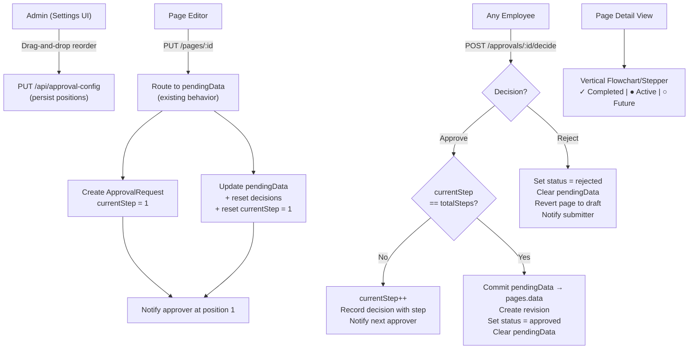
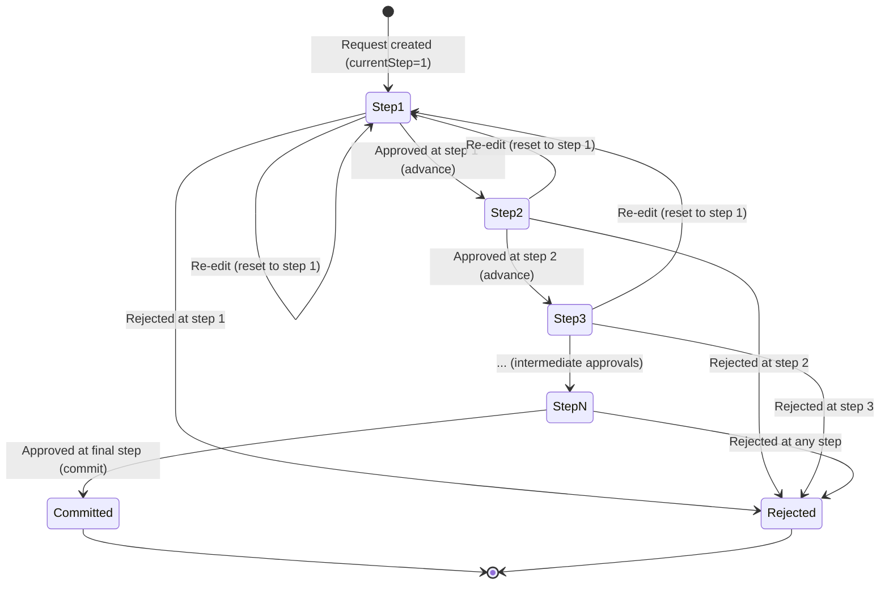

# Design Document: Sequential Approval Chain

## Overview

This feature transforms the existing flat approval model into a sequential, step-by-step "chain of command" for the Pages module. Currently, the `approvalConfigApprovers` table stores approvers without order, and `submitDecision` resolves the request when the count of approvals meets the total approver count. This design introduces:

- **Ordered approvers**: A `position` column on `approvalConfigApprovers` defines the chain sequence.
- **Step-by-step flow**: A `currentStep` column on `approvalRequests` tracks which position in the chain is active. Each approval advances the step; only the final step triggers commit-on-approval.
- **Cascading rejection**: A rejection at any step immediately terminates the entire request.
- **Relaxed authorization (demo mode)**: Any employee can approve/reject at any step — the chain defines structure and flow, not access control.
- **Drag-and-drop settings UI**: Administrators reorder approvers visually; positions are persisted as contiguous 1-based integers.
- **Flowchart progress UI**: The page detail view shows a vertical stepper with completed, active, and future steps.

The feature builds on top of the existing `pendingData` / commit-on-approval semantics from the pages-approval-draft-preview feature.

## Architecture



### Key Architectural Decisions

1. **Single decision per step**: Each chain step requires exactly one approval to advance. The `approvalDecisions` table records which employee approved and at which step.
2. **Position column on existing table**: Rather than creating a new junction table, we add `position` to `approvalConfigApprovers`. This minimizes migration complexity.
3. **currentStep on approvalRequests**: Tracks chain progress directly on the request row, avoiding the need to count decisions to determine the current position.
4. **chainStep on approvalDecisions**: Each decision records the step it was made at, enabling the flowchart UI to show who approved at each step.
5. **Reuse existing notification infrastructure**: The `notifyApprovers` function is adapted to notify only the current-step approver instead of all approvers.

## Components and Interfaces

### Modified Components

#### 1. Schema: `approvalConfigApprovers` table

Add a `position` integer column with a unique constraint per `configId`:

```typescript
export const approvalConfigApprovers = pgTable(
  "approval_config_approvers",
  {
    id: uuid("id").primaryKey().defaultRandom(),
    configId: uuid("config_id")
      .notNull()
      .references(() => approvalConfig.id, { onDelete: "cascade" }),
    userId: uuid("user_id")
      .notNull()
      .references(() => users.id, { onDelete: "cascade" }),
    position: integer("position").notNull().default(0),
  },
  (table) => [
    uniqueIndex("approval_config_approvers_unique_idx").on(table.configId, table.userId),
    uniqueIndex("approval_config_approvers_position_idx").on(table.configId, table.position),
  ]
);
```

#### 2. Schema: `approvalRequests` table

Add a `currentStep` integer column defaulting to 1:

```typescript
export const approvalRequests = pgTable(
  "approval_requests",
  {
    // ... existing columns ...
    currentStep: integer("current_step").notNull().default(1),
  },
  // ... existing indexes ...
);
```

#### 3. Schema: `approvalDecisions` table

Add a `chainStep` integer column to record which step the decision was made at:

```typescript
export const approvalDecisions = pgTable(
  "approval_decisions",
  {
    // ... existing columns ...
    chainStep: integer("chain_step"),
  },
  (table) => [
    // Replace the existing unique index to allow multiple decisions across steps
    // (after re-edit resets, a user could approve again at the same step)
    uniqueIndex("approval_decisions_unique_idx").on(
      table.requestId,
      table.approverId,
      table.chainStep
    ),
    index("approval_decisions_request_idx").on(table.requestId),
  ]
);
```

#### 4. Approval Service: `submitDecision` (lib/cms/approval/service.ts)

The core logic changes from flat threshold to sequential step advancement:

```typescript
// Pseudocode for modified submitDecision
async function submitDecision(db, requestId, approverId, decision, comment?) {
  return await db.transaction(async (tx) => {
    // Lock and fetch the request
    const request = await getRequestForUpdate(tx, requestId);
    if (!request || request.status !== "pending") throw new Error("...");

    // Get total chain length
    const totalSteps = await getChainLength(tx, request.contentModule);

    // Insert decision with chainStep
    await tx.insert(approvalDecisions).values({
      requestId,
      approverId,
      decision,
      comment: comment ?? null,
      chainStep: request.currentStep,
    });

    if (decision === "rejected") {
      // Cascading rejection — terminate immediately
      await tx.update(approvalRequests).set({
        status: "rejected",
        resolvedAt: new Date(),
        pendingData: null,
      }).where(eq(approvalRequests.id, requestId));
      
      await updateContentStatus(tx, request.contentId, request.contentModule, "draft");
      await notifySubmitterOfRejection(tx, request, approverId, comment);
      return { ...request, status: "rejected" };
    }

    // Decision is "approved"
    if (request.currentStep >= totalSteps) {
      // Final step — commit pending draft
      await commitPendingDraft(tx, request);
      await tx.update(approvalRequests).set({
        status: "approved",
        resolvedAt: new Date(),
        pendingData: null,
        currentStep: request.currentStep,
      }).where(eq(approvalRequests.id, requestId));
      
      await notifySubmitterOfApproval(tx, request);
      return { ...request, status: "approved" };
    } else {
      // Intermediate step — advance
      const nextStep = request.currentStep + 1;
      await tx.update(approvalRequests).set({
        currentStep: nextStep,
      }).where(eq(approvalRequests.id, requestId));
      
      await notifyApproverAtStep(tx, request.contentModule, nextStep, request);
      return { ...request, currentStep: nextStep };
    }
  });
}
```

#### 5. Approval Service: `resetDecisions` (lib/cms/approval/service.ts)

Extended to also reset `currentStep` to 1:

```typescript
export async function resetDecisions(db: Database, requestId: string): Promise<void> {
  await db.delete(approvalDecisions).where(eq(approvalDecisions.requestId, requestId));
  await db.update(approvalRequests).set({ currentStep: 1 }).where(eq(approvalRequests.id, requestId));
}
```

#### 6. Approval Service: `createApprovalRequestWithDraft`

Extended to explicitly set `currentStep: 1`:

```typescript
export async function createApprovalRequestWithDraft(db, contentId, contentModule, submitterId, data) {
  const [request] = await db.insert(approvalRequests).values({
    contentId,
    contentModule,
    submitterId,
    status: "pending",
    pendingData: data,
    currentStep: 1,
  }).returning();
  
  // Notify the first approver in the chain
  await notifyApproverAtStep(db, contentModule, 1, request);
  return request;
}
```

#### 7. Approval Service: `getApprovalProgress`

Extended to return chain-aware progress:

```typescript
export async function getApprovalProgress(db, contentId, contentModule) {
  // ... fetch request ...
  // Get ordered approvers with positions
  const chainApprovers = await db.select({
    userId: approvalConfigApprovers.userId,
    position: approvalConfigApprovers.position,
    userName: users.name,
  })
  .from(approvalConfigApprovers)
  .innerJoin(approvalConfig, eq(approvalConfigApprovers.configId, approvalConfig.id))
  .innerJoin(users, eq(approvalConfigApprovers.userId, users.id))
  .where(eq(approvalConfig.contentModule, contentModule))
  .orderBy(approvalConfigApprovers.position);

  // Get decisions with chain step info
  const decisions = await db.select({
    // ... fields including chainStep ...
  }).from(approvalDecisions).where(eq(approvalDecisions.requestId, request.id));

  return {
    currentStep: request.currentStep,
    totalSteps: chainApprovers.length,
    chain: chainApprovers,
    decisions,
    status: request.status,
  };
}
```

#### 8. Approval Routes (lib/cms/api/routes/approvals.ts)

- `GET /approvals/content/:module/:contentId` — extended response includes `currentStep`, `totalSteps`, `chain` (ordered approvers), and decisions with `chainStep`.
- `POST /approvals/:id/decide` — unchanged authorization logic (any employee for pages), but the underlying `submitDecision` now handles sequential advancement.
- `GET /api/approval-config` — response includes `position` field for each approver, sorted by position.

#### 9. Settings UI: `ContentApprovalSection` (app/ora-panel/settings/page.tsx)

The `ApproverPicker` component is replaced with an `OrderedApproverList` that supports:
- Drag-and-drop reordering (using `@dnd-kit/core` + `@dnd-kit/sortable`)
- Visible position numbers (1, 2, 3, ...)
- Drag handles on each item
- Visual flow arrows between items
- Add appends to end; remove re-numbers remaining items

```typescript
interface OrderedApproverListProps {
  users: { id: string; name: string; email: string }[];
  orderedApprovers: { userId: string; position: number }[];
  onChange: (approvers: { userId: string; position: number }[]) => void;
}
```

The `handleSaveModule` function sends the ordered list with positions to the API.

#### 10. Page Detail View: Chain Progress Stepper (app/ora-panel/pages/[id]/page.tsx)

A new `<ApprovalChainStepper>` component renders the chain as a vertical flowchart:

```typescript
interface ChainStepperProps {
  chain: { userId: string; userName: string; position: number }[];
  decisions: { chainStep: number; approverId: string; approverName: string; decision: string; comment: string | null; createdAt: string }[];
  currentStep: number;
  totalSteps: number;
  requestStatus: "pending" | "approved" | "rejected";
}
```

Visual states per step:
- **Completed** (position < currentStep or status=approved): Green checkmark, shows actual approver name + timestamp
- **Active** (position === currentStep and status=pending): Highlighted/pulsing border, shows nominal approver
- **Future** (position > currentStep and status=pending): Greyed out
- **Rejected** (the step where rejection occurred): Red X mark with reason
- **Skipped** (steps after rejection): Greyed out with strikethrough

#### 11. Notification Service (lib/cms/approval/notifications.ts)

New function `notifyApproverAtStep` sends notification to only the approver at the specified chain position:

```typescript
export async function notifyApproverAtStep(
  db: Database,
  contentModule: ContentModule,
  step: number,
  request: ApprovalRequest
): Promise<void> {
  // Look up the approver at the given position
  const approver = await getApproverAtPosition(db, contentModule, step);
  if (!approver) return;
  
  const totalSteps = await getChainLength(db, contentModule);
  const subject = `[Ora CMS] Step ${step} of ${totalSteps} — Content awaiting your review`;
  // ... send email with step context ...
}
```

### New Components

#### 12. `ApprovalChainStepper` Component (lib/cms/components/ApprovalChainStepper.tsx)

A reusable vertical stepper component that renders the chain progress flowchart. Used in both the page detail view and the review dashboard.

#### 13. Position Utility Functions (lib/cms/approval/positions.ts)

Pure functions for position management:

```typescript
/** Reorder: move item from sourceIndex to destinationIndex, return new positions */
export function reorderPositions(items: { userId: string; position: number }[], fromIndex: number, toIndex: number): { userId: string; position: number }[];

/** Remove: delete item at index, re-number remaining to be contiguous from 1 */
export function removeAndRenumber(items: { userId: string; position: number }[], removeIndex: number): { userId: string; position: number }[];

/** Add: append new item at position N+1 */
export function appendApprover(items: { userId: string; position: number }[], userId: string): { userId: string; position: number }[];
```

## Data Models

### Schema Changes Summary

| Table | Column | Type | Default | Constraint |
|-------|--------|------|---------|------------|
| `approval_config_approvers` | `position` | `integer` | `0` | UNIQUE per `(config_id, position)` |
| `approval_requests` | `current_step` | `integer` | `1` | NOT NULL |
| `approval_decisions` | `chain_step` | `integer` | `null` | Part of new unique index `(request_id, approver_id, chain_step)` |

### Migration SQL

```sql
-- Add position to approvalConfigApprovers
ALTER TABLE approval_config_approvers ADD COLUMN position integer NOT NULL DEFAULT 0;
CREATE UNIQUE INDEX approval_config_approvers_position_idx ON approval_config_approvers (config_id, position);

-- Add currentStep to approvalRequests
ALTER TABLE approval_requests ADD COLUMN current_step integer NOT NULL DEFAULT 1;

-- Add chainStep to approvalDecisions and update unique constraint
ALTER TABLE approval_decisions ADD COLUMN chain_step integer;
DROP INDEX IF EXISTS approval_decisions_unique_idx;
CREATE UNIQUE INDEX approval_decisions_unique_idx ON approval_decisions (request_id, approver_id, chain_step);
```

### State Machine



### API Response Shapes

**GET /api/approval-config** (extended):
```typescript
interface ApprovalConfigResponse {
  id: string;
  contentModule: ContentModule;
  enabled: boolean;
  approvers: {
    id: string;
    userId: string;
    userName: string;
    email: string;
    position: number; // NEW
  }[];
}
```

**GET /api/approvals/content/:module/:contentId** (extended):
```typescript
interface ApprovalProgressResponse {
  request: {
    id: string;
    status: "pending" | "approved" | "rejected";
    currentStep: number; // NEW
    createdAt: string;
    resolvedAt: string | null;
  } | null;
  currentStep: number; // NEW
  totalSteps: number; // NEW
  chain: { // NEW — ordered approver list
    userId: string;
    userName: string;
    position: number;
  }[];
  decisions: {
    id: string;
    approverId: string;
    approverName: string;
    decision: "approved" | "rejected";
    comment: string | null;
    chainStep: number; // NEW
    createdAt: string;
  }[];
}
```

## Correctness Properties

*A property is a characteristic or behavior that should hold true across all valid executions of a system — essentially, a formal statement about what the system should do. Properties serve as the bridge between human-readable specifications and machine-verifiable correctness guarantees.*

### Property 1: Position integrity after reorder, add, and remove

*For any* valid ordered list of approvers and any valid mutation (reorder from index A to index B, append a new approver, or remove an approver at index I), the resulting list SHALL have contiguous positions starting from 1 with no gaps or duplicates, and SHALL contain exactly the expected set of approvers.

**Validates: Requirements 1.2, 1.3, 1.6**

### Property 2: Configuration position round-trip

*For any* valid ordered list of approvers with positions 1 through N, saving the configuration via the API and reading it back SHALL produce the same ordered list with identical positions.

**Validates: Requirements 1.4, 8.1**

### Property 3: Initial step is always 1

*For any* newly created approval request for the Pages module, the `currentStep` field SHALL equal 1.

**Validates: Requirements 2.1, 2.6**

### Property 4: Intermediate approval advances step without resolving

*For any* approval request with a chain of length N > 1 and current step S where S < N, submitting an "approved" decision SHALL set `currentStep` to S + 1 and keep the request status as "pending".

**Validates: Requirements 2.2, 2.3**

### Property 5: Final step approval commits pending draft

*For any* approval request where `currentStep` equals the total chain length, submitting an "approved" decision SHALL: copy `pendingData` into `pages.data`, create a revision of the previous data, set the request status to "approved", set `pendingData` to null, and set the page status to "published".

**Validates: Requirements 2.4**

### Property 6: Decision records the chain step

*For any* decision submitted at chain step S, the resulting decision record SHALL have `chainStep` equal to S.

**Validates: Requirements 2.5, 4.5**

### Property 7: Cascading rejection terminates and cleans up

*For any* approval request at any chain step S (1 ≤ S ≤ N), submitting a "rejected" decision SHALL immediately set the request status to "rejected", set `pendingData` to null, and revert the page status to "draft".

**Validates: Requirements 5.1, 5.2, 5.4**

### Property 8: Rejection reason validation

*For any* string composed entirely of whitespace (including empty string), submitting a rejection SHALL be rejected with a 400 error. *For any* non-empty, non-whitespace string, the rejection SHALL be accepted and the comment stored verbatim.

**Validates: Requirements 5.5**

### Property 9: Re-edit resets all decisions and step

*For any* approval request with K existing decisions (K ≥ 1) at current step S > 1, saving new changes to the pending draft SHALL delete all K decisions and reset `currentStep` to 1.

**Validates: Requirements 7.1, 7.2**

### Property 10: Employee authorization

*For any* user with `userType = "employee"`, the system SHALL allow them to submit a decision. *For any* user with a different `userType`, the system SHALL reject the decision with a 403 error. The decision record SHALL always store the actual employee's ID as `approverId`.

**Validates: Requirements 4.1, 4.5, 8.3**

### Property 11: API chain progress response completeness

*For any* approval request at step S of N with D decisions recorded, the `GET /approvals/content/:module/:contentId` response SHALL include `currentStep` = S, `totalSteps` = N, a `chain` array of length N sorted by position, and a `decisions` array of length D each containing a `chainStep` field.

**Validates: Requirements 8.2, 8.4**

## Error Handling

| Scenario | Behavior |
|----------|----------|
| `POST /approvals/:id/decide` on already-resolved request | Return 409 `{ error: "This approval request has already been resolved" }` |
| `POST /approvals/:id/decide` by non-employee | Return 403 `{ error: "Only employees can submit decisions" }` |
| `POST /approvals/:id/decide` with empty/whitespace rejection reason | Return 400 `{ error: "Rejection reason is required" }` |
| `PUT /api/approval-config` with duplicate positions | Return 400 `{ error: "Positions must be unique and contiguous" }` |
| `PUT /api/approval-config` with non-contiguous positions | Server normalizes to contiguous 1-based sequence before persisting |
| Concurrent approval at same step (race condition) | Database transaction with row-level lock on `approvalRequests`; second transaction sees updated `currentStep` and fails unique constraint on `(requestId, approverId, chainStep)` → returns 409 |
| Re-edit during concurrent approval | Transaction on re-edit acquires lock first; approval transaction retries and sees reset state |
| Chain configuration changed while request is pending | Existing requests continue with the chain length at time of creation (stored as `totalSteps` is derived from current config — if chain shrinks below `currentStep`, next approval triggers commit) |
| Notification delivery failure | Caught and logged to audit; never blocks the approval workflow |
| Approver removed from chain while at their step | Demo mode allows any employee to act; notification failure is logged but flow continues |

## Testing Strategy

### Property-Based Tests (fast-check)

Each correctness property will be implemented as a property-based test using `fast-check` with a minimum of 100 iterations. Tests use `pg-mem` for in-memory database simulation (consistent with existing test infrastructure).

**Library**: `fast-check` (already in devDependencies)
**Runner**: `vitest` (already configured)
**Database**: `pg-mem` for isolated, fast test execution

Tag format: `Feature: sequential-approval-chain, Property {number}: {property_text}`

Properties to implement:

1. **Position integrity** — Generate random approver lists (1–10 items), apply random mutations (reorder, add, remove), verify contiguous 1-based positions with correct set membership.
2. **Configuration round-trip** — Generate random ordered approver lists, save via service, read back, verify identical order and positions.
3. **Initial step** — Generate random content submissions, verify `currentStep = 1` on created requests.
4. **Intermediate approval advances** — Generate chains of length 2–10, approve at various intermediate steps, verify `currentStep` increments and status stays "pending".
5. **Final step commits** — Generate chains of various lengths, advance to final step, approve, verify commit semantics (pendingData → pages.data, revision created, status = approved).
6. **Decision records step** — Generate decisions at various steps, verify `chainStep` field matches the step at submission time.
7. **Cascading rejection** — Generate chains of various lengths, reject at random steps, verify status = "rejected", pendingData = null, page status = "draft".
8. **Rejection reason validation** — Generate whitespace-only strings and valid non-whitespace strings, verify rejection/acceptance behavior.
9. **Re-edit reset** — Generate requests with 1–5 existing decisions at various steps, trigger re-edit, verify all decisions deleted and `currentStep = 1`.
10. **Employee authorization** — Generate users with various `userType` values, verify only employees can submit decisions and their ID is recorded.
11. **API response completeness** — Generate requests at various chain positions with various decision histories, verify response shape and field presence.

### Unit Tests (example-based)

- Settings UI renders position numbers and drag handles for each approver
- Settings UI shows flow arrows between approver cards
- Drag-and-drop reorder updates local state correctly
- Remove from middle re-numbers remaining approvers
- Page detail stepper shows correct visual states (completed/active/future/rejected/skipped)
- Review dashboard shows "Step X of Y — Nominally: [Name]" format
- Editor displays reset warning when pending approval exists
- Notification email includes step position context ("Step 2 of 3")

### Integration Tests

- Full chain workflow: create → approve step 1 → approve step 2 → approve step 3 (final) → verify commit
- Rejection at step 2 of 3: verify chain terminates, pendingData cleared, page reverted
- Re-edit after step 2 approved: verify decisions cleared, step reset to 1, notification sent to step-1 approver
- Configuration change: add approver to chain, verify new requests use updated chain length
- Concurrent approval: two employees approve simultaneously at same step, verify only one succeeds
