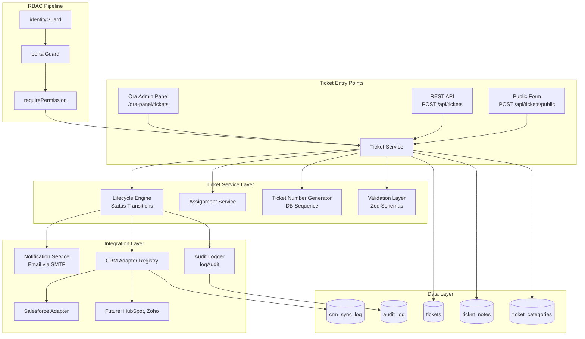
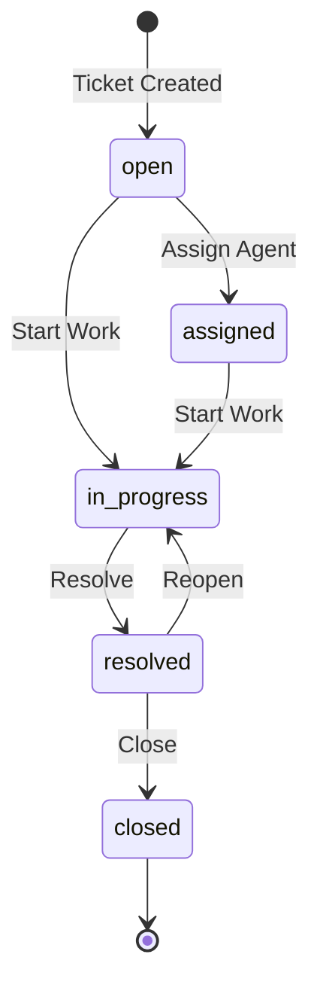
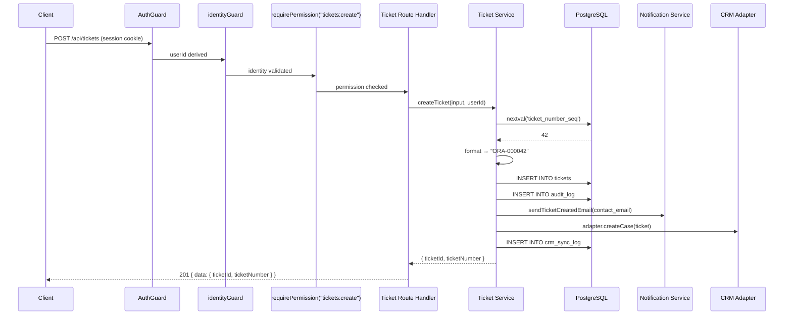
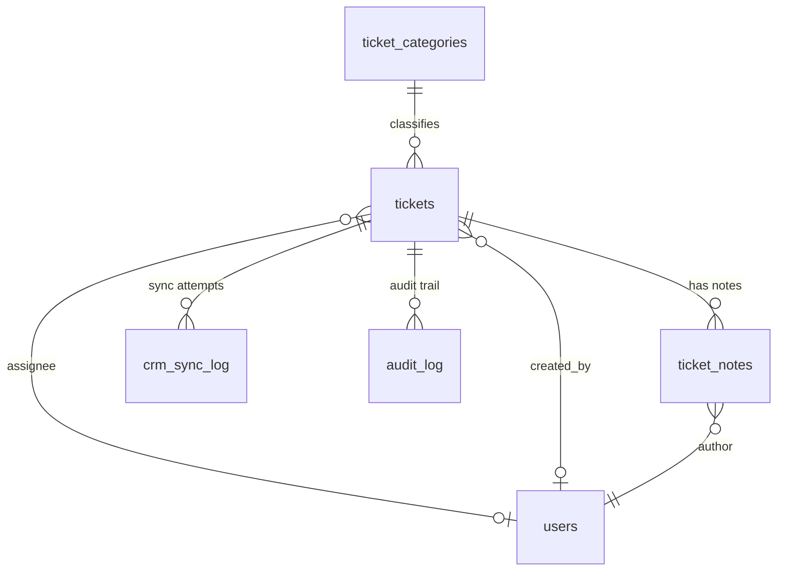

# Design Document: Support Ticketing System

## Overview

The Support Ticketing System adds a lead-oriented support ticket module to the Ora platform. Tickets represent inbound inquiries from leads or customers, created through three channels: manually by Ora employees via the admin panel, programmatically via a REST API (enabling AI chat agents), or through a public-facing submission form. Each ticket follows a defined lifecycle (Open → Assigned → In Progress → Resolved → Closed) with enforced status transitions. The module integrates with the existing RBAC permission model, sends transactional email notifications on key events, synchronizes ticket data to external CRMs through a pluggable adapter layer (Salesforce first), and records all operations in the existing audit trail.

### Key Design Decisions

1. **Extend existing schema patterns**: New tables (`tickets`, `ticket_notes`, `ticket_categories`, `crm_sync_log`) follow the same Drizzle ORM conventions used throughout `lib/cms/schema.ts` — UUID primary keys, `created_at`/`updated_at` timestamps, text enums, and index definitions.

2. **Database sequence for ticket numbers**: A PostgreSQL sequence (`ticket_number_seq`) guarantees monotonically increasing, gap-free ticket numbers even under concurrent inserts. The application formats the raw integer as `ORA-XXXXXX`.

3. **State machine for lifecycle enforcement**: A pure function `isValidTransition(from, to)` encodes the allowed status transitions as a lookup table. All status changes route through a single `transitionTicketStatus` service function that validates the transition, applies side effects (timestamps, assignee checks), triggers notifications, syncs to CRM, and writes audit entries — all within a database transaction.

4. **CRM adapter registry pattern**: A TypeScript interface `CrmAdapter` defines `createCase`, `updateCase`, and `getCaseStatus`. Concrete adapters (Salesforce first) are registered in a map. The active adapter is resolved from `CRM_ADAPTER` env var or `site_settings`. If none is configured, CRM sync is silently skipped.

5. **Reuse existing infrastructure**: Email notifications use the existing `sendEmail` function from `lib/cms/approval/notifications.ts`. Audit logging uses the existing `logAudit` function from `lib/cms/audit.ts`. RBAC enforcement uses the existing `identityGuard`, `portalGuard`, and `requirePermission` middleware from `lib/cms/rbac/middleware.ts`.

6. **Elysia route composition**: Ticket API routes follow the same pattern as other route files in `lib/cms/api/routes/` — exported as an Elysia plugin composed into the main API in `lib/cms/api/index.ts`.

## Architecture



### Ticket Lifecycle State Machine



### Request Flow — Ticket Creation (API)



## Components and Interfaces

### 1. Schema Extensions (`lib/cms/schema.ts`)

New tables added to the existing schema file:

- `tickets` — core ticket records with lifecycle fields
- `ticket_notes` — internal notes/comments on tickets
- `ticket_categories` — configurable classification labels
- `crm_sync_log` — CRM synchronization attempt records

New type additions to `lib/cms/types.ts`:

- `TicketStatus`, `TicketPriority`, `TicketSource` type aliases
- `AuditAction` extended with `"ticket_create"`, `"ticket_assign"`, `"ticket_status_change"`, `"ticket_note_add"`
- `AuditEntityType` extended with `"ticket"`, `"ticket_status_change"`, `"ticket_note"`

### 2. Ticket Number Generator (`lib/cms/tickets/ticket-number.ts`)

```typescript
/**
 * Generate the next ticket number using a PostgreSQL sequence.
 * Returns formatted string like "ORA-000042".
 */
export async function generateTicketNumber(db: Database): Promise<string>;

/**
 * Format a raw sequence integer into the ORA-XXXXXX format.
 * Pure function — no DB access.
 */
export function formatTicketNumber(seq: number): string;

/**
 * Parse a ticket number string back to its numeric portion.
 * Returns null if the format is invalid.
 */
export function parseTicketNumber(ticketNumber: string): number | null;
```

### 3. Lifecycle Engine (`lib/cms/tickets/lifecycle.ts`)

```typescript
/** Valid status transitions as a lookup table */
export const VALID_TRANSITIONS: Record<TicketStatus, TicketStatus[]>;

/**
 * Pure function — returns true if the transition is allowed.
 */
export function isValidTransition(from: TicketStatus, to: TicketStatus): boolean;

/**
 * Transition a ticket's status within a transaction.
 * Validates the transition, applies side effects (timestamps, assignee),
 * writes audit log, triggers notifications, and syncs to CRM.
 */
export async function transitionTicketStatus(
  db: Database,
  ticketId: string,
  newStatus: TicketStatus,
  actorId: string,
  assigneeId?: string
): Promise<Ticket>;
```

### 4. Ticket Service (`lib/cms/tickets/service.ts`)

```typescript
export interface CreateTicketInput {
  subject: string;
  description: string;
  contactName: string;
  contactEmail: string;
  contactPhone?: string;
  priority?: TicketPriority;
  category?: string;
  source: TicketSource;
  createdBy: string | null;
}

export async function createTicket(
  db: Database,
  input: CreateTicketInput
): Promise<{ ticketId: string; ticketNumber: string }>;

export async function assignTicket(
  db: Database,
  ticketId: string,
  assigneeId: string,
  actorId: string
): Promise<Ticket>;

export async function addNote(
  db: Database,
  ticketId: string,
  authorId: string,
  content: string,
  isInternal?: boolean
): Promise<TicketNote>;

export async function getTicketById(
  db: Database,
  ticketId: string
): Promise<TicketWithNotes | null>;

export async function listTickets(
  db: Database,
  filters: TicketFilters
): Promise<{ tickets: Ticket[]; total: number }>;
```

### 5. CRM Adapter Interface (`lib/cms/tickets/crm/adapter.ts`)

```typescript
export interface CrmCaseInput {
  ticketNumber: string;
  subject: string;
  description: string;
  contactName: string;
  contactEmail: string;
  contactPhone?: string;
  priority: string;
  category?: string;
  status: string;
}

export interface CrmCaseResult {
  externalId: string;
  status: string;
}

export interface CrmAdapter {
  readonly name: string;
  createCase(input: CrmCaseInput): Promise<CrmCaseResult>;
  updateCase(externalId: string, updates: Partial<CrmCaseInput>): Promise<CrmCaseResult>;
  getCaseStatus(externalId: string): Promise<string>;
}
```

### 6. CRM Adapter Registry (`lib/cms/tickets/crm/registry.ts`)

```typescript
export function registerAdapter(name: string, adapter: CrmAdapter): void;
export function getActiveAdapter(): CrmAdapter | null;
```

The registry reads `CRM_ADAPTER` from env or `site_settings`. If not set, `getActiveAdapter()` returns `null` and CRM sync is skipped.

### 7. Salesforce Adapter (`lib/cms/tickets/crm/salesforce.ts`)

```typescript
export class SalesforceAdapter implements CrmAdapter {
  readonly name = "salesforce";
  // Authenticates via OAuth 2.0 client credentials (SF_CLIENT_ID, SF_CLIENT_SECRET, SF_LOGIN_URL)
  // Retries up to 3 times with exponential backoff on failure
  // Logs all attempts to crm_sync_log
}
```

### 8. Ticket Notifications (`lib/cms/tickets/notifications.ts`)

```typescript
export async function sendTicketCreatedEmail(
  db: Database,
  ticket: Ticket
): Promise<void>;

export async function sendTicketAssignedEmail(
  db: Database,
  ticket: Ticket,
  assigneeEmail: string
): Promise<void>;

export async function sendTicketResolvedEmail(
  db: Database,
  ticket: Ticket
): Promise<void>;

export async function sendTicketClosedEmail(
  db: Database,
  ticket: Ticket
): Promise<void>;
```

All functions use the existing `sendEmail` from `lib/cms/approval/notifications.ts`. Failures are caught, logged to audit with `entity_type: "notification"`, and never block the ticket operation.

### 9. Ticket API Routes (`lib/cms/api/routes/tickets.ts`)

```typescript
export const ticketsRoutes: Elysia;
// POST   /tickets         — create ticket (authenticated, tickets:create)
// POST   /tickets/public  — create ticket (unauthenticated, rate-limited)
// GET    /tickets         — list tickets (authenticated, tickets:read)
// GET    /tickets/:id     — get ticket detail (authenticated, tickets:read)
// PATCH  /tickets/:id/status   — transition status (authenticated, tickets:update)
// PATCH  /tickets/:id/assign   — assign ticket (authenticated, tickets:assign)
// POST   /tickets/:id/notes    — add note (authenticated, tickets:update)
```

### 10. Ticket Category Routes (`lib/cms/api/routes/ticket-categories.ts`)

```typescript
export const ticketCategoriesRoutes: Elysia;
// POST   /ticket-categories       — create category (tickets:manage)
// GET    /ticket-categories       — list categories (tickets:read)
// PATCH  /ticket-categories/:id   — update category (tickets:manage)
// DELETE /ticket-categories/:id   — deactivate category (tickets:manage)
```

### 11. Rate Limiter (`lib/cms/tickets/rate-limit.ts`)

```typescript
/**
 * In-memory rate limiter for the public ticket submission endpoint.
 * Tracks submissions per IP address with a sliding window.
 */
export class RateLimiter {
  constructor(maxRequests: number, windowMs: number);
  isAllowed(ip: string): boolean;
  record(ip: string): void;
}
```

Default configuration: 5 submissions per IP per 15-minute window.

### 12. Validation Schemas (`lib/cms/tickets/validation.ts`)

```typescript
import { z } from "zod";

export const createTicketSchema: z.ZodSchema;   // subject, description, contactName, contactEmail required
export const publicTicketSchema: z.ZodSchema;    // same as above, no auth fields
export const transitionStatusSchema: z.ZodSchema; // newStatus required, assigneeId optional
export const assignTicketSchema: z.ZodSchema;    // assigneeId required
export const addNoteSchema: z.ZodSchema;         // content required, isInternal optional
export const ticketFiltersSchema: z.ZodSchema;   // status, priority, category, assignee, dateRange, source, search, page, pageSize
export const createCategorySchema: z.ZodSchema;  // name, displayName required
export const updateCategorySchema: z.ZodSchema;  // name, displayName, description, isActive optional
```

### 13. RBAC Seed Extension (`lib/cms/tickets/seed.ts`)

```typescript
/**
 * Seeds ticket-related permissions and role assignments.
 * Called from server startup alongside existing seedRbac.
 */
export async function seedTicketPermissions(db: Database): Promise<void>;
```

Registers permissions: `tickets:create`, `tickets:read`, `tickets:update`, `tickets:assign`, `tickets:delete`, `tickets:manage`.

Role grants:
- `super_admin` → `tickets:*` (via wildcard, already covered)
- `sales_manager` → `tickets:create`, `tickets:read`, `tickets:update`, `tickets:assign`
- `content_manager` → `tickets:read`
- `viewer` → `tickets:read`

## Data Models

### Tickets Table

```typescript
export const tickets = pgTable(
  "tickets",
  {
    id: uuid("id").primaryKey().defaultRandom(),
    ticketNumber: text("ticket_number").notNull().unique(),
    subject: text("subject").notNull(),
    description: text("description").notNull(),
    status: text("status", {
      enum: ["open", "assigned", "in_progress", "resolved", "closed"],
    }).notNull().default("open"),
    priority: text("priority", {
      enum: ["low", "medium", "high", "urgent"],
    }).notNull().default("medium"),
    category: text("category"),
    contactName: text("contact_name").notNull(),
    contactEmail: text("contact_email").notNull(),
    contactPhone: text("contact_phone"),
    source: text("source", {
      enum: ["manual", "api", "form"],
    }).notNull(),
    assigneeId: uuid("assignee_id").references(() => users.id),
    createdBy: uuid("created_by").references(() => users.id),
    externalCrmId: text("external_crm_id"),
    createdAt: timestamp("created_at").defaultNow().notNull(),
    updatedAt: timestamp("updated_at").defaultNow().notNull(),
    resolvedAt: timestamp("resolved_at"),
    closedAt: timestamp("closed_at"),
  },
  (table) => [
    index("tickets_status_idx").on(table.status),
    index("tickets_assignee_id_idx").on(table.assigneeId),
    index("tickets_category_idx").on(table.category),
    index("tickets_created_at_idx").on(table.createdAt),
    index("tickets_contact_email_idx").on(table.contactEmail),
  ]
);
```

### Ticket Notes Table

```typescript
export const ticketNotes = pgTable(
  "ticket_notes",
  {
    id: uuid("id").primaryKey().defaultRandom(),
    ticketId: uuid("ticket_id")
      .notNull()
      .references(() => tickets.id, { onDelete: "cascade" }),
    authorId: uuid("author_id")
      .notNull()
      .references(() => users.id),
    content: text("content").notNull(),
    isInternal: boolean("is_internal").notNull().default(true),
    createdAt: timestamp("created_at").defaultNow().notNull(),
  },
  (table) => [
    index("ticket_notes_ticket_id_idx").on(table.ticketId),
  ]
);
```

### Ticket Categories Table

```typescript
export const ticketCategories = pgTable(
  "ticket_categories",
  {
    id: uuid("id").primaryKey().defaultRandom(),
    name: text("name").notNull().unique(),
    displayName: text("display_name").notNull(),
    description: text("description"),
    isActive: boolean("is_active").notNull().default(true),
    createdAt: timestamp("created_at").defaultNow().notNull(),
  }
);
```

### CRM Sync Log Table

```typescript
export const crmSyncLog = pgTable(
  "crm_sync_log",
  {
    id: uuid("id").primaryKey().defaultRandom(),
    ticketId: uuid("ticket_id")
      .notNull()
      .references(() => tickets.id),
    direction: text("direction", {
      enum: ["outbound", "inbound"],
    }).notNull(),
    action: text("action").notNull(),
    status: text("status", {
      enum: ["success", "failed", "pending"],
    }).notNull().default("pending"),
    externalRefId: text("external_ref_id"),
    errorMessage: text("error_message"),
    requestPayload: jsonb("request_payload"),
    responsePayload: jsonb("response_payload"),
    attemptedAt: timestamp("attempted_at").defaultNow().notNull(),
    completedAt: timestamp("completed_at"),
  },
  (table) => [
    index("crm_sync_log_ticket_id_idx").on(table.ticketId),
    index("crm_sync_log_status_idx").on(table.status),
  ]
);
```

### Entity Relationship Diagram




## Correctness Properties

*A property is a characteristic or behavior that should hold true across all valid executions of a system — essentially, a formal statement about what the system should do. Properties serve as the bridge between human-readable specifications and machine-verifiable correctness guarantees.*

### Property 1: Ticket number round-trip

*For any* positive integer N (within the 6-digit range 1–999999), formatting N as a ticket number via `formatTicketNumber` and then parsing it back via `parseTicketNumber` should return the original integer N. Conversely, *for any* valid ticket number string matching the `ORA-XXXXXX` pattern, parsing then reformatting should produce the original string.

**Validates: Requirements 1.4, 15.2, 15.4**

### Property 2: Status transition validity

*For any* pair of ticket statuses (from, to), `isValidTransition(from, to)` should return true if and only if the pair is in the set {(open, assigned), (open, in_progress), (assigned, in_progress), (in_progress, resolved), (resolved, closed), (resolved, in_progress)}. All other pairs should return false.

**Validates: Requirements 2.1, 2.2**

### Property 3: Status transition side effects

*For any* valid status transition on a ticket:
- If the new status is "assigned", the ticket's assignee_id must be non-null after the transition.
- If the new status is "resolved", the ticket's resolved_at must be set to a non-null timestamp.
- If the new status is "closed", the ticket's closed_at must be set to a non-null timestamp.
- If the transition is from "resolved" to "in_progress" (reopen), the ticket's resolved_at must be cleared to null.

**Validates: Requirements 2.3, 2.4, 2.5, 2.6**

### Property 4: Ticket creation invariants

*For any* valid ticket creation input (non-empty subject, description, contact_name, and valid contact_email) with a given source ("manual", "api", or "form"), the resulting ticket should have status "open", the source field matching the input source, and created_by set to the authenticated user's ID for "manual"/"api" sources or null for "form" source. The response should include both a valid ticket_id (UUID) and a valid ticket_number (matching ORA-XXXXXX format).

**Validates: Requirements 3.2, 3.3, 4.2, 4.3, 4.4, 5.2**

### Property 5: Ticket creation input validation

*For any* ticket creation input where at least one of subject, description, contact_name, or contact_email is empty or whitespace-only, OR where contact_email does not match a valid email format, the creation should be rejected and no ticket record should be created.

**Validates: Requirements 3.4, 4.6, 5.4**

### Property 6: Assignment validates active employee

*For any* user record, ticket assignment should succeed if and only if the target user has `is_active = true` AND `user_type = "employee"`. All other combinations of active status and user type should result in rejection.

**Validates: Requirements 6.3, 6.5**

### Property 7: Ticket filtering correctness

*For any* set of tickets and any combination of filter criteria (status, priority, category, assignee, date range, source), every ticket in the returned results should match all specified filter criteria, and no ticket matching all criteria should be excluded from the results.

**Validates: Requirements 7.2, 7.7**

### Property 8: Ticket search correctness

*For any* set of tickets and any search query string, every ticket in the returned results should contain the search string (case-insensitive) in at least one of: ticket_number, subject, contact_name, or contact_email.

**Validates: Requirements 7.3**

### Property 9: Pagination bounds

*For any* set of N tickets, page number P, and page size S, the returned results should contain at most S tickets, and the tickets should correspond to the correct offset slice of the full result set. The total count should equal N regardless of page/size.

**Validates: Requirements 7.4**

### Property 10: Status count accuracy

*For any* set of tickets, the status count summary should return counts where the sum of counts for each status equals the total number of tickets, and each individual count equals the actual number of tickets with that status.

**Validates: Requirements 7.5**

### Property 11: Ticket audit trail completeness

*For any* ticket mutation — creation, assignment/reassignment, status transition, or note addition — an audit_log entry should be created with the correct entity_type, action, entity_id (ticket_id), actor user_id, and relevant change details (old/new status, old/new assignee).

**Validates: Requirements 2.7, 14.1, 14.2, 14.3, 14.4**

### Property 12: Notification triggers on lifecycle events

*For any* ticket lifecycle event — creation, assignment, resolution, or closure — the notification service should be invoked with the correct recipient email (contact_email for creation/resolution/closure, assignee email for assignment) and the ticket number should be included in the email payload.

**Validates: Requirements 9.1, 9.2, 9.3, 9.4**

### Property 13: Notification failure does not block ticket operation

*For any* ticket operation where the email notification fails (throws an error), the ticket operation itself should still complete successfully, and an audit_log entry with entity_type "notification" should be created recording the failure.

**Validates: Requirements 9.6**

### Property 14: Rate limiter enforcement

*For any* IP address, the rate limiter should allow the first 5 requests within a 15-minute window and reject subsequent requests. After the window expires, the counter should reset and allow new requests.

**Validates: Requirements 5.3**

### Property 15: CRM sync log lifecycle

*For any* CRM synchronization attempt, a crm_sync_log record with status "pending" should be created before the external API call. On success, the record should be updated to status "success" with a non-null external_ref_id and completed_at. On failure (after all retries), the record should be updated to status "failed" with a non-null error_message.

**Validates: Requirements 12.2, 12.3, 12.4**

### Property 16: Category name uniqueness

*For any* category name that already exists in the ticket_categories table, attempting to create another category with the same name should be rejected.

**Validates: Requirements 16.2**

### Property 17: Category deactivation preserves record

*For any* active ticket category, deactivating it should set is_active to false while the record remains in the database (not deleted). Existing tickets referencing that category should remain unchanged.

**Validates: Requirements 16.3**

### Property 18: Note creation sets author correctly

*For any* ticket and any authenticated user adding a note, the resulting ticket_notes record should have author_id equal to the authenticated user's user_id, and the content should match the input.

**Validates: Requirements 8.3**

## Error Handling

### Validation Errors (HTTP 400)

| Scenario | Response |
|---|---|
| Missing required fields (subject, description, contact_name, contact_email) | `{ error: "Validation failed", details: { field: "Required" } }` |
| Invalid email format | `{ error: "Validation failed", details: { contactEmail: "Invalid email format" } }` |
| Invalid status transition | `{ error: "Invalid status transition from {from} to {to}" }` |
| Missing assignee_id when transitioning to "assigned" | `{ error: "Assignee is required for status 'assigned'" }` |
| Empty note content | `{ error: "Validation failed", details: { content: "Required" } }` |
| Duplicate category name | `{ error: "A category with this name already exists" }` (HTTP 409) |

### Authentication Errors (HTTP 401)

| Scenario | Response |
|---|---|
| Missing or expired session on protected endpoints | `{ error: "Unauthorized" }` |
| Account deactivated | `{ error: "Account is deactivated" }` |

### Authorization Errors (HTTP 403)

| Scenario | Response |
|---|---|
| Missing required ticket permission | `{ error: "Access denied: insufficient permissions", required: "tickets:create" }` |

### Not Found Errors (HTTP 404)

| Scenario | Response |
|---|---|
| Ticket ID does not exist | `{ error: "Ticket not found" }` |
| Category ID does not exist | `{ error: "Category not found" }` |

### Rate Limiting Errors (HTTP 429)

| Scenario | Response |
|---|---|
| Public form exceeds 5 submissions per 15 minutes | `{ error: "Too many requests. Please try again later." }` |

### Assignment Errors (HTTP 400)

| Scenario | Response |
|---|---|
| Target assignee not active | `{ error: "Assignee must be an active user" }` |
| Target assignee not employee type | `{ error: "Assignee must be an employee" }` |

### CRM Sync Error Handling

- CRM sync failures are logged to `crm_sync_log` with status "failed" and error details.
- CRM sync failures never block the ticket operation — they are fire-and-forget with logging.
- Salesforce adapter retries up to 3 times with exponential backoff (1s, 2s, 4s) before marking as failed.

### Notification Error Handling

- Email notification failures are caught, logged to `audit_log` with entity_type "notification", and never block the ticket operation.
- If SMTP is not configured, notifications are silently skipped with a console warning (matching existing behavior in `lib/cms/approval/notifications.ts`).

## Testing Strategy

### Property-Based Testing

This feature is well-suited for property-based testing because it contains extensive pure business logic (status transition validation, ticket number formatting/parsing, input validation, filtering, rate limiting) with universal properties that should hold across a wide input space.

**Library**: [fast-check](https://github.com/dubzzz/fast-check) (already installed in devDependencies).

**Configuration**: Minimum 100 iterations per property test.

**Tag format**: `Feature: support-ticketing-system, Property {number}: {property_text}`

Each correctness property (Properties 1–18) should be implemented as a single property-based test. The test files should be organized as:

- `lib/cms/tickets/ticket-number.property.test.ts` — Property 1 (ticket number round-trip)
- `lib/cms/tickets/lifecycle.property.test.ts` — Properties 2, 3 (status transitions and side effects)
- `lib/cms/tickets/service.property.test.ts` — Properties 4, 5, 6, 18 (creation invariants, validation, assignment, notes)
- `lib/cms/tickets/query.property.test.ts` — Properties 7, 8, 9, 10 (filtering, search, pagination, counts)
- `lib/cms/tickets/audit.property.test.ts` — Property 11 (audit trail completeness)
- `lib/cms/tickets/notifications.property.test.ts` — Properties 12, 13 (notification triggers and failure handling)
- `lib/cms/tickets/rate-limit.property.test.ts` — Property 14 (rate limiter enforcement)
- `lib/cms/tickets/crm-sync.property.test.ts` — Property 15 (CRM sync log lifecycle)
- `lib/cms/tickets/categories.property.test.ts` — Properties 16, 17 (category uniqueness and deactivation)

### Unit Tests (Example-Based)

Unit tests cover specific examples, seed data, and concrete scenarios:

- RBAC seed verification: ticket permissions exist, role grants are correct (Requirements 13.1–13.5)
- CRM adapter registry: register/retrieve adapters, no adapter configured returns null (Requirements 10.3–10.5)
- API endpoint contract tests: correct HTTP methods, paths, response shapes (Requirements 4.1, 5.1)
- UI page existence: /ora-panel/tickets, /ora-panel/tickets/new, /ora-panel/tickets/[id] render (Requirements 3.1, 7.1, 8.1)

### Integration Tests

Integration tests verify end-to-end flows with a real or mocked database:

- Full ticket lifecycle: create → assign → in_progress → resolve → close
- Concurrent ticket creation produces distinct ticket numbers (Requirement 15.3)
- Salesforce adapter with mocked API: create case, update case, retry on failure (Requirements 11.2–11.5)
- RBAC middleware enforcement on ticket endpoints (Requirements 3.5, 6.4, 7.6, 8.4, 8.5, 13.6, 16.4, 16.5)
- Public form rate limiting with real request sequences

### Test Data Generators (fast-check Arbitraries)

Key generators needed for property tests:

- `arbTicketStatus()` — generates one of the five valid ticket statuses
- `arbTicketPriority()` — generates one of the four valid priorities
- `arbTicketSource()` — generates one of the three valid sources
- `arbValidTicketInput()` — generates valid ticket creation inputs with non-empty fields and valid email
- `arbInvalidTicketInput()` — generates inputs with at least one missing/invalid required field
- `arbTicketNumber()` — generates integers 1–999999 for ticket number testing
- `arbTicketFilterCriteria()` — generates random filter combinations
- `arbTicketSet(n)` — generates a set of n tickets with varying statuses, priorities, categories
- `arbValidEmail()` — generates syntactically valid email addresses
- `arbInvalidEmail()` — generates strings that are not valid emails
- `arbIpAddress()` — generates random IPv4 addresses for rate limiter testing
